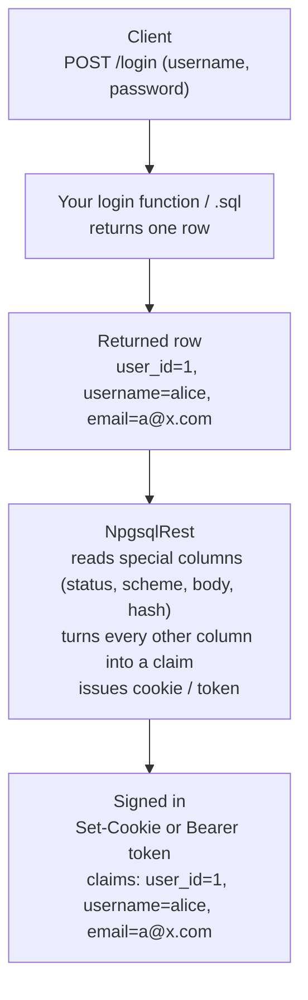
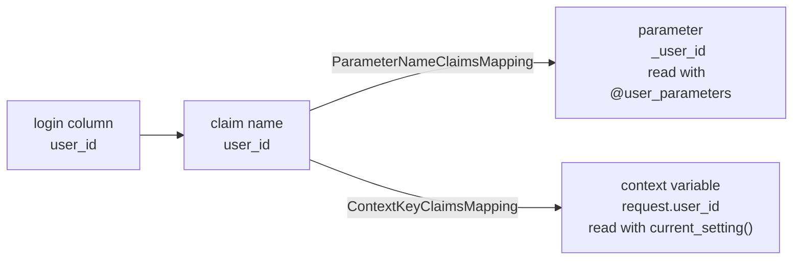

# LOGIN

::: info Also known as
`signin` (with or without `@` prefix)
:::

Mark a routine (function/procedure) or SQL file endpoint as a **sign-in endpoint**.

```
@login
```

::: tip Looking for the bigger picture?
This page is the reference for the `@login` annotation. For an end-to-end walkthrough — configuring an auth scheme, how claims flow through the system, and reading claims back in your other endpoints — see the [**Authentication guide**](../guide/authentication).
:::

## How a login endpoint works

A login endpoint is an ordinary endpoint that returns **one row**. NpgsqlRest treats that row specially:

1. The client `POST`s credentials (e.g. username + password) to the endpoint.
2. Your SQL runs and returns **at most one record**.
3. NpgsqlRest reads a few **[special columns](#special-columns)** (`status`, `scheme`, `body`, `hash`) for control flow.
4. **Every other column becomes a [user claim](#claims-how-columns-become-the-user)** — the column name is the claim name, the column value is the claim value.
5. NpgsqlRest signs the user in by issuing the cookie or token for the active scheme.



There is **no status column required** — if the row is returned the login succeeds; if **no row** is returned the result is **401 Unauthorized**. (Add a `status` column only when you need explicit HTTP status control.)

## Minimal example

The simplest login: verify the password inside SQL, return the user's claims on success, return nothing on failure.

```sql
create function login(_username text, _password text)
returns table (
    scheme text,
    user_id int,
    username text,
    email text
)
language sql
security definer
as $$
select
    'cookies' as scheme,   -- special column: which auth scheme to sign in
    u.user_id,             -- every non-special column
    u.username,            -- becomes a claim
    u.email
from users u
where u.username = _username
  and verify_password(_password, u.password_hash);  -- your own check
$$;

comment on function login(text, text) is '
HTTP POST
@login
@anonymous
@security_sensitive';
```

**Equivalent as a SQL file endpoint** (`sql/login.sql`):

```sql
/*
HTTP POST
@login
@anonymous
@security_sensitive
*/
select
    'cookies' as scheme,   -- special column: which auth scheme to sign in
    u.user_id,             -- every non-special column
    u.username,            -- becomes a claim
    u.email
from users u
where u.username = :username
  and verify_password(:password, u.password_hash);
```

- On a correct password, one row is returned → the user is signed in with claims `user_id`, `username`, `email`.
- On a wrong username/password, the `where` matches nothing → **empty result → 401 Unauthorized**.
- [`@anonymous`](./allow-anonymous) lets unauthenticated callers reach the endpoint (required when [`RequiresAuthorization`](../config/npgsqlrest) is on).
- [`@security_sensitive`](./security-sensitive) keeps the password out of the logs.

> This is the pattern used in the [Security & Auth example](/examples/). NpgsqlRest never sees the password hash — you verify it yourself. For the alternative where NpgsqlRest verifies the hash for you, see [Password verification](#password-verification).

## The return record

| Rule | Result |
|------|--------|
| Must return a **named record (table)** | A `void` routine, or one returning an **unnamed** record set, is rejected at startup with an error |
| Returns **a row** (and no failing `status`/`hash`) | Login succeeds, claims are created |
| Returns **no row** (empty result) | **401 Unauthorized** |
| Returns **multiple rows** | Only the **first** row is read; the rest is discarded |

Special-column names are matched **case-insensitively** against the PostgreSQL column names of the returned row; every other column becomes a claim under its **exact column name** — no name conversion is applied.

## Special columns

Four column names are consumed by NpgsqlRest for control flow and are **not** turned into claims. Their names are configurable in [`AuthenticationOptions`](../config/authentication-options).

| Column | Config option | Default | Purpose |
|--------|---------------|---------|---------|
| Status | `StatusColumnName` | `status` | Controls login success/failure and HTTP status |
| Scheme | `SchemeColumnName` | `scheme` | Which authentication scheme to sign in |
| Body   | `BodyColumnName`   | `body`  | Response body message |
| Hash   | `HashColumnName`   | `hash`  | Password hash for built-in verification |

### Status column

Optional. When present, it controls success/failure explicitly:

**Boolean:**
- `true` → login continues with claims (ends in `200 OK`)
- `false` → **401 Unauthorized**, login stops

**Numeric (`int`/`smallint`/`bigint`):**
- `200` → login continues with claims
- any other value → returns **that** HTTP status code, login stops

If the column is neither boolean nor numeric, the endpoint returns **500 Internal Server Error**.

> Omit the `status` column entirely to use the default rule: **row returned = success, no row = 401**.

### Scheme column

Sets the authentication **scheme** used for this sign-in. Use it when more than one scheme is configured (e.g. cookie *and* bearer token *and* JWT) so a single login function can issue any of them — typically driven by a request parameter:

```sql
-- the client asks for 'cookies', 'token', or 'jwt'
select _scheme as scheme, u.user_id, u.username, u.roles
from users u
where u.username = _username;
```

A scheme value that isn't configured is rejected (404). See the [Multiple Auth Schemes example](/examples/).

### Body column

A text message returned in the **response body** — but only when the active scheme doesn't already write the body itself:

- **Cookie authentication** doesn't write a body → the `body` value is used.
- **Bearer token / JWT** schemes always write the token to the body → the `body` value is ignored.

## Claims: how columns become the user

This is the core of the login contract. **Every returned column that isn't a [special column](#special-columns) becomes a claim**, where:

- **column name → claim name (claim type)**
- **column value → claim value**

So a login function returning `user_id`, `username`, `email`, `roles` produces exactly those four claims, plus whatever else you select. No transformation, no mapping config is needed to *create* claims — you simply select the columns you want.

### Identity claims

Among all the claims, three are designated as the **canonical identity**. NpgsqlRest uses them for the signed-in principal, for role-based `@authorize`, and as `$2`/`$3` in the [verification callbacks](#verification-callbacks). They are configured in [`AuthenticationOptions`](../config/authentication-options#default-claim-types):

| Config option | Default claim name | Used for |
|---------------|--------------------|----------|
| `DefaultUserIdClaimType` | `user_id` | The user identifier |
| `DefaultNameClaimType`   | `user_name` | The display name |
| `DefaultRoleClaimType`   | `user_roles` | Roles for `@authorize role1, role2` |

Make sure your login routine returns **a column matching each of these names** (or change the config to match your column names). For example, the [Multiple Auth Schemes example](/examples/) returns a `roles` column and configures:

```json
{
  "NpgsqlRest": {
    "AuthenticationOptions": {
      "DefaultUserIdClaimType": "user_id",
      "DefaultNameClaimType": "username",
      "DefaultRoleClaimType": "roles"
    }
  }
}
```

Now `@authorize admin` works because NpgsqlRest knows the `roles` claim holds the role list.

### Using claims in your other endpoints

Once a user is signed in, the claims travel with every request. To read them inside a *protected* endpoint, NpgsqlRest can inject them two ways:

| Mechanism | How you read the claim | Mapping config | Annotation |
|-----------|------------------------|----------------|------------|
| **As parameters** | a function/`$N` parameter | `ParameterNameClaimsMapping` (param name → claim name) | [`@user_parameters`](./user-parameters) |
| **As context variables** | `current_setting('request.user_id', true)` | `ContextKeyClaimsMapping` (context key → claim name) | [`@user_context`](./user-context) |

The thread that ties it all together is the **claim name** — the same string appears as the login column name *and* as the value in the mapping object:



Both mechanisms are covered in depth — with worked examples — in the [Authentication guide → Accessing claims](../guide/authentication#accessing-claims-in-your-endpoints). See also [`@user_parameters`](./user-parameters), [`@user_context`](./user-context), and [Claims Mapping configuration](../config/claims-mapping).

## Password verification

There are **two ways** to verify the password. Pick one.

::: tip Which one should I use?
**Option B (the built-in hasher) is the more secure default and is recommended for production.** Two reasons:

- **Security** — it uses a strong, OWASP-recommended PBKDF2-SHA256 configuration out of the box, so you don't have to get the cryptography right yourself.
- **Where the work runs** — password hashing is *deliberately* CPU-intensive. The built-in hasher runs it on the **NpgsqlRest application instance**, whereas verifying in SQL (Option A) runs it on your **database server**. The app tier is usually far easier to scale horizontally than PostgreSQL, so keeping expensive hashing off the database is an important architectural consideration.

**Option A (verify in SQL)** is simpler and keeps everything in the database — fine for small or low-traffic apps, or when you want full control over the hashing scheme.
:::

### Option A — verify in SQL (no `hash` column)

You verify the password yourself (as in the [minimal example](#minimal-example)) and simply **don't return a matching row** when it fails. NpgsqlRest stays out of it — this is the simplest approach and gives you full control over hashing.

You don't need anything external: PostgreSQL's built-in [`pgcrypto`](https://www.postgresql.org/docs/current/pgcrypto.html) extension already provides `crypt()`, `gen_salt()`, and `digest()`:

```sql
create extension if not exists pgcrypto;
```

**Recommended hashing** — pre-hash the password with SHA-256 and base64-encode it *before* bcrypt. Bcrypt silently truncates its input at 72 bytes; the SHA-256 + base64 step produces a fixed 44-character digest that always fits, so passwords of any length (and any byte content) are hashed safely:

```sql
-- hash (on registration / password change)
crypt(encode(digest(_password, 'sha256'), 'base64'), gen_salt('bf', 12))

-- verify (on login) — compare the recomputed hash against the stored one
crypt(encode(digest(_password, 'sha256'), 'base64'), _password_hash) = _password_hash
```

Wrap them as reusable helpers — `verify_password()` is the function used in the [minimal example](#minimal-example) above:

```sql
create function hash_password(_password text)
returns text
language sql
as $$
  select crypt(encode(digest(_password, 'sha256'), 'base64'), gen_salt('bf', 12));
$$;

create function verify_password(_password text, _password_hash text)
returns boolean
language sql
as $$
  select crypt(encode(digest(_password, 'sha256'), 'base64'), _password_hash) = _password_hash;
$$;
```

Store the hash when **registering** a user with the same `hash_password()`:

```sql
insert into users (username, email, password_hash)
values (_username, _email, hash_password(_password));
```

::: tip Work factor
The second argument to `gen_salt('bf', …)` is the bcrypt work factor (cost). `12` is a sensible default in 2025 — raise it for stronger (but slower) hashing.
:::

### Option B — built-in hasher (return a `hash` column)

Return the stored password hash in a column named `hash` (configurable via `HashColumnName`) and let NpgsqlRest verify it against the submitted password using its built-in hasher.

When a `hash` column is present, NpgsqlRest:

1. Reads the hash value from that column.
2. Identifies the **password parameter** — the first parameter whose name contains `PasswordParameterNameContains` (default `pass`).
3. Verifies the submitted password against the hash.
4. On failure, returns **404 Not Found** and the row's claims are discarded.

The **hash column name** and the **password-parameter substring** are set in [`AuthenticationOptions`](../config/authentication-options#login-response-columns) — these are the defaults:

```json
{
  "NpgsqlRest": {
    "AuthenticationOptions": {
      "HashColumnName": "hash",
      "PasswordParameterNameContains": "pass"
    }
  }
}
```

Change them to match your own naming. The example below uses these defaults:

```sql
create function login(_username text, _password text)
returns table (hash text, user_id int, username text, email text, roles text[])
language sql
as $$
  select
    u.password_hash as hash,  -- NpgsqlRest verifies _password against this
    u.user_id,
    u.username,
    u.email,
    u.roles
  from users u
  where u.username = _username;
$$;

comment on function login(text, text) is '
HTTP POST
@login
@anonymous
@security_sensitive';
```

The built-in hasher uses **PBKDF2** with **SHA-256**, a **128-bit salt**, and **600,000 iterations** (OWASP-recommended as of 2025). Use the matching [`@param <hash> is hash of <password>`](./parameter-hash) annotation when **registering** users so the stored hash is compatible. A custom `IPasswordHasher` can be injected in source code if needed.

### Verification callbacks

With **Option B**, you can run a command on success or failure of the built-in verification — the only way to react to the outcome, since the verification itself happens inside NpgsqlRest.

```json
{
  "NpgsqlRest": {
    "AuthenticationOptions": {
      "PasswordVerificationFailedCommand": "call password_verification_failed($1, $2, $3)",
      "PasswordVerificationSucceededCommand": "call password_verification_succeeded($1, $2, $3)"
    }
  }
}
```

Both commands receive up to three positional parameters — all optional (define your procedure with 0, 1, 2, or 3):

| Position | Type | Description |
|----------|------|-------------|
| `$1` | `text` | Authentication scheme used for the login |
| `$2` | `text` | User ID (the `DefaultUserIdClaimType` claim) |
| `$3` | `text` | Username (the `DefaultNameClaimType` claim) |

Typical use — lock the account after repeated failures, reset the counter and log on success:

```sql
create procedure password_verification_failed(_scheme text, _user_id text, _user_name text)
language plpgsql as $$
declare _attempts int;
begin
    update users set password_attempts = password_attempts + 1
    where user_id = _user_id::int
    returning password_attempts into _attempts;

    if _attempts >= 5 then
        update users set locked_until = now() + interval '15 minutes'
        where user_id = _user_id::int;
    end if;
end;
$$;

create procedure password_verification_succeeded(_scheme text, _user_id text, _user_name text)
language plpgsql as $$
begin
    update users set password_attempts = 0
    where user_id = _user_id::int and password_attempts > 0;

    insert into login_history (user_id, logged_in_at) values (_user_id::int, now());
end;
$$;
```

> See the [Multiple Auth Schemes example](/examples/) for both callbacks wired up end-to-end.

## More examples

### Multiple schemes from one login

A single login function that can sign the user into cookie, bearer-token, or JWT depending on the requested `scheme`, using the built-in hasher (`hash` column):

```sql
create function login(_scheme text, _username text, _password text)
returns table (
    scheme text,
    user_id int,
    username text,
    roles text[],
    email text,
    hash text
)
language sql
as $$
select
    _scheme,            -- 'cookies', 'token' or 'jwt'
    u.user_id,
    u.username,
    u.roles,
    u.email,
    u.password_hash as hash  -- built-in verification
from users u
where u.username = _username;
$$;

comment on function login(text, text, text) is '
HTTP POST
@login
@anonymous
@security_sensitive';
```

**Equivalent as a SQL file endpoint** (`sql/login.sql`):

```sql
/*
HTTP POST
@login
@anonymous
@security_sensitive
@param $1 scheme
@param $2 username
@param $3 password text
*/
select
    $1 as scheme,            -- 'cookies', 'token' or 'jwt'
    u.user_id,
    u.username,
    u.roles,
    u.email,
    u.password_hash as hash  -- built-in verification
from users u
where u.username = $2;
```

### Explicit status code and message

Use a `status` + `body` column to return a specific HTTP status with a message (cookie scheme, where `body` is honored):

```sql
create function login(_email text, _password text)
returns table (status int, body text, user_id int, username text)
language plpgsql
as $$
begin
  if exists (
    select 1 from users
    where email = _email and verify_password(_password, password_hash)
  ) then
    return query
      select 200, 'Welcome back'::text, u.user_id, u.username
      from users u where u.email = _email;
  else
    return query select 401, 'Invalid credentials'::text, null::int, null::text;
  end if;
end;
$$;

comment on function login(text, text) is '
HTTP POST /auth/login
@login
@anonymous
@security_sensitive';
```

### Role-protected endpoint after login

Once `roles` is the role claim, protect endpoints with `@authorize`:

```sql
comment on function get_users() is '
HTTP GET
@authorize admin';   -- only users whose roles claim contains "admin"
```

## Related

- [**Authentication guide**](../guide/authentication) — full walkthrough: schemes, login, claims, and reading claims back
- [Authentication configuration](../config/auth) — configure Cookie / Bearer / JWT / External schemes
- [Authentication Options](../config/authentication-options) — login behavior, special columns, claim types
- [Claims Mapping](../config/claims-mapping) — map claims to parameters and context

## Related Annotations

- [LOGOUT](./logout) — mark as sign-out endpoint
- [USER_PARAMETERS](./user-parameters) — read claims as function parameters
- [USER_CONTEXT](./user-context) — read claims as PostgreSQL context variables
- [PARAMETER_HASH](./parameter-hash) — hash passwords on registration with the same built-in hasher
- [SECURITY_SENSITIVE](./security-sensitive) — keep credentials out of logs
- [ALLOW_ANONYMOUS](./allow-anonymous) — login endpoints typically need this
- [AUTHORIZE](./authorize) — protect other endpoints
