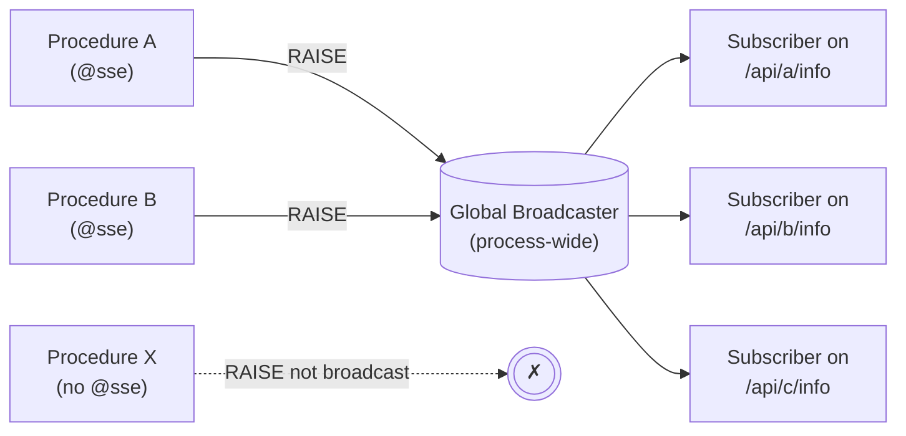
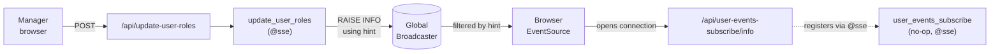

# SSE

::: info Also known as
`sse_events_path`, `sse_path` (with or without `@` prefix)
:::

Enable Server-Sent Events (SSE) streaming for the endpoint.

## How events flow

`@sse` is the only SSE annotation that affects runtime behavior on its own, and it does **two independent things**:

1. **Registers a connection URL** at `<endpoint-path>/<level>` — clients open an `EventSource` against it to listen.
2. **Enables broadcasting from this procedure** — `RAISE` statements inside this procedure's body forward their notices to the SSE broadcaster.

A procedure without `@sse` can `RAISE` whatever it wants — those notices never reach SSE subscribers.



There is **one process-wide broadcaster**. Every connected `EventSource` reads from the same stream regardless of which `/info` URL it opened — the URL is just an entry point, not a topic name. Once a connection is established, the path it came in through is no longer used for routing.

Per-event filtering decides which subscribers actually receive each event:

- The originating endpoint's [scope](sse-events-scope.md) (`matching` / `authorize` / `all`).
- An optional `RAISE ... USING HINT` override, parsed as `<scope> [value1] [value2] ...`.
- Optional execution-ID correlation via the `X-NpgsqlRest-ID` header.

::: warning Common pitfall
**The URL is not a topic.** Subscribers on `/api/foo/info` and `/api/bar/info` do not see different streams — they see the same stream. If you want events from procedure B to reach clients connected to procedure A's URL, **both procedures must have `@sse`**: A so clients can connect, B so its `RAISE`s broadcast. See the [cross-procedure pattern](#cross-procedure-pattern) below.
:::

## Syntax

```
@sse
@sse <path>
@sse <path> on <level>
```

**level**: `info`, `notice`, `warning`

## SSE Path Construction

The SSE endpoint path is constructed by **appending** the SSE path segment to the **original endpoint path**.

### When Path is Omitted

When the path is omitted (`@sse` without arguments), the SSE path segment defaults to the **notice level name in lowercase**:

| Level | SSE Path Segment |
|-------|------------------|
| `INFO` (default) | `info` |
| `NOTICE` | `notice` |
| `WARNING` | `warning` |

**Example:** If your endpoint path is `/api/my-function` and you use `@sse` without arguments, the SSE endpoint will be at `/api/my-function/info` (since `INFO` is the default level).

### When Custom Path is Specified

When you specify a custom path (`@sse my_events`), that path segment is appended to the endpoint path.

**Example:** If your endpoint path is `/api/my-function` and you use `@sse my_events`, the SSE endpoint will be at `/api/my-function/my_events`.

## Default Level

The default notice level is **`INFO`**. This can be changed globally via the [`DefaultServerSentEventsEventNoticeLevel`](../config/npgsqlrest#server-sent-events) configuration setting.

## Level Filtering

::: warning Important
SSE events are sent **only for the exact level specified**, not for "this level and above".
:::

When you set the level to `NOTICE`, only `RAISE NOTICE` statements will generate SSE events. `RAISE INFO` and `RAISE WARNING` statements will **not** generate SSE events for that endpoint.

| Configured Level | `RAISE INFO` | `RAISE NOTICE` | `RAISE WARNING` |
|------------------|--------------|----------------|-----------------|
| `INFO` | Sent | Not sent | Not sent |
| `NOTICE` | Not sent | Sent | Not sent |
| `WARNING` | Not sent | Not sent | Sent |

If you need events from multiple levels, create separate SSE endpoints for each level.

## Examples

### Basic SSE Endpoint (function)

```sql
create function long_running_process(_id int)
returns void
language plpgsql
as $$
begin
  raise info 'Starting process...';
  -- do work
  raise info 'Progress: 50%%';
  -- more work
  raise info 'Complete!';
end;
$$;

comment on function long_running_process(int) is
'HTTP POST
@sse events';
```

If the endpoint is at `/api/long-running-process`, the SSE endpoint will be at `/api/long-running-process/events`. It receives `RAISE INFO` messages (the default level).

### Basic SSE Endpoint (SQL file)

The same behavior, expressed as a SQL file:

```sql
/*
HTTP POST
@sse events
@param $1 _id int
@void
*/
do $$
begin
    raise info 'Starting process...';
    -- do work
    raise info 'Progress: 50%%';
    -- more work
    raise info 'Complete!';
end;
$$;
```

For files placed under the configured `Path` with the default `CommentsMode`, the leading comment block carries the same annotations as a function comment.

### With Notice Level

```sql
comment on function background_task() is
'HTTP POST
@sse updates on notice';
```

If the endpoint is at `/api/background-task`, the SSE endpoint will be at `/api/background-task/updates`. It receives **only** `RAISE NOTICE` messages.

### Warning Level Only

```sql
comment on function critical_job() is
'HTTP POST
@sse alerts on warning';
```

If the endpoint is at `/api/critical-job`, the SSE endpoint will be at `/api/critical-job/alerts`. It receives **only** `RAISE WARNING` messages.

### Using Default Path (Level Name)

```sql
comment on function my_process() is
'HTTP POST
@sse';
```

If the endpoint is at `/api/my-process`, the SSE endpoint will be at `/api/my-process/info` (default path segment from the default `INFO` level).

```sql
comment on function my_process() is
'HTTP POST
@sse_events_level notice
@sse';
```

If the endpoint is at `/api/my-process`, the SSE endpoint will be at `/api/my-process/notice` (path segment derived from the configured `NOTICE` level).

## Cross-procedure pattern

The single-procedure case (one procedure both broadcasts and exposes the URL) is straightforward. But sometimes the procedure that **triggers** an event isn't the one that should be the **client subscription URL**. Common reasons:

- The trigger has restrictive authorization (e.g. `manager` only) but listeners are regular users.
- Multiple triggers feed one logical stream — having a stable subscribe URL keeps the client code simple as new triggers are added.
- The semantic name of the trigger (`update_user_roles`) reads wrong as a client-facing URL.

The pattern: split publish from subscribe across two procedures, each with `@sse`. Annotate the trigger so its `RAISE`s broadcast; annotate a no-op procedure so its URL is the stable client entry point. Use `RAISE ... USING HINT` inside the trigger to scope events per user.



### Function form

```sql
-- Subscribe URL: a no-op procedure whose @sse only registers the URL.
-- Annotated 'authorize' so any authenticated user can connect.
create procedure user_events_subscribe()
language plpgsql as $$ begin perform 1; end; $$;

comment on procedure user_events_subscribe() is '
HTTP GET
@authorize
@sse
@sse_scope authorize';

-- Emitter: the procedure that actually causes events. @sse is required
-- here too — without it, the RAISE never reaches the broadcaster.
create procedure update_user_roles(_target_user_id int, _roles text[])
language plpgsql as $$
begin
    -- ... do the role update ...
    raise info 'roles updated'
        using hint = format('authorize %s', _target_user_id);
end;
$$;

comment on procedure update_user_roles(int, text[]) is '
HTTP POST
@authorize manager
@sse
@sse_scope authorize';
```

### SQL file form

The same shape, expressed as two files. `@sse` and `@sse_scope` work identically; the no-op subscribe file is just a body that does nothing.

```sql
-- file: sql/user-events-subscribe.sql
/*
HTTP GET
@authorize
@sse
@sse_scope authorize
@void
*/
select 1;
```

```sql
-- file: sql/update-user-roles.sql
/*
HTTP POST
@authorize manager
@sse
@sse_scope authorize
@param $1 _target_user_id int
@param $2 _roles text[]
@void
*/
do $$
declare
    _target_user_id int = $1;
    _roles text[]    = $2;
begin
    -- ... do the role update ...
    raise info 'roles updated'
        using hint = format('authorize %s', _target_user_id);
end;
$$;
```

### What the client does

```ts
const eventSource = new EventSource('/api/user-events-subscribe/info');

eventSource.onmessage = () => {
    // ... handle the event ...
};
```

Clients open `EventSource` once against `/api/user-events-subscribe/info`. When `update_user_roles` runs, its `RAISE` flows through the global broadcaster, every subscriber receives it, and the per-event hint (`authorize <target_user_id>`) ensures only the affected user's connection writes the data line. The fact that the event came from a different URL than the one the client subscribed to is invisible to both sides — they share the broadcaster.

The `@sse` on `update_user_roles` is what enables broadcasting; the `@sse` on `user_events_subscribe` is what gives clients a stable, semantically meaningful URL to open. They serve different purposes despite using the same annotation.

## Behavior

`@sse` affects the procedure on two sides — its execution and its URL. Each side is independent, even though one annotation enables both.

### On the publisher side

What `@sse` does to the procedure's execution:

- Subscribes to PostgreSQL notices on the connection during the procedure's execution.
- Filters by the configured level (only `RAISE` statements matching that level are forwarded).
- Pushes matching notices to the global broadcaster, tagged with the originating endpoint's metadata and the optional `X-NpgsqlRest-ID` header for execution-ID correlation.
- Procedures without `@sse` skip this entire path — their notices are not visible to any subscriber.

### On the subscriber side

What `@sse` does to the procedure's URL:

- Registers `<endpoint-path>/<level>` as an SSE connection URL (or the custom path you specified).
- Connections to this URL are pure listeners — they never invoke the procedure body.
- Each connection iterates the broadcaster's stream and decides per-event whether to write to the response, based on the originating endpoint's scope and any `HINT` override.

Because the URL is a connection point and not a topic, subscribers on different `@sse` URLs see the same stream. Use the URL primarily to give clients a stable, meaningful connection address and to scope which roles can subscribe (via the procedure's regular authorization).

## Related

- [Server-Sent Events Guide](../guide/sse) — the full walkthrough
- [NpgsqlRest Options configuration](../config/npgsqlrest) - Configure SSE options
- [Comment Annotations Guide](../guide/annotations) - How annotations work
- [Configuration Guide](../guide/configuration) - How configuration works

## Related Annotations

- [SSE_EVENTS_LEVEL](./sse-events-level) - Set notice level
- [SSE_EVENTS_SCOPE](./sse-events-scope) - Set distribution scope

## See Also

- [NpgsqlRest Options](/config/npgsqlrest) - SSE configuration settings
