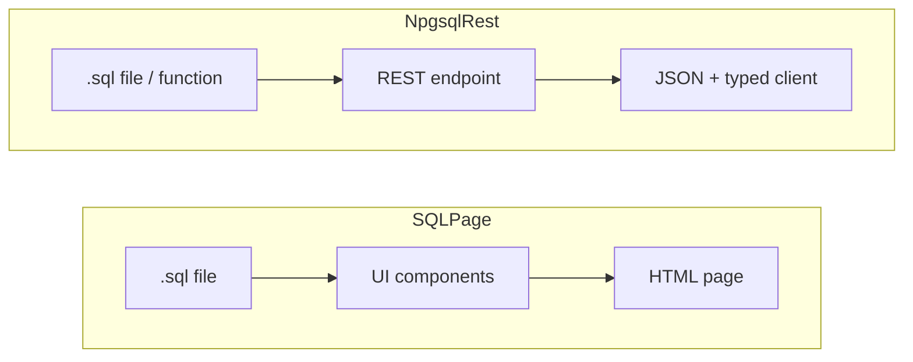
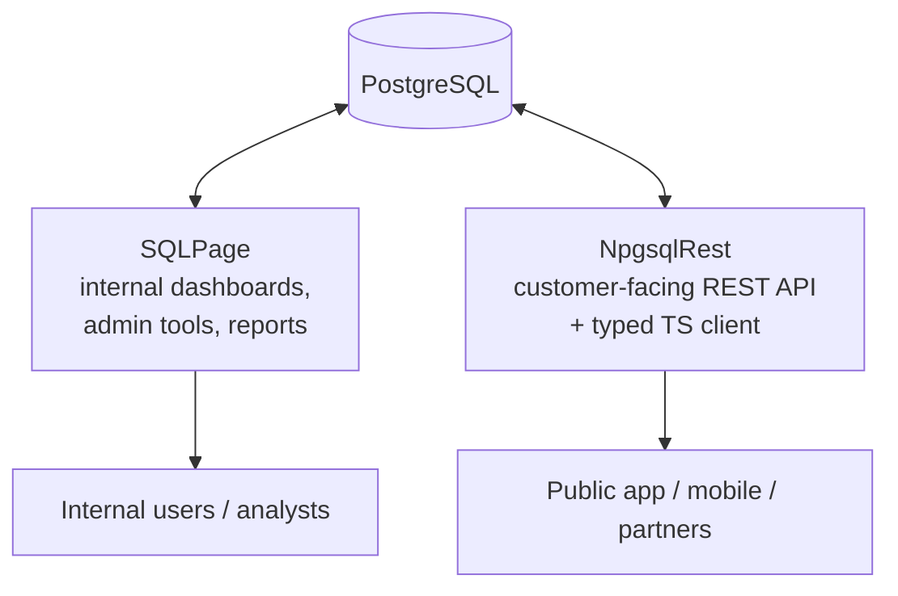

# NpgsqlRest vs SQLPage: Two SQL-First Tools, Two Different Layers

<p class="blog-meta">
<span class="tag">Comparison</span> · <span class="tag">SQLPage</span> · <span class="tag">SQL-First</span> · <span class="tag">June 2026</span>
</p>

---

Most comparisons on this site put NpgsqlRest next to other tools that do the same job — turning PostgreSQL into a REST API. [PostgREST and Supabase](/blog/npgsqlrest-vs-postgrest-supabase-comparison) are direct competitors in that sense: all three answer the same question.

[SQLPage](https://sql-page.com) is different. It shares NpgsqlRest's core idea — **write SQL, not application code** — but it spends that idea on the *other* end of the stack. SQLPage renders **web UIs** from SQL. NpgsqlRest serves **REST APIs** from SQL. So this isn't a "which one wins" piece. It's a map of where each one fits — and they fit together more often than they compete.

## The shared idea

Both tools belong to the same family: logic and data live in the database, and a single self-contained binary turns SQL into something a browser can use — no ORM, no hand-written backend, no separate runtime.

| Shared foundation | NpgsqlRest | SQLPage |
|---|:---:|:---:|
| SQL-first (`.sql` files are the unit of work) | ✅ | ✅ |
| Single self-contained binary | ✅ (.NET) | ✅ (Rust) |
| Connects directly to the database | ✅ | ✅ |
| Built-in authentication & sessions | ✅ | ✅ |
| File uploads | ✅ | ✅ |
| CSV export | ✅ | ✅ |
| Open source | ✅ | ✅ (MIT) |
| Trivial deployment (copy binary, run) | ✅ | ✅ |

If you like the SQL-first philosophy, you'll feel at home in either. The difference is what comes *out* of the binary.

## The fork in the road



**SQLPage maps SQL results to UI components and streams back an HTML page.** Each `.sql` file is a page. You pick a component (`list`, `card`, `chart`, `form`, `table`, `map`…) and feed it rows. There is no separate frontend — SQLPage *is* the frontend.

**NpgsqlRest maps SQL files and functions to REST endpoints and returns JSON.** Each `.sql` file or routine is an API endpoint. There is no UI — you consume the API from your own frontend (often with a [generated TypeScript client](/config/codegen)), a mobile app, or another service.

That single difference — **HTML out vs JSON out** — is what everything else follows from.

## Where SQLPage is stronger: the UI

This is SQLPage's whole identity, and it's genuinely strong. Building a page is a couple of `SELECT`s:

```sql
-- users.sql — a complete, working web page
SELECT 'list' AS component, 'Users' AS title;
SELECT name AS title, email AS description, '/user.sql?id=' || id AS link
FROM users
ORDER BY name;
```

Want a bar chart instead? Change the component name:

```sql
SELECT 'chart' AS component, 'Monthly sales' AS title, 'bar' AS type;
SELECT month AS x, total AS y FROM sales ORDER BY month;
```

SQLPage ships **50+ components** — tables, cards, forms, charts, maps (with PostGIS/Spatialite), timelines, carousels, steps — plus password auth, form handling, and even multi-database support (PostgreSQL, MySQL/MariaDB, SQLite, SQL Server, and ODBC sources like DuckDB, ClickHouse, Snowflake, and BigQuery). For an internal dashboard, an admin panel, or a data-entry tool, you can have a working interface in minutes with **zero frontend code**.

**NpgsqlRest does not do this.** It does not render SQL results into UI components. What it offers on the frontend side is the *plumbing* to build your own UI:

- **[TypeScript/JavaScript client generation](/config/codegen)** — typed fetch modules generated from your endpoints, so your hand-built frontend stays in sync with the database
- **[Static file serving](/config/static-files)** — host your frontend (or any static site) directly from the same binary
- **[Template parsing](/config/static-files#content-parsing)** — substitute `{claimType}` placeholders (name, email, role) into HTML before serving

That's useful, but it's not a UI builder. **If "render a UI from SQL" is the goal, SQLPage wins decisively.**

## Where NpgsqlRest is stronger: the API

SQLPage *can* emit JSON — it has a `json` component, and with `sqlpage.request_method()` you can branch on GET/POST/PUT/DELETE and hand-roll an endpoint:

```sql
-- A JSON endpoint in SQLPage — manual, one file at a time
SELECT 'json' AS component, 'array' AS type;
SELECT id, name, email FROM users ORDER BY name;
```

That's fine for a simple read endpoint. SQLPage routes it automatically — like NpgsqlRest, dropping a `.sql` file gives you a URL with no route registration. But the file is an *imperative script that happens to output JSON*, not a declared endpoint. There's no inferred contract — no typed parameters, no OpenAPI, no client codegen, no per-endpoint policy. Every method check, status code, and header is something you write by hand in SQL.

NpgsqlRest is built around the API. The same kind of endpoint is generated automatically, and configured declaratively in a SQL comment:

```sql
create function api.get_user(p_id int)
returns setof user_info
language sql
begin atomic;
select id, name, email, role from users where id = p_id;
end;

comment on function api.get_user(int) is '
HTTP GET /users/{p_id}
@authorize admin, user
@cached
@cache_expires_in 300
@rate_limiter_policy standard
';
```

And it brings the rest of the API platform with it:

| API capability | NpgsqlRest | SQLPage |
|---|:---:|:---:|
| File-based routing (drop a `.sql` file, get a URL) | ✅ | ✅ |
| Expose existing functions/procedures as endpoints (no file) | ✅ | ❌ |
| Inferred HTTP contract (typed params, method, response shape) | ✅ | ❌ (imperative script per file) |
| Path parameters (`/users/{id}`), method routing, function overloading | ✅ | ❌ |
| OpenAPI / Swagger generation | ✅ | ❌ |
| TypeScript client codegen + `.http` test files | ✅ | ❌ |
| Per-endpoint caching (memory/Redis/hybrid) | ✅ | ❌ |
| Per-endpoint rate limiting (partitioned per user/IP) | ✅ | ❌ |
| Declarative auth schemes (JWT, encrypted Bearer/Cookie, OAuth, Passkey) | ✅ | ⚠️ basic |
| Reverse proxy & [HTTP client types](/config/http-client) (call external APIs from SQL) | ✅ | ❌ |
| Server-Sent Events streaming | ✅ | ❌ |
| Error policies (RFC 7807, per-endpoint status mapping) | ✅ | ❌ |
| Security headers, health checks, OpenTelemetry | ✅ | ❌ |

⚠️ SQLPage has password/session auth aimed at protecting *pages*, not the multi-scheme token model an API needs.

**If "serve a typed, policy-rich API to a frontend, mobile app, or other service" is the goal, NpgsqlRest wins decisively.**

## They're complementary, not rivals

Here's the part most "X vs Y" posts miss: because they target different layers, **you can run both against the same PostgreSQL database** — and it's a good architecture.



A common split:

- **SQLPage for the inside** — the ops dashboard, the admin panel, the quick report a colleague needs by Friday. Things where the audience is internal and a generated UI is exactly enough.
- **NpgsqlRest for the outside** — the customer-facing API behind your product's frontend or mobile app, where you need a stable contract, typed clients, caching, rate limiting, and real auth.

Both read the same tables and call the same functions. Your business logic stays in one place — the database — which is the whole point of the [SQL-first / business-rules-in-the-database](/blog/the-power-of-simplicity) approach both tools share.

## When to choose each

**Reach for SQLPage when:**

- You need an internal tool, dashboard, or admin UI *fast*, with no frontend stack
- Your audience is analysts or internal users, not a public API consumer
- You want UI components (charts, maps, forms) generated straight from queries
- You're on MySQL, SQLite, SQL Server, or a warehouse like DuckDB/ClickHouse/Snowflake — SQLPage is multi-database; NpgsqlRest is PostgreSQL-only

**Reach for NpgsqlRest when:**

- You're building an **API** — for your own frontend, a mobile app, partners, or AI agents
- You want endpoints generated automatically with OpenAPI, typed TypeScript clients, and `.http` test files
- You need production API concerns: caching, rate limiting, multiple auth schemes, retry, proxying external services, SSE
- You want per-endpoint configuration version-controlled in SQL comments
- You're on PostgreSQL and want to go deep on it

**Reach for both when** you have an internal side *and* an external side — which most real products do.

## Conclusion

SQLPage and NpgsqlRest answer different questions with the same philosophy. SQLPage asks *"how do I get a UI out of SQL?"* and answers it beautifully. NpgsqlRest asks *"how do I get a production API out of SQL?"* and answers that. Neither is a worse version of the other — they sit one layer apart.

If you've already adopted the SQL-first mindset, the honest takeaway isn't "switch." It's: use SQLPage where you need a screen, use NpgsqlRest where you need an endpoint, and let both lean on the same PostgreSQL so your logic never gets duplicated.

---

<BlogNav
  :get-started="[
    { text: 'Installation Guide', href: '/guide/installation' },
    { text: 'Quick Start', href: '/guide/quick-start' },
    { text: 'SQL File Source', href: '/config/sql-file-source' },
    { text: 'TypeScript Code Generation', href: '/config/codegen' }
  ]"
/>
