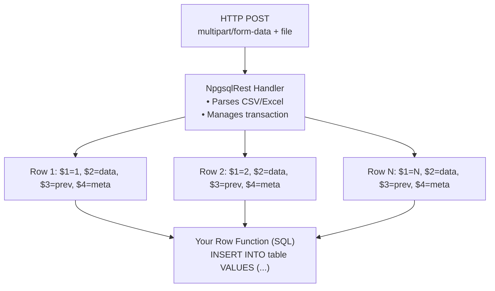

# CSV and Excel Ingestion Made Easy: PostgreSQL Row Processing with NpgsqlRest

<p class="blog-meta">
  <span>January 2026</span> ·
  <span class="tag">CSV</span>
  <span class="tag">Excel</span>
  <span class="tag">PostgreSQL</span>
  <span class="tag">Data Import</span>
  <span class="tag">NpgsqlRest</span>
</p>

Importing CSV and Excel files into PostgreSQL is one of the most common data engineering tasks. Traditional approaches require you to **know the file structure in advance**, hardcode that structure into your application code, and **redeploy on every change**.

What if you could handle any file structure dynamically, adjust to changes without redeployment, and reduce hundreds of lines of code to a single SQL function?

This tutorial demonstrates how NpgsqlRest's CSV and Excel upload handlers transform file ingestion into a declarative, row-by-row processing pipeline - with automatic TypeScript client generation and progress tracking included.

> **Source Code**: [github.com/NpgsqlRest/npgsqlrest-docs/examples/7_csv_excel_uploads](https://github.com/NpgsqlRest/npgsqlrest-docs/tree/main/examples/7_csv_excel_uploads)

## The Traditional Approach: Rigid and Brittle

With traditional CSV/Excel import implementations, you must:

1. **Know the exact structure** before writing code
2. **Hardcode column mappings** into your application
3. **Redeploy the application** whenever the file format changes
4. **Maintain separate code paths** for different file types

And that's just the structure problem. You also need to:

- **Choose and configure a parsing library** (pandas, Apache Commons CSV, csv-parse, ExcelDataReader...)
- **Write file upload handling** with multipart/form-data parsing
- **Implement transaction management** (BEGIN, COMMIT, ROLLBACK)
- **Handle validation** (MIME types, file size limits, format checking)
- **Integrate authentication** to track who uploaded what
- **Write error handling** for malformed files and partial failures
- **Create TypeScript types** manually for the frontend

This creates a rigid system where a simple change like adding a column requires code changes, testing, and redeployment - not to mention the hundreds of lines of boilerplate code you have to write and maintain just to get the basics working.

## The NpgsqlRest Approach: Dynamic and Flexible

NpgsqlRest takes a fundamentally different approach. **All of that boilerplate comes out of the box:**

- CSV and Excel parsing? **Built-in.**
- File upload handling? **Built-in.**
- Transaction management? **Built-in.**
- MIME type validation? **Built-in.**
- Authentication integration? **Built-in.**
- Error handling and rollback? **Built-in.**
- TypeScript client with progress tracking? **Auto-generated.**

**Your row function receives a `text[]` array containing whatever is in the row.** That's it. No hardcoded structure, no column mappings in application code, no redeployment when formats change.

Simply put:
- Your row function is **executed for every row** in the file
- You receive **dynamic data as `text[]`** - the raw values from that row
- You receive **upload metadata** - file name, content type, user claims
- You receive **the result from the previous row** - enabling accumulation patterns (like returning the last inserted ID)

When the file structure changes, you just `ALTER` or `CREATE OR REPLACE` your row function. No application restart required.

## How It Works



NpgsqlRest:
1. **Receives the upload** via HTTP multipart/form-data
2. **Parses the file** using optimized C# libraries (CsvHelper for CSV, ExcelDataReader for Excel)
3. **Calls your SQL function** for each row, passing the data as a text array
4. **Manages the transaction** - all rows succeed or all are rolled back
5. **Returns metadata** about the upload to your main function

## The Row Function: Four Parameters, Infinite Flexibility

| Parameter | Type | Description |
|-----------|------|-------------|
| `$1` | `int` | Row index (1-based) |
| `$2` | `text[]` | Row values as a text array - **whatever is in the row** |
| `$3` | `any` | Result from previous row (for chaining/accumulation) |
| `$4` | `json` | Metadata (file name, MIME type, user claims, etc.) |

### CSV Row Function Example

```sql
create or replace function example_7.csv_upload_row(
    _index int,           -- Row number (1-based)
    _row text[],          -- Row data: _row[1], _row[2], etc. - dynamic!
    _prev_result int,     -- Return value from previous row call
    _meta json            -- Metadata: fileName, contentType, size, claims
)
returns int
language plpgsql
as $$
begin
    insert into example_7.csv_uploads (user_id, file_name, row_index, row_data)
    values (
        (_meta->'claims'->>'user_id')::int,  -- User ID from auth claims
        _meta->>'fileName',                   -- Original file name
        _index,                               -- Row number
        coalesce(_row, '{}')                  -- Row data as array
    );

    -- Return count for chaining - passed to next row as $3
    return coalesce(_prev_result, 0) + 1;
end;
$$;
```

### Excel Row Function Example

Excel is nearly identical, but includes sheet name and actual Excel row index in metadata:

```sql
create or replace function example_7.excel_upload_row(
    _index int,
    _row text[],
    _prev_result int,
    _meta json
)
returns int
language plpgsql
as $$
begin
    insert into example_7.excel_uploads (user_id, file_name, sheet_name, row_index, row_data)
    values (
        (_meta->'claims'->>'user_id')::int,
        _meta->>'fileName',
        _meta->>'sheet',        -- Sheet name (Excel only)
        _index,
        coalesce(_row, '{}')
    );

    return coalesce(_prev_result, 0) + 1;
end;
$$;
```

**The same row function works for both CSV and Excel** with minor metadata differences. You can even reuse the same function for both if you don't need sheet-specific handling.

## Row Chaining: The Power of `$3`

The `$3` parameter (`_prev_result`) receives whatever the previous row's function call returned. For the first row, it's `NULL`. This enables powerful accumulation patterns:

**Counting rows:**
```sql
return coalesce(_prev_result, 0) + 1;  -- Returns 1, 2, 3, ... N
```

**Returning the last inserted ID:**
```sql
-- Insert and return the new ID
insert into orders (...) values (...) returning id into _new_id;
return _new_id;  -- Next row receives this as _prev_result
```

**Summing a column:**
```sql
return coalesce(_prev_result, 0) + (_row[3])::numeric;  -- Sum column 3
```

**Building a running list:**
```sql
return coalesce(_prev_result, '[]'::json) || json_build_array(_row[1]);
```

The final return value is included in the upload metadata as `lastResult` (CSV) or `result` (Excel).

## The Upload Endpoint Function

The main upload function receives metadata about all processed files:

```sql
create or replace function example_7.csv_upload(
    _meta json = null
)
returns json
language sql
begin atomic;
select _meta;
end;

comment on function example_7.csv_upload(json) is '
HTTP POST
@upload for csv
@param _meta is upload metadata
@delimiters = ,;
@row_command = select example_7.csv_upload_row($1,$2,$3,$4)';
```

That's it. This annotation:
- Creates a `POST /api/example-7/csv-upload` endpoint
- Configures the CSV parser to accept `,` and `;` as delimiters
- Specifies which function processes each row
- Injects upload metadata into `_meta`

### Upload Metadata Structure

The `_meta` parameter receives a JSON **array** with one element per uploaded file:

```json
[
  {
    "type": "csv",
    "fileName": "sales_data.csv",
    "contentType": "text/csv",
    "size": 45678,
    "success": true,
    "status": "Ok",
    "lastResult": 1247
  }
]
```

For Excel with multiple sheets (`all_sheets = true`), you get one entry per sheet:

```json
[
  {
    "type": "excel",
    "fileName": "report.xlsx",
    "sheet": "January",
    "success": true,
    "rows": 450,
    "result": 450
  },
  {
    "type": "excel",
    "fileName": "report.xlsx",
    "sheet": "February",
    "success": true,
    "rows": 380,
    "result": 380
  }
]
```

## Dynamic Structure: No Hardcoding, No Redeployment

The `text[]` approach is the key to flexibility:

**Store raw, process later:**
```sql
-- Accept ANY file structure without schema changes
insert into raw_imports (source, row_index, data, imported_at)
values (
    _meta->>'fileName',
    _index,
    _row,  -- Store the entire text[] as-is
    now()
);
```

**Transform when you know the structure:**
```sql
-- File structure: name, email, signup_date
create or replace function process_user_import(
    _index int,
    _row text[],
    _prev_result int,
    _meta json
)
returns int
language plpgsql
as $$
begin
    -- Skip header row
    if _index = 1 then
        return 0;
    end if;

    insert into users (name, email, signup_date, imported_by)
    values (
        _row[1],                              -- Name (text)
        lower(trim(_row[2])),                 -- Email (normalized)
        _row[3]::date,                        -- Signup date (cast to date)
        (_meta->'claims'->>'user_id')::int    -- Importing user
    );

    return coalesce(_prev_result, 0) + 1;
end;
$$;
```

**When the structure changes**, just update the function:

```sql
-- New file structure: name, email, phone, signup_date
create or replace function process_user_import(...)
...
    insert into users (name, email, phone, signup_date, imported_by)
    values (
        _row[1],
        lower(trim(_row[2])),
        _row[3],           -- New phone column
        _row[4]::date,     -- signup_date moved to column 4
        (_meta->'claims'->>'user_id')::int
    );
...
```

**No application restart. No redeployment. Instant effect.**

## Configuration

Enable CSV and Excel handlers in `config.json`:

```json
{
  "NpgsqlRest": {
    "UploadOptions": {
      "Enabled": true,

      "UploadHandlers": {
        "CsvUploadEnabled": true,
        "CsvUploadKey": "csv",
        "CsvUploadDelimiterChars": ",;",
        "CsvUploadHasFieldsEnclosedInQuotes": true,
        "CsvUploadSetWhiteSpaceToNull": true,

        "ExcelUploadEnabled": true,
        "ExcelUploadKey": "excel",
        "ExcelAllSheets": true,
        "ExcelDateFormat": "yyyy-MM-dd",
        "ExcelTimeFormat": "HH:mm:ss",
        "ExcelDateTimeFormat": "yyyy-MM-dd HH:mm:ss"
      }
    }
  }
}
```

## Annotation Options

### CSV Handler Options

| Option | Default | Description |
|--------|---------|-------------|
| `row_command` | (required) | SQL command to process each row |
| `delimiters` | `,` | Delimiter character(s) for parsing |
| `has_fields_enclosed_in_quotes` | `true` | Fields may be enclosed in quotes |
| `set_white_space_to_null` | `true` | Convert whitespace-only values to NULL |

### Excel Handler Options

| Option | Default | Description |
|--------|---------|-------------|
| `row_command` | (required) | SQL command to process each row |
| `sheet_name` | `null` | Specific sheet to process (first sheet if null) |
| `all_sheets` | `false` | Process all sheets in workbook |
| `time_format` | `HH:mm:ss` | Format for time values |
| `date_format` | `yyyy-MM-dd` | Format for date values |
| `datetime_format` | `yyyy-MM-dd HH:mm:ss` | Format for datetime values |
| `row_is_json` | `false` | Pass row as JSON instead of text array |
| `fallback_handler` | `null` | Handler name to delegate to if format validation fails (e.g., `csv`). Available on all upload handlers since 3.8.0 (previously Excel-only). |

## Row Metadata Differences: CSV vs Excel

**CSV row metadata (`$4`):**
```json
{
  "type": "csv",
  "fileName": "data.csv",
  "contentType": "text/csv",
  "size": 12345,
  "claims": { "user_id": "1", "username": "alice" }
}
```

**Excel row metadata (`$4`):**
```json
{
  "type": "excel",
  "fileName": "data.xlsx",
  "contentType": "application/vnd.openxmlformats-officedocument.spreadsheetml.sheet",
  "size": 67890,
  "sheet": "Sheet1",
  "rowIndex": 5,
  "claims": { "user_id": "1", "username": "alice" }
}
```

Key difference: Excel includes `sheet` (current sheet name) and `rowIndex` (actual Excel row number including empty rows). CSV does not have these - use `$1` for the row index.

## Generated TypeScript Client

NpgsqlRest automatically generates a TypeScript client with progress tracking:

```typescript
// Auto-generated - you write ZERO of this code

interface ICsvUploadResponse {
    type: string;
    fileName: string;
    contentType: string;
    size: number;
    success: boolean;
    status: string;
    [key: string]: string | number | boolean;
}

export async function csvUpload(
    files: FileList | null,
    request: ICsvUploadRequest,
    progress?: (loaded: number, total: number) => void,
): Promise<{
    status: number,
    response: ICsvUploadResponse[],
    error: {status: number; title: string; detail?: string | null} | undefined
}> {
    return new Promise((resolve, reject) => {
        if (!files || files.length === 0) {
            reject(new Error("No files to upload"));
            return;
        }
        var xhr = new XMLHttpRequest();
        if (progress) {
            xhr.upload.addEventListener("progress", (event) => {
                if (event.lengthComputable && progress) {
                    progress(event.loaded, event.total);
                }
            }, false);
        }
        xhr.onload = function () {
            if (this.status >= 200 && this.status < 300) {
                resolve({status: this.status, response: JSON.parse(this.responseText), error: undefined});
            } else {
                resolve({status: this.status, response: [], error: JSON.parse(this.responseText)});
            }
        };
        xhr.onerror = function () {
            reject({xhr: this, status: this.status, statusText: this.statusText});
        };
        xhr.open("POST", baseUrl + "/api/example-7/csv-upload" + parseQuery(request));
        const formData = new FormData();
        for(let i = 0; i < files.length; i++) {
            formData.append("file", files[i], files[i].name);
        }
        xhr.send(formData);
    });
}
```

Using it in your frontend:

```typescript
import { csvUpload } from "./example7Api.ts";

const response = await csvUpload(
    fileInput.files,
    {},
    (loaded, total) => {
        const percent = Math.round((loaded / total) * 100);
        progressBar.style.width = `${percent}%`;
    }
);

if (response.status === 200) {
    console.log(`Imported ${response.response[0].lastResult} rows`);
}
```

## Advanced Patterns

### Skipping Header Rows

```sql
if _index = 1 then
    return null;  -- Skip header, don't increment counter
end if;
```

### Validation and Rejection

```sql
-- Validate required fields
if _row[1] is null or _row[2] is null then
    raise exception 'Row % missing required fields', _index;
end if;

-- Validate format
if _row[3] !~ '^\d{4}-\d{2}-\d{2}$' then
    raise exception 'Row % has invalid date format: %', _index, _row[3];
end if;
```

### Upsert (Insert or Update)

```sql
insert into products (sku, name, price)
values (_row[1], _row[2], _row[3]::numeric)
on conflict (sku) do update set
    name = excluded.name,
    price = excluded.price,
    updated_at = now();
```

### Processing Only Specific Sheets

```sql
comment on function excel_upload(json) is '
HTTP POST
@upload for excel
@sheet_name = Transactions
@row_command = select process_transaction_row($1,$2,$3,$4)';
```

### JSON Row Format for Complex Data

```sql
comment on function excel_upload(json) is '
HTTP POST
@upload for excel
@row_is_json = true
@row_command = select process_json_row($1,$2,$3,$4)';
```

With `row_is_json = true`, `$2` becomes JSON with Excel cell references as keys:
```json
{"A1": "Name", "B1": "Amount", "C1": 123.45}
```

## Transaction Safety

All row commands execute within a single transaction. If any row fails:
- All previous inserts are rolled back
- Error is returned to the client
- No partial imports

This is automatic - you don't write transaction handling code.

## Combining Handlers: Process AND Store the Original File

You can combine CSV/Excel handlers with `file_system` or `large_object` handlers to both process the rows AND store the original file. This is useful when you need to:

- Keep the original file for audit/compliance
- Allow users to download the source file later
- Reprocess the file if business logic changes

```sql
comment on function example_7.csv_upload(json) is '
HTTP POST
@upload for csv, large_object
@param _meta is upload metadata
@row_command = select example_7.csv_upload_row($1,$2,$3,$4)';
```

The handler list is comma-separated. With this configuration:
1. The CSV handler processes each row via `row_command`
2. The [Large Object handler](/blog/secure-image-uploads-postgresql-typescript#large-object-handler) stores the original file in PostgreSQL
3. **Both operate within the same transaction**

### Combined Handler Metadata

When using multiple handlers, your upload function receives a JSON **array** with one entry per handler:

```json
[
  {
    "type": "csv",
    "fileName": "data.csv",
    "contentType": "text/csv",
    "size": 12345,
    "success": true,
    "status": "Ok",
    "lastResult": 500
  },
  {
    "type": "large_object",
    "fileName": "data.csv",
    "contentType": "text/csv",
    "size": 12345,
    "success": true,
    "status": "Ok",
    "oid": 16456
  }
]
```

The CSV entry contains `lastResult` (final row function return value), while the Large Object entry contains `oid` (PostgreSQL Large Object identifier for retrieving the file later).

You can store both in your database:

```sql
insert into csv_imports (file_name, rows_processed, original_file_oid)
select
    m->>'fileName',
    (m->>'lastResult')::int,
    (select (x->>'oid')::bigint from json_array_elements(_meta) x where x->>'type' = 'large_object')
from json_array_elements(_meta) m
where m->>'type' = 'csv' and (m->>'success')::boolean = true;
```

If any row command fails or raises an exception, the entire transaction rolls back - including the Large Object storage. The original file won't be saved if processing fails.

This gives you the best of both worlds: structured data extraction with original file preservation, all with transactional consistency.

For more details on Large Object and File System handlers, see [Secure Image Uploads with PostgreSQL](/blog/secure-image-uploads-postgresql-typescript).

## Fallback Handler: One Endpoint for Both Excel and CSV

::: info Updated in 3.8.0
The `fallback_handler` parameter is now available on **all** upload handlers (previously Excel-only). This enables scenarios like CSV format check fails on a binary file → fall back to `large_object` or `file_system` to save the raw file.
:::

Sometimes users don't know (or care) whether their file is `.xlsx` or `.csv` - they just want to upload it. With the `fallback_handler` parameter, you can create a single upload endpoint that tries Excel first and automatically falls back to CSV if the file isn't a valid Excel format:

```sql
create or replace function example_7.combined_upload(
    _meta json = null
)
returns json
language sql
begin atomic;
select _meta;
end;

comment on function example_7.combined_upload(json) is '
HTTP POST
@authorize
@upload for excel
@param _meta is upload metadata
@all_sheets = true
@fallback_handler = csv
@row_command = select example_7.combined_upload_row($1,$2,$3,$4)';
```

When `@fallback_handler = csv` is set:
1. The Excel handler (ExcelDataReader) tries to parse the uploaded file first
2. If it fails (invalid Excel format), the handler automatically delegates to the CSV handler
3. The same `@row_command` is used for both - your row function receives `text[]` either way

This is simpler than the [combined handler approach](#combining-handlers-process-and-store-the-original-file) when you just want to accept either format. No need for separate endpoints - one function handles both:

```sql
create or replace function example_7.combined_upload_row(
    _index int,
    _row text[],
    _prev_result int,
    _meta json
)
returns int
language plpgsql
as $$
begin
    insert into example_7.combined_uploads (user_id, file_name, sheet_name, row_index, row_data)
    values (
        (_meta->'claims'->>'user_id')::int,
        _meta->>'fileName',
        _meta->>'sheet',    -- NULL for CSV, sheet name for Excel
        _index,
        coalesce(_row, '{}')
    );

    return coalesce(_prev_result, 0) + 1;
end;
$$;
```

You can check the `type` field in the metadata (`$4`) to know which parser handled the file: `"excel"` or `"csv"`.

## Authentication Integration

With `RowCommandUserClaimsKey` configured (default: `"claims"`), authenticated user information is available in every row's metadata:

```sql
-- Access user_id from claims
(_meta->'claims'->>'user_id')::int

-- Access username
_meta->'claims'->>'username'
```

This enables per-user import tracking, row-level authorization, and audit trails.

## Comparison with Other Tools

### COPY Command

PostgreSQL's `COPY` command is fast for bulk loading, but:
- Requires superuser or `pg_read_server_files` role
- No row-level processing or transformation
- No progress tracking
- No user authentication context
- File must be on server or streamed via psql

NpgsqlRest's approach gives you per-row control while maintaining transaction safety.

### ETL Tools (Talend, Pentaho, etc.)

Enterprise ETL tools are powerful but:
- Require separate infrastructure
- Complex visual configuration
- Overkill for simple imports
- No automatic API generation

### Python/pandas

pandas is excellent for data analysis but:
- Loads entire file into memory
- Requires application-level transaction handling
- No automatic TypeScript client generation
- Manual authentication integration

NpgsqlRest streams rows to PostgreSQL, using database-native transactions.

## Conclusion: What You Don't Have to Write

To implement CSV/Excel import the **traditional way**, you need:

- CSV/Excel parsing library integration (pandas, Apache Commons CSV, csv-parse, etc.)
- HTTP endpoint for file upload handling
- File validation (MIME types, size limits, format checking)
- Transaction management code (BEGIN, COMMIT, ROLLBACK)
- Error handling and partial failure recovery
- Authentication and authorization integration
- Database insertion logic with column mappings
- TypeScript/JavaScript types for the frontend (manual)
- Frontend upload form with progress tracking
- **And then redeploy** whenever the file structure changes

With **NpgsqlRest**, you write:

- One SQL row function (~15-20 lines)
- One SQL upload function (~8-10 lines)
- A few annotation lines (~4 lines)

And you get:
- Automatic file parsing (CSV and Excel)
- Built-in validation (MIME types, format checking)
- Transaction management (automatic rollback on error)
- Authentication integration (user claims in metadata)
- TypeScript client with progress tracking (auto-generated)
- **No redeployment** when file structure changes - just update the SQL function

### The Numbers

| Metric | Traditional Approach | NpgsqlRest |
|--------|---------------------|------------|
| Backend code | 150-300 lines | ~30 lines (SQL only) |
| Frontend code | 50-100 lines | ~15 lines (using generated client) |
| Libraries to learn/configure | 3-5 | 0 |
| Files to create/maintain | 5-10 | 2-3 (SQL files) |
| Time to implement | 1-3 days | 30 minutes |
| Redeployment on structure change | Yes | No |

**Estimated savings: 80-90% less code, 90%+ time reduction.**

The `text[]` approach means your row function receives whatever data is in the file. When you know the structure, cast and transform inline. When you don't, store raw and process later. When the structure changes, update the function - no application restart required.

This covers virtually all CSV and Excel import scenarios - from simple data loads to complex ETL pipelines - with minimal code and maximum flexibility.

::: tip SQL File Source
Everything in this post also works with [SQL file endpoints](/guide/sql-files) — no functions needed. See the [SQL file version of this example](https://github.com/NpgsqlRest/npgsqlrest-docs/tree/main/examples/7_csv_excel_uploads_sql_file).
:::

<BlogNav
  source-code="https://github.com/NpgsqlRest/npgsqlrest-docs/tree/main/examples/7_csv_excel_uploads"
  :get-started="[
    { text: 'Quick Start Guide', href: '/guide/quick-start' },
    { text: 'Upload Annotations', href: '/annotations/upload' },
    { text: 'Upload Configuration', href: '/config/uploads' },
    { text: 'Code Generation', href: '/config/codegen' }
  ]"
/>
