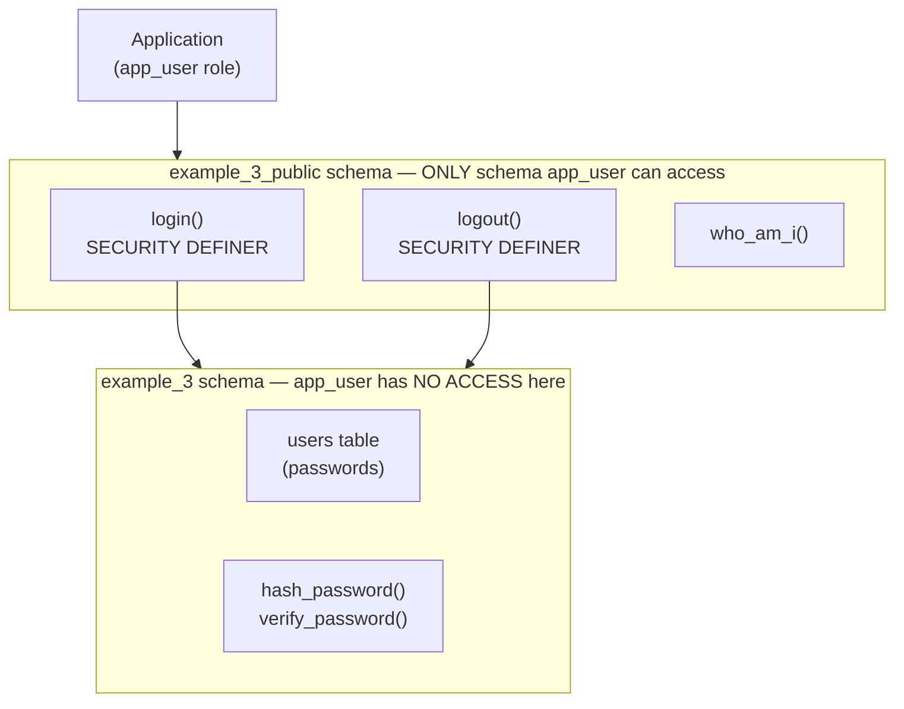

# Database-Level Security: Building Secure Authentication with PostgreSQL and NpgsqlRest

<p class="blog-meta">
  <span>January 2026</span> ·
  <span class="tag">Security</span>
  <span class="tag">PostgreSQL</span>
  <span class="tag">Authentication</span>
  <span class="tag">NpgsqlRest</span>
</p>

Most web applications treat databases as dumb storage - a place to persist data that the application logic protects. This is backwards. Your database is the last line of defense, and it should be the strongest.

This post demonstrates how to build a secure authentication system using PostgreSQL as the security boundary, implementing the Principle of Least Privilege at the database level, and using advanced password hashing techniques that go beyond standard bcrypt limitations.

> **Source Code**: The complete working example is available at [github.com/NpgsqlRest/npgsqlrest-docs/examples/3_security_and_auth](https://github.com/NpgsqlRest/npgsqlrest-docs/tree/main/examples/3_security_and_auth)

## The Principle of Least Privilege (PoLP)

The Principle of Least Privilege states that any user, program, or process should have only the minimum privileges necessary to perform its function. In traditional web applications, the database connection often has full access to all tables - a disaster waiting to happen.

With NpgsqlRest, we implement PoLP at the database level:



The key insight: **the application role cannot access tables directly**. It can only call functions in a public schema, and those functions use `SECURITY DEFINER` to access protected data.

## Schema Architecture

### The Protected Schema

The `example_3` schema contains sensitive data and internal functions. This is defined in `V1__example_3_schema.sql` - a **versioned migration**. The `V1__` prefix means this is version 1, and versioned migrations only run once (unlike repeatable `R__` migrations that run on every change).

```sql
-- V1__example_3_schema.sql (versioned migration - runs only once)

-- Create the protected schema
drop schema if exists example_3 cascade;
create schema example_3;

-- Enable pgcrypto for password hashing
create extension if not exists pgcrypto with schema example_3;

-- Users table with password hashes
create table example_3.users (
    user_id int primary key generated always as identity,
    username text not null,
    email text not null,
    password_hash text[] not null  -- Array of hashes (explained below)
);
```

### The Public API Schema

The same versioned migration also creates the public schema for API endpoints:

```sql
-- Create public schema for API endpoints
drop schema if exists example_3_public cascade;
create schema example_3_public;
```

### The Restricted Application Role

Here's where PoLP becomes concrete. We create a role with minimal permissions:

```sql
-- Create application role with minimal privileges
create role ${APP_USER} with
    login
    nosuperuser
    nocreatedb
    nocreaterole
    noinherit
    noreplication
    connection limit -1
    password '${APP_PASSWORD}';

-- Grant ONLY usage on the public schema
-- This is the ONLY grant this role needs
grant usage on schema example_3_public to ${APP_USER};
```

The `${APP_USER}` and `${APP_PASSWORD}` placeholders are environment variables that get replaced when running migrations. The [pgmigrations](https://www.npmjs.com/package/@vbilopav/pgmigrations) tool supports this `${VAR}` syntax for variable substitution.

> **Note on credentials**: In this example, `APP_USER` and `APP_PASSWORD` are stored in the `.env` file alongside the superuser credentials used to run migrations. **This is for demonstration purposes only.** In production, these credentials should be stored separately - the superuser credentials belong to whoever administers the database and runs migrations (DevOps, DBA, etc.), while the application credentials should be managed through your secrets management system.

Note what's **not** granted:
- No access to `example_3` schema
- No access to any tables
- No ability to create objects
- No superuser privileges

The application can only execute functions in `example_3_public`. Period.

## Bypassing Bcrypt's 72-Byte Limit

Bcrypt is the gold standard for password hashing, but it has a critical limitation: **it silently ignores everything after byte 72**. This means these two passwords hash identically:

```
"a]2@[Z]f)!BqC6:g%/$wrz7-Cz<B9!@z]j{9,X]3xaM'uqQW*l7:zK"s:-xt*2Pd$e7Emore_stuff_here"
"a]2@[Z]f)!BqC6:g%/$wrz7-Cz<B9!@z]j{9,X]3xaM'uqQW*l7:zK"s:-xt*2Pd$e7E"
```

An attacker who discovers this limit could exploit it. Our solution: **segment the password and hash each segment separately**.

### The Hash Function

```sql
-- R__1_example_3_hash_password.sql

--
-- Bcrypt has a 72-byte input limit - any characters beyond that are silently ignored.
-- This function overcomes that limitation by splitting passwords into 72-char segments,
-- hashing each segment separately, and returning an array of hashes.
-- This allows secure hashing of passwords with unlimited length.
--
create or replace function example_3.hash_password(
    _input text
)
returns text[]
parallel safe
language plpgsql
as
$$
declare
    _segment text;
    _result text[] = '{}';
    _alg text = 'bf';  -- Blowfish (bcrypt)
    _i int;
    _max_len constant int = 72;
begin
    for _i in 0..ceil(length(_input) / _max_len) + 1 loop
        _segment = substring(_input from _i * _max_len + 1 for _max_len);
        if length(_segment) > 0 then
            _result = array_append(_result, example_3.crypt(_segment, example_3.gen_salt(_alg)));
        end if;
    end loop;

    return _result;
end;
$$;
```

### The Verify Function

```sql
-- R__2_example_3_verify_password.sql

create or replace function example_3.verify_password(
    _input text,
    _array text[]
)
returns boolean
language plpgsql
as
$$
declare
    _segment text;
    _max_len constant int = 72;
    _expected_segments int;
    _segment_count int = 0;
begin
    for _i in 0..ceil(length(_input) / _max_len) + 1 loop
        _segment = substring(_input from _i * _max_len + 1 for _max_len);
        if length(_segment) > 0 then
            _segment_count = _segment_count + 1;
            if example_3.crypt(_segment, _array[_i+1]) <> _array[_i+1] then
                return false;
            end if;
        end if;
    end loop;

    -- Ensure the hash array has exactly the expected number of segments
    if coalesce(array_length(_array, 1), 0) <> _segment_count then
        return false;
    end if;

    return true;
end;
$$;
```

### Testing the Password Functions

The tests run on every migration, ensuring the functions work correctly:

```sql
do
$$
declare
    _hash text[];
    _long_password text;
begin
    -- Test 1: Simple password hash and verify
    _hash = example_3.hash_password('mypassword123');
    assert example_3.verify_password('mypassword123', _hash),
        'Test 1 failed: correct password should verify';

    -- Test 2: Wrong password should not verify
    assert not example_3.verify_password('wrongpassword', _hash),
        'Test 2 failed: wrong password should not verify';

    -- Test 3: Empty string vs actual password
    assert not example_3.verify_password('', _hash),
        'Test 3 failed: empty string should not verify against non-empty hash';

    -- Test 4: Empty password hash and verify
    _hash = example_3.hash_password('');
    assert example_3.verify_password('', _hash),
        'Test 4 failed: empty password should verify against its own hash';

    -- Test 5: Long password (> 72 chars to test segmentation)
    _long_password = repeat('a', 100);
    _hash = example_3.hash_password(_long_password);
    assert array_length(_hash, 1) > 1,
        'Test 5a failed: long password should produce multiple hash segments';
    assert example_3.verify_password(_long_password, _hash),
        'Test 5b failed: long password should verify correctly';

    -- Test 6: Very long password (> 144 chars for 3 segments)
    _long_password = repeat('x', 200);
    _hash = example_3.hash_password(_long_password);
    assert array_length(_hash, 1) >= 3,
        'Test 6a failed: very long password should produce 3+ hash segments';
    assert example_3.verify_password(_long_password, _hash),
        'Test 6b failed: very long password should verify correctly';
    assert not example_3.verify_password(repeat('y', 200), _hash),
        'Test 6c failed: different long password should not verify';

    -- Test 7: Special characters
    _hash = example_3.hash_password('p@!?w0rd!#%&*()');
    assert example_3.verify_password('p@!?w0rd!#%&*()', _hash),
        'Test 7 failed: special characters should hash and verify correctly';

    -- Test 8: Unicode characters
    _hash = example_3.hash_password('пароль密码🔐');
    assert example_3.verify_password('пароль密码🔐', _hash),
        'Test 8 failed: unicode characters should hash and verify correctly';

    raise notice 'All password hash/verify tests passed!';
end;
$$;
```

## The Authentication Functions

### Understanding SECURITY DEFINER

Before diving into the functions, let's clarify how `SECURITY DEFINER` works:

- **Default behavior (`SECURITY INVOKER`)**: Functions run with the privileges of the user calling them
- **`SECURITY DEFINER`**: Functions run with the privileges of the user who *created* them

Since migrations are run by a superuser (or at least a privileged role), functions marked `SECURITY DEFINER` will execute with those elevated privileges - even when called by the restricted application role.

This is the key mechanism that makes PoLP work:
1. The `example_3_public` schema contains *only* the functions that the application needs to call - nothing else
2. The application role has `USAGE` on `example_3_public` schema, so it can discover and call those functions
3. Those functions are `SECURITY DEFINER`, so they run as the superuser who created them
4. Inside the function, we can access `example_3.users` table - something the application role cannot do directly

### Protecting Against Search Path Attacks

`SECURITY DEFINER` functions have a well-known vulnerability: **search path injection**. When a function calls other functions or operators without schema-qualifying them, PostgreSQL uses the `search_path` to resolve them. An attacker can manipulate this path to substitute malicious functions that execute with elevated privileges.

For example, if a `SECURITY DEFINER` function uses the `+` operator without qualification, an attacker could:
1. Create a schema they control
2. Define a malicious `+` operator in that schema
3. Manipulate `search_path` to prioritize their schema
4. When the function runs as superuser, the malicious operator executes with superuser privileges

The fix is simple: **always set `search_path` explicitly** on `SECURITY DEFINER` functions:

```sql
set search_path = pg_catalog, pg_temp
```

This ensures only trusted system catalogs are searched. Even if a function doesn't call other functions, it's good practice to include this on all `SECURITY DEFINER` functions as defense in depth.

For more details on this vulnerability, see [Abusing SECURITY DEFINER functions](https://www.cybertec-postgresql.com/en/abusing-security-definer-functions/) and [CVE-2018-1058](https://wiki.postgresql.org/wiki/A_Guide_to_CVE-2018-1058:_Protect_Your_Search_Path).

### Login Function

```sql
-- R__example_3_public_login.sql

create or replace function example_3_public.login(
    _username text,
    _password text
)
returns table (
    scheme text,
    user_id int,
    username text,
    email text
)
language sql
set search_path = pg_catalog, pg_temp  -- Protect against search path attacks
security definer  -- Runs as migration user (superuser), not app_user
begin atomic;
select
    'cookies' as scheme,  -- Tells NpgsqlRest to use cookie authentication
    user_id,
    username,
    email
from example_3.users  -- app_user can't access this table directly!
where
    username = _username
    and example_3.verify_password(_password, password_hash);
end;

comment on function example_3_public.login(text, text) is '
HTTP POST
@login
@anonymous';  -- Allow unauthenticated access to login
```

The [`login` annotation](/annotations/login) marks this as an authentication endpoint. Here's how it works:

1. The function must return a **named record (table)** - returning void, simple values, or an empty result triggers 401 Unauthorized
2. The `scheme` column specifies which configured authentication scheme to use (in this case `'cookies'`, but it could be any scheme you've configured - Bearer tokens, JWT, etc.)
3. All other columns (`user_id`, `username`, `email`) become **security claims** stored in the authentication cookie
4. The `anonymous` annotation allows unauthenticated access - otherwise users couldn't log in!

On successful login, NpgsqlRest signs in the user with the specified scheme and the returned claims become available in subsequent requests.

### Logout Function

```sql
-- R__example_3_public_logout.sql

create or replace function example_3_public.logout()
returns text
set search_path = pg_catalog, pg_temp
language sql
security definer
begin atomic;
select 'cookies';  -- Return the scheme to clear
end;

comment on function example_3_public.logout() is
'HTTP POST
@logout
@authorize';  -- Requires authentication
```

The `logout` annotation tells NpgsqlRest to clear the authentication cookie.

### Who Am I Function

This function demonstrates [user parameters](/config/authentication-options#user-parameters) - claims from the authentication cookie are automatically injected:

```sql
-- R__example_3_public_who_am_i.sql

create or replace function example_3_public.who_am_i(
    _user_id text = null,
    _username text = null,
    _email text = null
)
returns table (
    user_id text,
    username text,
    email text
)
set search_path = pg_catalog, pg_temp  -- Good practice even without SECURITY DEFINER
language sql
begin atomic;
select
    _user_id,
    _username,
    _email;
end;

comment on function example_3_public.who_am_i(text, text, text) is '
HTTP GET
@authorize';
```

The parameters `_user_id`, `_username`, and `_email` are filled in automatically by NpgsqlRest from the authenticated user's claims - the client never sends them.

## NpgsqlRest Configuration

The [configuration](/guide/configuration) ties everything together:

```json
{
  "ApplicationName": "3_security_and_auth",

  "ConnectionStrings": {
    // Use the restricted application role
    "Default": "Host={PGHOST};Port={PGPORT};Database={PGDATABASE};Username={APP_USER};Password={APP_PASSWORD}"
  },

  "StaticFiles": {
    "RootPath": "./3_security_and_auth/public"
  },

  // Cookie authentication settings
  "Auth": {
    "CookieAuth": true,
    "CookieAuthScheme": "cookies",
    "CookieValidDays": 1,
    "CookieName": "example_3_auth"
  },

  "NpgsqlRest": {
    // ONLY expose the public schema
    "IncludeSchemas": [ "example_3_public" ],
    "RequiresAuthorization": true,

    "AuthenticationOptions": {
      "DefaultAuthenticationType": "example_3",
      // Map claims to function parameters
      "UseUserParameters": true,
      "ParameterNameClaimsMapping": {
        "_user_id": "user_id",
        "_username": "username",
        "_email": "email"
      }
    },

    "ClientCodeGen": {
      "FilePath": "./3_security_and_auth/src/{0}Api.ts"
    }
  }
}
```

Key configuration points:

1. **Connection uses the restricted role** - The application connects as `APP_USER`, not the superuser
2. **Only public schema is exposed** - `IncludeSchemas: ["example_3_public"]` ensures internal functions are never exposed
3. **Cookie authentication enabled** - `CookieAuth: true` with scheme matching what login returns
4. **User parameters mapped** - Claims from cookies are automatically injected into function parameters

## The Demo Application

The example includes a simple web interface demonstrating the authentication flow:

```html
<!-- public/index.html -->
<div id="login-form">
    <h2>Login</h2>
    <input type="text" id="username" placeholder="Username" value="alice" />
    <input type="password" id="password" placeholder="Password" value="password123" />
    <button id="login-btn">Login</button>
</div>

<div id="actions">
    <button id="whoami-btn">Who Am I?</button>
    <button id="logout-btn">Logout</button>
</div>
```

The TypeScript client is [automatically generated](/config/codegen):

```typescript
// Auto-generated by NpgsqlRest

interface ILoginRequest {
    username: string | null;
    password: string | null;
}

interface IWhoAmIResponse {
    userId: string | null;
    username: string | null;
    email: string | null;
}

export async function login(request: ILoginRequest) : Promise<{
    status: number,
    response: string,
    error: {status: number; title: string; detail?: string | null} | undefined
}> {
    const response = await fetch(baseUrl + "/api/example-3-public/login", {
        method: "POST",
        body: JSON.stringify(request)
    });
    // ...
}

export async function whoAmI(request: IWhoAmIRequest) : Promise<{
    status: number,
    response: IWhoAmIResponse[],
    error: {status: number; title: string; detail?: string | null} | undefined
}> {
    // ...
}
```

Test users are created during migration:

```sql
-- R__3_example_3_test_data.sql
insert into example_3.users (username, email, password_hash) values
('alice', 'alice@example.com', example_3.hash_password('password123')),
('bob', 'bob@example.com', example_3.hash_password('password456'));
```

## Why This Architecture is More Secure

### 1. Defense in Depth

Even if an attacker compromises the application, they cannot:
- Read the users table directly
- Access password hashes
- Call internal functions
- Modify data outside of what the API functions allow

The database itself enforces security boundaries.

### 2. SQL Injection Becomes Less Dangerous

Traditional SQL injection exploits often rely on the application having broad database permissions. With PoLP:

```sql
-- Attacker tries: ' OR '1'='1
-- Even if injection succeeds, app_user can only call functions in example_3_public
-- No direct table access means no data exfiltration
```

### 3. No Secrets in Application Code

Password hashing and verification happen entirely in PostgreSQL. The application never sees raw passwords or hashes - it just passes them to functions.

### 4. Auditable Security Boundary

The security model is visible in the database schema:
- Which role has what permissions
- Which functions use `SECURITY DEFINER`
- What the public API surface is

This makes security audits straightforward.

### 5. Bcrypt Limit Protection

The segmented password hashing ensures long passwords remain secure. An attacker who knows about bcrypt's 72-byte limit gains no advantage.

## Comparison with Traditional Approaches

| Traditional Stack | This Approach |
|------------------|---------------|
| App has full DB access | App has minimal permissions |
| ORM manages all tables | App can only call functions |
| Password hashing in app code | Password hashing in PostgreSQL |
| SQL injection = full compromise | SQL injection = limited scope |
| Security logic scattered | Security logic centralized in DB |
| Audit requires code review | Audit visible in schema |

## Conclusion

Security should be built into the architecture, not bolted on. By implementing the Principle of Least Privilege at the database level, you create applications that are **secure by default**:

1. **Restricted roles** ensure the application can only do what it's supposed to
2. **Schema separation** isolates internal data from the API surface
3. **`SECURITY DEFINER` functions** provide controlled access to protected data
4. **Database-level password hashing** keeps secrets out of application code
5. **Segmented bcrypt** eliminates the 72-byte password limit vulnerability

Combined with NpgsqlRest's [end-to-end type safety](/blog/end-to-end-static-type-checking-postgresql-typescript) and [superior performance](/blog/postgresql-rest-api-benchmark-2026), this approach delivers applications that are not only faster and more maintainable, but fundamentally more secure.

The database is your most trusted component - treat it that way.

<BlogNav
  source-code="https://github.com/NpgsqlRest/npgsqlrest-docs/tree/main/examples/3_security_and_auth"
  :get-started="[
    { text: 'Quick Start Guide', href: '/guide/quick-start' },
    { text: 'Cookie Authentication', href: '/config/auth#cookie-authentication' },
    { text: 'Authentication Options', href: '/config/authentication-options' }
  ]"
/>
