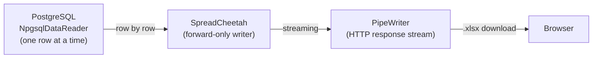

# Excel Exports Done Right: Zero-Allocation Streaming from PostgreSQL

<p class="blog-meta">
  <span>February 2026</span> ·
  <span class="tag">Excel</span>
  <span class="tag">Export</span>
  <span class="tag">PostgreSQL</span>
  <span class="tag">Performance</span>
  <span class="tag">NpgsqlRest</span>
</p>

After 20 years of maintaining codebases, I can confidently say: **Excel export code is the worst part of any system.** It eats all the memory. It crashes servers. It brings down production. I've seen teams isolate export services behind separate infrastructure just so a report download doesn't take the rest of the application with it.

NpgsqlRest 3.7.0 changes this completely. One SQL annotation turns any PostgreSQL function into a streaming `.xlsx` download with **constant memory usage**, **zero allocations per cell**, and **native Excel type mapping** - all without writing a single line of application code.

> **Source Code**: The complete working example is available at [github.com/NpgsqlRest/npgsqlrest-docs/examples/14_table_format](https://github.com/NpgsqlRest/npgsqlrest-docs/tree/main/examples/14_table_format)

## Why Excel Exports Are Terrible

The traditional approach to Excel exports goes something like this:

1. Execute a query and **load the entire result set into memory**
2. Create an in-memory workbook object (another copy of all the data)
3. Write cells one by one (allocating strings for each cell value)
4. Serialize the workbook to a byte array (yet another copy)
5. Send the byte array to the client

For a 1 million row report, you're looking at 3-4x the data size in memory simultaneously.

And that's the *best case*. In practice, export code often introduces **N+1 query patterns** that make things catastrophically worse. The export iterates over rows, and for each row it fires off additional queries to fetch related data - customer names, product details, category labels, audit info. A 100,000-row export becomes 100,001 database queries. The database connection pool fills up, response times spike across the entire application, and now your export isn't just crashing the export service - it's dragging down every other request in the system.

This is why export endpoints are the number one cause of `OutOfMemoryException` in enterprise systems. It's why teams build separate "report servers" and queue-based export systems. It's why a simple "Download to Excel" button requires an entire architecture discussion.

## The NpgsqlRest Approach: Pure Streaming

NpgsqlRest's table format rendering takes a fundamentally different approach:



**Rows flow directly from PostgreSQL to the browser.** The full result set is never materialized in memory. There are no intermediate collections. No buffering the entire dataset.

All you need is one annotation:

```sql
comment on function get_report() is '
HTTP GET
@table_format = excel
';
```

That's it. Your function's result set streams straight to the user's browser as an `.xlsx` download.

## What Makes This Special

### Zero-Allocation Cell Writing

The implementation is powered by [SpreadCheetah](https://github.com/sveinungf/spreadcheetah) - a library built from the ground up for high-performance, forward-only spreadsheet generation.

SpreadCheetah writes cells as value types (`DataCell` structs), avoiding heap allocations per cell. Combined with a pre-allocated cell array that gets reused for every row, memory pressure stays flat regardless of dataset size.

### Native Type Mapping

Integers, decimals, booleans, and DateTimes are written as **native Excel types** directly from the PostgreSQL reader - not stringified and re-parsed. Your numbers stay as numbers. Your dates stay as dates. Excel formulas work immediately without "Convert to Number" warnings.

| PostgreSQL Type | Excel Type |
|----------------|------------|
| `int`, `bigint` | Number |
| `numeric`, `float` | Number (with format) |
| `boolean` | Boolean |
| `date`, `timestamp` | DateTime |
| `text`, `varchar` | String |
| `json`, `jsonb` | String |

### Constant Memory Usage

Since Excel is compressed XML under the hood, some buffering is needed for the compression layer. But that buffering **doesn't exceed ~80KB** during export operations, regardless of whether you're exporting 100 rows or 10 million rows.

### AOT/Trim Compatible

No reflection, no expression trees, no runtime code generation. Works perfectly with .NET's `PublishAot` and full trimming - important for the single-binary deployment that NpgsqlRest uses.

## Building an Excel Export Endpoint

### Step 1: Write Your Function

Your PostgreSQL function defines the report. The return columns become Excel columns:

```sql
create or replace function example_14.get_data(
    _format text,
    _excel_file_name text = null,
    _excel_sheet text = null
)
returns table (
    int_val int,
    bigint_val bigint,
    numeric_val numeric(10,4),
    float_val double precision,
    bool_val bool,
    text_val text,
    date_val date,
    timestamp_val timestamp,
    time_val time,
    json_val json,
    null_text text,
    null_int int
)
language sql
begin atomic;
select * from (values
    (42,        9999999999::bigint, 3.1415::numeric(10,4), 2.71828::float8, true,  'hello world',      '2025-06-15'::date, '2025-06-15 14:30:00'::timestamp, '09:45:30'::time, '{"key":"value"}'::json, null::text, null::int),
    (-1,        0::bigint,          0.0001::numeric(10,4), -99.99::float8,  false, 'special <chars> &', '2000-01-01'::date, '2000-01-01 00:00:00'::timestamp, '23:59:59'::time, '[1,2,3]'::json,        'not null', 7),
    (2147483647, -1::bigint,        99999.9999::numeric(10,4), 0::float8,   true,  '',                  '1999-12-31'::date, '1999-12-31 23:59:59'::timestamp, '00:00:00'::time, 'null'::json,           null::text, null::int)
);
end;
```

In a real application, this would be your reporting query - joins across tables, aggregations, window functions, whatever your report needs. The point is: **the report logic lives in PostgreSQL**, not in application code.

### Step 2: Add the Annotation

The function comment controls everything:

```sql
comment on function example_14.get_data(text,text,text) is '
HTTP GET
@authorize
@table_format = {_format}
@excel_file_name = {_excel_file_name}
@excel_sheet = {_excel_sheet}
@tsclient_url_only = true
';
```

| Annotation | Effect |
|------------|--------|
| `@authorize` | Require authentication |
| `@table_format = {_format}` | Dynamic format from `_format` parameter (`html` or `excel`) |
| `@excel_file_name = {_excel_file_name}` | Custom download filename from parameter |
| `@excel_sheet = {_excel_sheet}` | Custom worksheet name from parameter |
| `@tsclient_url_only = true` | Generate only URL constant in TypeScript (not a fetch function) |

The `{_format}` placeholder is the key pattern here. It resolves the table format from a function parameter, allowing the same endpoint to serve both HTML table views and Excel downloads depending on what the client requests.

### Step 3: Configure Table Format

Enable the feature in your `config.json`:

```json
{
  "NpgsqlRest": {
    "TableFormatOptions": {
      "Enabled": true,
      "HtmlEnabled": true,
      "ExcelEnabled": true,
      "ExcelKey": "excel"
    }
  }
}
```

That's the entire backend. No libraries to install. No export service to build. No memory tuning to configure.

## Two Formats, One Endpoint

The dynamic `@table_format = {_format}` pattern means the same function serves both HTML and Excel:

**HTML view** (for browser preview):
```
GET /api/example-14/get-data?format=html
```

Renders a styled HTML table in the browser - perfect for quick previews and copy-paste into Excel.

**Excel download** (for file export):
```
GET /api/example-14/get-data?format=excel
```

Streams a properly-typed `.xlsx` file as a download.

### Static Format Annotation

If you don't need dynamic format switching, you can hardcode the format:

```sql
-- Always Excel download
comment on function monthly_report() is '
HTTP GET
@table_format = excel
@excel_file_name = monthly_report.xlsx
@excel_sheet = Report Data
';
```

```sql
-- Always HTML table
comment on function dashboard_data() is '
HTTP GET
@table_format = html
';
```

## The TypeScript Client: URL-Only Generation

For table format endpoints, the traditional fetch-based client doesn't make sense. You don't `fetch()` an Excel file - you navigate to it. That's what `@tsclient_url_only = true` is for.

NpgsqlRest generates only the URL constant and request interface:

```typescript
// Auto-generated - no fetch function, just the URL builder
export const getDataUrl = (request: IGetDataRequest) =>
    baseUrl + "/api/example-14/get-data" + parseQuery(request);

interface IGetDataRequest {
    format: string | null;
    excelFileName?: string | null;
    excelSheet?: string | null;
}
```

Using it in your frontend:

```typescript
import { getDataUrl } from "./example14Api.ts";

// HTML preview - open in browser
htmlLink.href = getDataUrl({ format: "html" });

// Excel download - navigate to trigger download
excelLink.addEventListener("click", (e) => {
    e.preventDefault();
    const dateStr = new Date().toISOString().slice(0, 19).replace(/[-:]/g, "");
    const fileName = `data-${dateStr}.xlsx`;
    const sheetName = `data-${dateStr}`;
    document.location.href = getDataUrl({
        format: "excel",
        excelFileName: fileName,
        excelSheet: sheetName
    });
});
```

Notice how the Excel filename includes a timestamp - each download gets a unique name. This is resolved on the server from the `{_excel_file_name}` placeholder.

Or for the simplest case, just a plain HTML link:

```html
<a href="/api/example-14/get-data?format=html">View as HTML Table</a>
<a href="/api/example-14/get-data?format=excel">Download Excel</a>
```

No JavaScript required for basic usage.

## Excel Format Configuration

### DateTime and Numeric Formats

Control how dates and numbers appear in Excel cells:

```json
{
  "NpgsqlRest": {
    "TableFormatOptions": {
      "Enabled": true,
      "ExcelEnabled": true,
      "ExcelDateTimeFormat": "yyyy-mm-dd hh:mm",
      "ExcelNumericFormat": "#,##0.00"
    }
  }
}
```

| Option | Default | Examples |
|--------|---------|---------|
| `ExcelDateTimeFormat` | `yyyy-MM-dd HH:mm:ss` | `yyyy-mm-dd`, `dd/mm/yyyy hh:mm` |
| `ExcelNumericFormat` | General | `#,##0.00`, `0.00`, `#,##0` |

These are [Excel Format Codes](https://support.microsoft.com/en-us/office/number-format-codes-5026bbd6-04bc-48cd-bf33-80f18b4eae68), not .NET format strings. They control how Excel displays the values in cells.

### Worksheet and File Names

Set defaults globally, override per-endpoint:

```json
{
  "NpgsqlRest": {
    "TableFormatOptions": {
      "ExcelSheetName": "Data"
    }
  }
}
```

Per-endpoint overrides via annotations:

```sql
comment on function quarterly_report(_quarter int, _year int) is '
HTTP GET
@table_format = excel
@excel_file_name = Q{_quarter}_{_year}_report.xlsx
@excel_sheet = Q{_quarter} {_year}
';
```

Calling `GET /api/quarterly-report?quarter=2&year=2026` downloads `Q2_2026_report.xlsx` with a worksheet named `Q2 2026`.

## HTML Table Format

The HTML format renders results as a styled table suitable for browser viewing:

```sql
comment on function get_report() is '
HTTP GET
@table_format = html
';
```

The HTML output is designed for **copy-paste into Excel**. Select the table in your browser, paste into Excel, and the data transfers cleanly with proper column alignment.

You can customize the HTML wrapper:

```json
{
  "NpgsqlRest": {
    "TableFormatOptions": {
      "HtmlEnabled": true,
      "HtmlHeader": "<!DOCTYPE html><html><head><style>table { border-collapse: collapse; } th, td { border: 1px solid #ddd; padding: 8px; }</style></head><body>",
      "HtmlFooter": "</body></html>"
    }
  }
}
```

## Bonus: Built-In Statistics Endpoints

Version 3.7.0 also introduced **PostgreSQL statistics endpoints** - built-in HTTP endpoints for monitoring your database performance without writing any SQL:

```json
{
  "Stats": {
    "Enabled": true,
    "OutputFormat": "html",
    "SchemaSimilarTo": "example_14"
  }
}
```

This gives you four monitoring endpoints out of the box:

| Endpoint | Source | What It Shows |
|----------|--------|---------------|
| `/stats/routines` | `pg_stat_user_functions` | Function call counts, execution times |
| `/stats/tables` | `pg_stat_user_tables` | Tuple counts, table sizes, scan counts, vacuum info |
| `/stats/indexes` | `pg_stat_user_indexes` | Index scan counts, index definitions |
| `/stats/activity` | `pg_stat_activity` | Active sessions, running queries, wait events |

The default `html` output format renders as an HTML table you can view in the browser or copy-paste into Excel - the same HTML table format used by the table format rendering system.

### Stats Configuration Options

```json
{
  "Stats": {
    "Enabled": true,
    "OutputFormat": "html",
    "CacheDuration": "5 seconds",
    "RequireAuthorization": true,
    "AuthorizedRoles": ["admin"],
    "RateLimiterPolicy": "fixed",
    "SchemaSimilarTo": "my_schema"
  }
}
```

| Option | Description |
|--------|-------------|
| `OutputFormat` | `html` (default) or `json` |
| `CacheDuration` | Cache responses to avoid hitting pg_stat views on every request |
| `RequireAuthorization` | Lock down stats endpoints (recommended for production) |
| `AuthorizedRoles` | Restrict access to specific roles |
| `SchemaSimilarTo` | Filter stats to a specific schema pattern |
| `ConnectionName` | Query stats from a different connection (e.g., read replica) |

For routine statistics to work, make sure `track_functions` is enabled in PostgreSQL:

```sql
alter system set track_functions = 'all';
select pg_reload_conf();
```

## The Traditional Way vs. This Way

Here's what Excel export typically looks like in a traditional codebase:

| Traditional Excel Export | NpgsqlRest |
|--------------------------|------------|
| Install EPPlus/ClosedXML/NPOI | Nothing to install |
| Write query execution code | Write your SQL function |
| Build in-memory workbook | Streaming - no workbook object |
| Handle type conversions manually | Native type mapping |
| Manage memory for large exports | Constant ~80KB buffer |
| Write download response handling | Automatic |
| Separate export service for safety | Not needed |
| TypeScript types for parameters | Auto-generated |
| **200-500 lines of code** | **One SQL annotation** |

### Memory Profile Comparison

For a 1 million row export with 10 columns:

| Metric | Traditional (EPPlus/ClosedXML) | NpgsqlRest + SpreadCheetah |
|--------|-------------------------------|---------------------------|
| Peak memory | 500MB - 2GB+ | ~80KB buffer |
| Allocation rate | Millions of objects | Zero per-cell allocations |
| Time to first byte | After entire workbook built | Immediate (streaming) |
| Risk of OOM crash | High | None |

## Running the Example

```bash
# Clone the repository
git clone https://github.com/NpgsqlRest/npgsqlrest-docs.git
cd npgsqlrest-docs/examples

# Install dependencies
bun install

# Navigate to the example
cd 14_table_format

# Apply database migrations
bun run db:up

# Start the server
bun run dev
```

Open `http://localhost:8080`, log in with `alice` / `password123`, and try both the HTML view and Excel download links.

## Conclusion

Excel exports don't have to be the worst part of your system. With NpgsqlRest's table format rendering:

1. **Write your report as a PostgreSQL function** - the query IS the export
2. **Add `@table_format = excel`** - one annotation, done
3. **Rows stream directly to the browser** - no memory accumulation
4. **Native Excel types** - numbers, dates, and booleans just work
5. **Dynamic filenames and worksheets** - parameterized per request
6. **HTML preview built-in** - same endpoint, different format

No export libraries to learn. No memory to tune. No separate export services. No server crashes at 3 AM because someone exported a large report.

Just PostgreSQL functions streaming straight to `.xlsx` - one row at a time, start to finish, with constant memory usage.

<BlogNav
  source-code="https://github.com/NpgsqlRest/npgsqlrest-docs/tree/main/examples/14_table_format"
  :documentation="[
    { text: 'Table Format Configuration', href: '/config/table-format' },
    { text: 'Statistics Configuration', href: '/config/stats' },
    { text: 'Annotations Reference', href: '/annotations/' }
  ]"
/>
