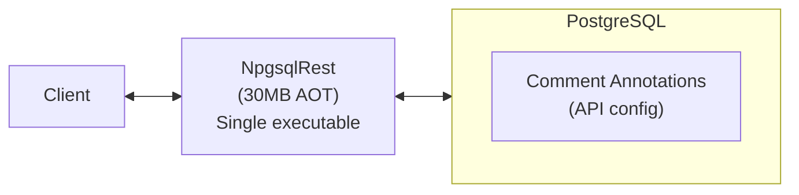
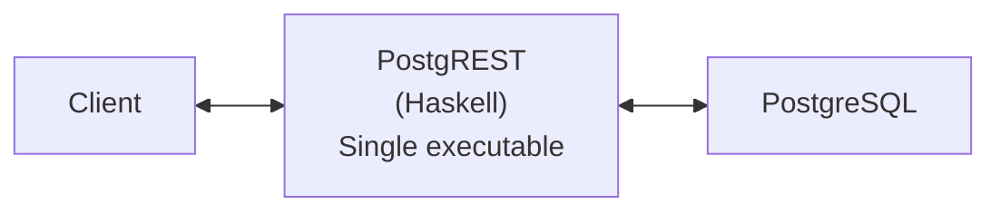
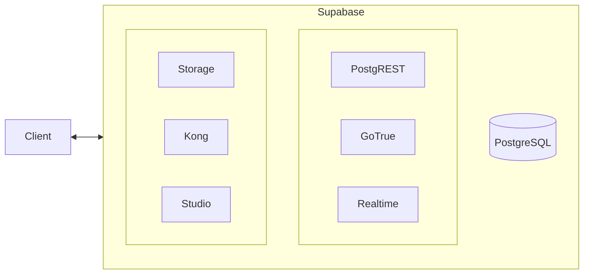

# NpgsqlRest vs PostgREST vs Supabase: Complete Feature Comparison

<p class="blog-meta">
<span class="tag">Comparison</span> · <span class="tag">PostgREST</span> · <span class="tag">Supabase</span> · <span class="tag">January 2026</span>
</p>

---

Choosing the right tool to expose your PostgreSQL database as a REST API can significantly impact your project's performance, maintainability, and development velocity. This comprehensive comparison examines three popular solutions: **NpgsqlRest**, **PostgREST**, and **Supabase**.

## Executive Summary

| Aspect | NpgsqlRest | PostgREST | Supabase |
|--------|------------|-----------|----------|
| **What It Is** | Complete platform in a single binary | Standalone executable/Docker | Backend-as-a-Service platform |
| **Core Focus** | SQL files + functions as REST endpoints | Table/View-centric REST API | Complete backend platform |
| **Best For** | SQL-first APIs, self-hosted full-stack | Flexible client-side queries | Managed hosting with dashboard |
| **Performance** | 4,588 req/s (100 VU) | 1,749 req/s (100 VU) | Uses PostgREST internally |
| **Deployment** | Single binary (~30MB), any cloud | Single binary (~20MB) | Managed cloud or complex self-host |
| **Self-Hosting** | Simple (single binary) | Simple | Complex (7+ services) |
| **Learning Curve** | Low (SQL comments) | Medium (RLS policies) | Medium (platform concepts) |

## Architecture Comparison

### NpgsqlRest



NpgsqlRest is a **complete platform in a single, self-contained executable** that connects directly to PostgreSQL and serves REST APIs. Starting with v3.12.0, the primary way to create endpoints is **SQL files** — write a `.sql` file, add a comment annotation, and it becomes a REST endpoint. No database deployment needed, no functions to create. For more complex logic, PostgreSQL functions and procedures are still fully supported and give you true static type checking end-to-end.

API configuration lives in SQL comments — the same annotation syntax works in both SQL files and database object comments. Custom paths, caching, rate limiting, authentication, and more, all version-controlled with your code.

Beyond API generation, NpgsqlRest includes everything needed for full-stack development:
- **[SQL file endpoints](/config/sql-file-source)** — drop a `.sql` file in a folder, get a REST endpoint. Single or multi-command batch scripts with named result sets
- **Static file serving** with authorization and [template parsing](/config/static-files) (replace placeholders with user claims)
- **[TypeScript/JavaScript code generation](/config/codegen)** for type-safe frontend clients
- **[HTTP test file generation](/config/http-files)** for API testing in VS Code and Visual Studio
- **Built-in authentication** (JWT, encrypted Bearer, encrypted Cookie, Basic Auth, OAuth, Passkey/WebAuthn)
- **File uploads** with image validation, CSV/Excel ingestion

No additional infrastructure required. Download, configure connection string, run. Deploy easily on any cloud server instance—AWS EC2, DigitalOcean, Hetzner, or your own servers.

### PostgREST



PostgREST follows a similar single-binary model. Both are lightweight and straightforward to deploy.

### Supabase



Supabase is a **platform** composed of multiple services. PostgREST handles REST API generation, GoTrue manages authentication, Kong provides API gateway functionality, and additional services handle storage, realtime, and the admin dashboard. Self-hosting requires orchestrating all these components.

**Key difference**: Both NpgsqlRest and Supabase are platforms, but NpgsqlRest packages everything into a single binary (~30MB) while Supabase requires 7+ separate services. Supabase offers a managed cloud service with a visual dashboard; NpgsqlRest gives you full control with simpler self-hosting on any cloud provider.

## Performance Benchmarks

Benchmark results from [PostgreSQL REST API Benchmark 2026](/blog/postgresql-rest-api-benchmark-2026), testing 14 frameworks under identical conditions:

### Requests Per Second (100 Concurrent Users, 1 Record)

| Framework | Requests/sec | Latency | Scaling Factor |
|-----------|-------------|---------|----------------|
| **NpgsqlRest JIT** | **4,588** | **10.88ms** | **9.5x** |
| NpgsqlRest AOT | 4,527 | 11.02ms | 9.7x |
| Swoole PHP | 4,423 | 11.29ms | 9.4x |
| Rust (Actix) | 3,940 | 12.67ms | 7.8x |
| PostgREST | 1,749 | 28.58ms | 6.5x |

**Key findings:**

- **NpgsqlRest JIT is 2.6x faster than PostgREST** at 100 concurrent users
- PostgREST improved significantly in v14.3: from 271 req/s (1 user) to 1,749 req/s (100 users) - a 6.5x improvement
- NpgsqlRest JIT scales excellently: from 480 req/s (1 user) to 4,588 req/s (100 users) - a 9.5x improvement
- The gap between NpgsqlRest JIT and AOT has nearly closed (only 1.3% difference)

### Larger Payloads (500 Records, 100 VU)

| Framework | Requests/sec | Latency |
|-----------|-------------|---------|
| Swoole PHP | 106.88 | 468ms |
| **NpgsqlRest JIT** | **82.37** | **607ms** |
| PostgREST | 78.59 | 636ms |

With larger payloads where database I/O dominates, the performance gap narrows significantly. Swoole PHP leads in data-heavy scenarios, while NpgsqlRest remains competitive with PostgREST.

### PostgreSQL Type Handling

| Type | NpgsqlRest | PostgREST | Supabase |
|------|:----------:|:---------:|:--------:|
| JSON/JSONB | ✅ | ✅ | ✅ |
| Arrays (int[], text[]) | ✅ | ✅ | ✅ |
| Composite types | ✅ | ✅ | ✅ |
| Date/Time types | ✅ | ✅ | ✅ |
| Boolean | ✅ | ✅ | ✅ |
| Variadic parameters | ✅ | ✅ | ✅ |
| OUT parameters | ✅ | ✅ | ✅ |
| Default parameters | ✅ | ✅ | ✅ |

All three frameworks handle PostgreSQL types correctly.

## Feature Comparison Matrix

### Platform Features

| Feature | NpgsqlRest | PostgREST | Supabase |
|---------|:----------:|:---------:|:--------:|
| Static file serving | ✅ | ❌ | ✅ |
| Static file authorization | ✅ | ❌ | ✅ |
| Template parsing (claim substitution) | ✅ | ❌ | ❌ |
| TypeScript/JavaScript code generation | ✅ | ❌ | ✅ |
| HTTP test file generation | ✅ | ❌ | ❌ |
| Built-in authentication | ✅ | ❌ | ✅ |
| File uploads | ✅ | ❌ | ✅ |
| Visual dashboard | ❌ | ❌ | ✅ |
| Managed cloud hosting | ❌ | ❌ | ✅ |
| Single-binary deployment | ✅ | ✅ | ❌ |
| Deploy on any cloud/server | ✅ | ✅ | ⚠️ |

⚠️ = Complex self-hosting (7+ services)

**NpgsqlRest as a complete platform**: Unlike PostgREST (API-only), NpgsqlRest includes everything needed to build and deploy full-stack applications:

- **[Static file serving](/config/static-files)** with path-based authorization—serve your frontend directly from NpgsqlRest
- **[Template parsing](/config/static-files#content-parsing)** replaces `{claimType}` placeholders in HTML files with authenticated user claims (name, email, role, etc.) before serving—build personalized pages without JavaScript
- **[TypeScript/JavaScript code generation](/config/codegen)** creates type-safe API clients automatically, keeping your frontend in sync with your database schema
- **[HTTP test file generation](/config/http-files)** creates `.http` files for VS Code REST Client and Visual Studio, enabling rapid API testing during development
- **Easy deployment** on any cloud server (AWS EC2, DigitalOcean, Hetzner, Azure VM, GCP Compute) or on-premises—just copy the binary and run

**Supabase offers different platform strengths**: managed cloud hosting, a visual Studio dashboard for database management, and real-time WebSocket subscriptions. Choose Supabase if you prefer managed infrastructure and a visual interface; choose NpgsqlRest if you want full control with simpler self-hosting.

### Core API Generation

| Feature | NpgsqlRest | PostgREST | Supabase |
|---------|:----------:|:---------:|:--------:|
| **SQL files as endpoints** | **✅** | **❌** | **❌** |
| **Multi-command SQL batch execution** | **✅** | **❌** | **❌** |
| Functions as endpoints | ✅ | ✅ | ✅ |
| Tables as endpoints | ✅ | ✅ | ✅ |
| Views as endpoints | ✅ | ✅ | ✅ |
| Function overloading | ✅ | ✅ | ✅ |
| Custom URL paths | ✅ | ❌ | ❌ |
| Path parameters (`/users/{id}`) | ✅ | ❌ | ❌ |
| OpenAPI/Swagger generation | ✅ | ✅ | ✅ |
| TypeScript client generation | ✅ | ❌ | ✅ |
| HTTP test file generation | ✅ | ❌ | ❌ |

**SQL file endpoints** are unique to NpgsqlRest. Neither PostgREST nor Supabase can turn a `.sql` file on disk into a REST endpoint. Both require you to create database objects first (functions, views, or tables) before anything is exposed as an API. With NpgsqlRest, you write a SQL file, annotate it with a comment, and the endpoint exists — no database deployment step, no `CREATE FUNCTION`. Multi-command files execute as a batch and return a JSON object with named result sets.

### Table and View Query Features

| Feature | NpgsqlRest | PostgREST | Supabase |
|---------|:----------:|:---------:|:--------:|
| Basic CRUD (SELECT/INSERT/UPDATE/DELETE) | ✅ | ✅ | ✅ |
| INSERT RETURNING | ✅ | ✅ | ✅ |
| ON CONFLICT (upsert) | ✅ | ✅ | ✅ |
| Client-side filtering operators | ❌ | ✅ (28+ operators) | ✅ |
| Client-side resource embedding | ❌ | ✅ | ✅ |
| Client-side aggregates | ❌ | ✅ | ✅ |
| Client-side column selection | ❌ | ✅ | ✅ |
| Client-side ordering/pagination | ❌ | ✅ | ✅ |

PostgREST and Supabase allow **clients to compose queries** against tables:
- Resource embedding automatically joins related tables based on foreign keys
- 28+ filtering operators including `like`, `ilike`, `in`, `fts` (full-text search), range operators
- Aggregate functions with automatic GROUP BY

NpgsqlRest takes a different approach: write the SQL yourself — either as a SQL file or a PostgreSQL function — and expose exactly the query you intend. These same capabilities (joins, full-text search, aggregates, filtering, pagination) are all available because you're writing actual SQL:

- **Full PostgreSQL power** — CTEs, window functions, recursive queries, full-text search, JSON operators, lateral joins — anything you can write in SQL
- **SQL files or functions** — SQL files for straightforward queries, functions when you need PL/pgSQL logic or static type checking
- **Security by design** — you expose exactly what you intend, not an entire table with filters
- **Predictable performance** — no surprise queries that scan entire tables or create N+1 problems

> **Author's note:** Table/view endpoints exist for convenience, but I consider exposing raw tables directly to be a questionable engineering practice. SQL files and functions provide a proper API contract, encapsulate business logic, and give you full control over what data is exposed and how. — *Vedran Bilopavlović, NpgsqlRest author*

**Choose PostgREST** if you want clients to compose their own queries against tables.
**Choose NpgsqlRest** if you prefer well-defined server-side endpoints with explicit query logic.

### Custom Types and Nested JSON

| Feature | NpgsqlRest | PostgREST | Supabase |
|---------|:----------:|:---------:|:--------:|
| Return composite types as JSON | ✅ | ✅ | ✅ |
| Return SETOF composite types | ✅ | ✅ | ✅ |
| Nested composite types in response | ✅ | ✅ | ✅ |
| Arrays of composite types (multiset) | ✅ | ✅ | ✅ |
| Deep nesting (3+ levels) | ✅ | ✅ | ✅ |
| Flat/merged composite mode | ✅ | ❌ | ❌ |
| Composite type as parameter | ✅ | ✅ | ✅ |
| Parameter field unnesting | ✅ | ❌ | ❌ |
| TypeScript types for nested structures | ✅ | ❌ | ⚠️ |

✅ = Full support
⚠️ = Partial support or workarounds needed
❌ = Not supported

All three frameworks support PostgreSQL composite types and can return nested JSON structures, including arrays of composite types (multiset pattern). Key differences:

- **NpgsqlRest offers two modes**: By default, composite type fields are **merged/flattened** into the parent object for simpler responses. Use the [`@nested` annotation](/annotations/nested) to preserve the hierarchical structure. PostgREST/Supabase always nest composite types.

- **Parameter unnesting**: NpgsqlRest automatically expands composite type parameters into individual named fields (e.g., `authorFirstName`, `authorLastName`), making API consumption more intuitive. PostgREST/Supabase require passing composite parameters as nested JSON objects.

- **TypeScript generation**: NpgsqlRest generates proper TypeScript interfaces for all nested structures automatically. Supabase generates types but may require manual casting for complex RPC return types. PostgREST has no built-in TypeScript generation (third-party tools like [kanel](https://github.com/kristiandupont/kanel) can help).

- **Deep nesting**: All three frameworks now handle arbitrary nesting depths. NpgsqlRest 3.4.4+ resolves nested composite types to any depth by default (configurable via [`ResolveNestedCompositeTypes`](/config/routine-options#resolve-nested-composite-types)). The only remaining limitation is 2D arrays of composite types at the return type level, which remain as tuple strings.

See [Custom Types and Multiset for Nested JSON](/blog/custom-types-multiset-rest-api) for detailed examples.

### Authentication

| Feature | NpgsqlRest | PostgREST | Supabase |
|---------|:----------:|:---------:|:--------:|
| **Token Schemes** | | | |
| Standard JWT Bearer token | ✅ | ✅ | ✅ |
| Encrypted Bearer token (Microsoft Data Protection) | ✅ | ❌ | ❌ |
| Encrypted Cookie | ✅ | ❌ | ✅ |
| HTTP Basic authentication | ✅ | ❌ | ❌ |
| **Authentication Sources** | | | |
| OAuth providers (Google, GitHub, etc.) | ✅ | ❌ | ✅ |
| Password authentication (custom) | ✅ | ❌ | ✅ |
| Passkey/WebAuthn (biometrics) | ✅ | ❌ | ⚠️ |
| **Password Hashing** | | | |
| PostgreSQL native (pgcrypto) | ✅ | ❌ | ❌ |
| Built-in PBKDF2 | ✅ | ❌ | ✅ |
| **Other Features** | | | |
| Custom login/logout functions | ✅ | ❌ | ✅ |
| Multiple auth schemes simultaneously | ✅ | ❌ | ✅ |
| Role-based access control | ✅ | ✅ | ✅ |
| Claims to PostgreSQL context | ✅ | ✅ | ✅ |
| Claims to PostgreSQL parameters | ✅ | ❌ | ❌ |

⚠️ = Requires third-party integration

**Token schemes**: NpgsqlRest supports three distinct token formats:
- **Standard JWT Bearer**: Industry-standard JSON Web Tokens
- **Microsoft Data Protection Bearer**: Encrypted bearer tokens using [ASP.NET Core Data Protection](/config/data-protection)—a Microsoft proprietary format that encrypts the entire token payload
- **Encrypted Cookies**: Session cookies encrypted with Data Protection, ideal for traditional web applications

**Authentication sources**: Users can authenticate via:
- **OAuth providers**: External identity providers (Google, GitHub, Microsoft, etc.)
- **Password authentication**: Either using PostgreSQL's native password hashing (via pgcrypto) or NpgsqlRest's built-in PBKDF2 implementation
- **Passkey/WebAuthn**: Passwordless authentication using device biometrics (fingerprint, Face ID) or security keys—client device dependent

**Passkey/WebAuthn support**: NpgsqlRest includes [built-in passkey authentication](/config/passkey-auth) for passwordless login using device biometrics or PINs. NpgsqlRest handles the WebAuthn protocol (CBOR parsing, signature verification) while your PostgreSQL functions control user management and credential storage. PostgREST has no passkey support. Supabase does not offer native passkey support—users must integrate third-party services like [Corbado](https://www.corbado.com/blog/supabase-passkeys) or [Descope](https://www.descope.com/blog/post/supabase-passkeys) to add passkeys to their Supabase applications.

NpgsqlRest also offers **[claims-to-parameters mapping](/annotations/user-parameters)** - user claims (user ID, roles, custom claims) are automatically injected as function parameters by configurable name matching, with type safety enforced by PostgreSQL. PostgREST and Supabase only support accessing claims via `current_setting()` or `auth.jwt()` context functions, requiring manual casting within your SQL code.

PostgREST only supports JWT - you need an external auth server like GoTrue (which is what Supabase uses).

### File Handling

| Feature | NpgsqlRest | PostgREST | Supabase |
|---------|:----------:|:---------:|:--------:|
| File uploads | ✅ | ❌ | ✅ |
| Image uploads with validation | ✅ | ❌ | ✅ |
| PostgreSQL Large Objects | ✅ | ❌ | ❌ |
| File system storage | ✅ | ❌ | ✅ |
| CSV file ingestion | ✅ | ❌ | ❌ |
| Excel file ingestion | ✅ | ❌ | ❌ |
| CSV export | ✅ | ✅ | ✅ |
| Excel (.xlsx) export (streaming) | ✅ | ❌ | ❌ |
| HTML table rendering | ✅ | ❌ | ❌ |
| Row-by-row processing | ✅ | ❌ | ❌ |
| Upload metadata to functions | ✅ | ❌ | ❌ |

NpgsqlRest provides **comprehensive file handling** including:
- Image uploads with format validation (JPEG, PNG, GIF, WebP, etc.)
- CSV/Excel ingestion with row-by-row processing through PostgreSQL functions
- PostgreSQL Large Objects for storing files directly in the database
- Combined handlers (multiple storage backends in a single transaction)
- **[Streaming Excel (.xlsx) exports](/blog/excel-export-table-format-postgresql-npgsqlrest)** with zero allocations and constant memory (~80KB), powered by SpreadCheetah. One annotation (`@table_format = excel`) turns any function into a downloadable spreadsheet with native Excel types. PostgREST and Supabase only support CSV export—for Excel, you need external libraries or third-party services.

PostgREST has **no file upload support**. Supabase requires a separate Storage service.

### Security and Infrastructure

| Feature | NpgsqlRest | PostgREST | Supabase |
|---------|:----------:|:---------:|:--------:|
| Application-level column encryption | ✅ | ❌ | ❌ |
| Security headers middleware | ✅ | ❌ | ❌ |
| Forwarded headers (reverse proxy) | ✅ | ⚠️ | ✅ |
| Health check endpoints | ✅ | ✅ | ⚠️ |
| PostgreSQL statistics endpoints | ✅ | ❌ | ✅ |

**Application-level column encryption**: NpgsqlRest provides transparent [`encrypt`/`decrypt` annotations](/annotations/encrypt-decrypt) powered by ASP.NET Data Protection. Parameter values are encrypted before being sent to PostgreSQL, and result columns are decrypted before returning to the client — the database stores ciphertext while the API consumer sees plaintext. Useful for PII (SSN, medical records) without requiring `pgcrypto` or client-side encryption. PostgREST has no built-in encryption. Supabase provides Vault for managing secrets but not annotation-level column encryption.

**Security headers**: NpgsqlRest includes built-in middleware for HTTP security headers (X-Content-Type-Options, X-Frame-Options, Referrer-Policy, Content-Security-Policy, Permissions-Policy, COOP, COEP, CORP). PostgREST and Supabase require reverse proxy configuration or application-level implementation.

**Forwarded headers**: NpgsqlRest has built-in middleware for processing X-Forwarded-For/Proto/Host headers with configurable trusted proxies and networks. PostgREST can read these headers via SQL but has no configuration for trusted proxy validation. Supabase handles this at their API gateway level.

**Health check endpoints**: NpgsqlRest provides `/health`, `/health/ready` (with PostgreSQL connectivity check), and `/health/live` endpoints for Kubernetes/Docker orchestration. PostgREST has `/live` and `/ready` via its Admin Server. Supabase has service-specific health checks but no unified application health endpoint.

**PostgreSQL statistics**: NpgsqlRest exposes `/stats/routines`, `/stats/tables`, `/stats/indexes`, and `/stats/activity` for monitoring PostgreSQL performance. PostgREST has no built-in stats endpoints (requires custom views). Supabase provides a Metrics API with ~200 PostgreSQL metrics (cloud only, not self-hosted).

### Performance Features

| Feature | NpgsqlRest | PostgREST | Supabase |
|---------|:----------:|:---------:|:--------:|
| Response caching (memory) | ✅ | ❌ | ❌ |
| Response caching (Redis) | ✅ | ❌ | ❌ |
| Hybrid cache with stampede protection | ✅ | ❌ | ❌ |
| Cache invalidation endpoints | ✅ | ❌ | ❌ |
| Rate limiting | ✅ | ❌ | ✅ |
| Multiple rate limit algorithms | ✅ | ❌ | ❌ |
| Connection pooling | ✅ | ✅ | ✅ |
| Command retry with backoff | ✅ | ❌ | ❌ |
| Connection retry with configurable delays | ✅ | ❌ | ❌ |
| Multi-host failover | ✅ | ❌ | ✅ |
| Request compression | ✅ | ✅ | ✅ |
| Response compression (Gzip/Brotli) | ✅ | ✅ | ✅ |

NpgsqlRest includes **enterprise-grade performance features**:
- Three caching modes: Memory, Redis, and Hybrid with stampede protection
- Four rate limiting algorithms: Fixed window, sliding window, token bucket, concurrency
- Automatic retry with exponential backoff for transient failures
- Connection retry with configurable delay sequences and PostgreSQL error code matching (e.g., connection lost, too many connections, server starting up)
- Multi-host failover with read replica support

### Real-Time Capabilities

| Feature | NpgsqlRest | PostgREST | Supabase |
|---------|:----------:|:---------:|:--------:|
| Server-Sent Events (SSE) | ✅ | ❌ | ❌ |
| WebSockets | ❌ | ❌ | ✅ |
| PostgreSQL RAISE streaming | ✅ | ❌ | ❌ |
| PostgreSQL LISTEN/NOTIFY | ❌ | ❌ | ✅ |
| Broadcast to subscribed clients | ✅ | ❌ | ✅ |
| Event scoping (authorize/matching/all) | ✅ | ❌ | ❌ |

NpgsqlRest uses **Server-Sent Events** for real-time streaming, which is simpler than WebSockets and works through standard HTTP. PostgreSQL's `RAISE INFO/NOTICE/WARNING` statements stream directly to connected clients - no message brokers or LISTEN/NOTIFY infrastructure needed. See the [Real-Time Chat example](/blog/real-time-chat-postgresql-sse-npgsqlrest).

### External Service Integration and Custom Code Execution

A critical question for any PostgreSQL REST framework: **how do you execute custom logic that isn't in the database?** — calling external APIs, rendering PDFs, sending emails, running ML inference, or integrating with third-party services.

Each platform takes a fundamentally different approach:

| Capability | NpgsqlRest | PostgREST | Supabase |
|---------|:----------:|:---------:|:--------:|
| **Proxy / External Service Calls** | | | |
| Forward request to upstream (passthrough) | ✅ | ❌ | ❌ |
| Transform upstream response in PG | ✅ | ❌ | ❌ |
| Forward PG result to upstream (proxy_out) | ✅ | ❌ | ❌ |
| Declarative proxy via SQL annotations | ✅ | ❌ | ❌ |
| Proxy response caching | ✅ | ❌ | ❌ |
| **Custom Code Runtimes** | | | |
| Edge Functions (Deno/TypeScript) | ❌ | ❌ | ✅ |
| Serverless function runtime | ❌ | ❌ | ✅ |
| **HTTP Client Types (app-layer HTTP calls)** | | | |
| Typed HTTP calls via composite types | ✅ | ❌ | ❌ |
| Parallel execution of multiple HTTP calls | ✅ | ❌ | ❌ |
| Placeholder substitution (URL, headers, body) | ✅ | ❌ | ❌ |
| All HTTP methods (GET/POST/PUT/PATCH/DELETE) | ✅ | ❌ | ❌ |
| Per-type timeout and retry with backoff | ✅ | ❌ | ❌ |
| Retry on specific status codes (429, 503, etc.) | ✅ | ❌ | ❌ |
| Server-side resolved parameters (secrets) | ✅ | ❌ | ❌ |
| **Database-level HTTP extensions** | | | |
| pg_net (async, JSON POST only, 200 req/s) | ❌ | ❌ | ✅ |
| http extension (sync, blocks DB connection) | ❌ | ⚠️ | ✅ |
| **Event-Driven** | | | |
| Database Webhooks (trigger → HTTP) | ❌ | ❌ | ✅ |
| Pre-request hook | ❌ | ✅ | ✅ |

⚠️ = Available via third-party PostgreSQL extension (not a PostgREST feature)

#### NpgsqlRest: Declarative Proxy in SQL

NpgsqlRest provides **three proxy modes** — all configured via SQL comment annotations on PostgreSQL functions, with zero additional infrastructure:

**1. Passthrough proxy** — forward the client request to an upstream service, return the upstream response directly. The PostgreSQL function is never executed (no database connection opened):

```sql
create function get_weather_forecast()
returns void language sql as 'select';

comment on function get_weather_forecast() is 'HTTP GET
@proxy https://weather-api.example.com';
```

**2. Transform proxy** — forward the request to upstream, then pass the upstream response into the PostgreSQL function for processing. The function receives the upstream status code, body, headers, content type, success flag, and error message as parameters:

```sql
create function enrich_user_data(
    _user_id int,
    _proxy_status_code int default null,
    _proxy_body text default null,
    _proxy_success boolean default null
)
returns json language plpgsql as $$
begin
    if not _proxy_success then
        return json_build_object('error', 'upstream failed');
    end if;
    -- Combine upstream data with local data
    return json_build_object(
        'external', _proxy_body::json,
        'local', (select row_to_json(u) from users u where u.id = _user_id)
    );
end; $$;

comment on function enrich_user_data(int, int, text, boolean) is 'HTTP GET
@proxy https://external-api.example.com';
```

**3. Proxy out (post-execution proxy)** — execute the PostgreSQL function first, then forward its result as the request body to an upstream service. The upstream response is returned to the client. Ideal for scenarios where PostgreSQL prepares a payload and an external service does heavy processing (PDF rendering, ML inference, image processing):

```sql
create function generate_invoice(order_id int)
returns json language plpgsql as $$
begin
    return (select json_build_object(
        'customer', c.name, 'items', json_agg(row_to_json(i))
    ) from orders o
    join customers c on c.id = o.customer_id
    join order_items i on i.order_id = o.id
    where o.id = order_id
    group by c.name);
end; $$;

comment on function generate_invoice(int) is 'HTTP GET
@proxy_out POST https://pdf-renderer.internal/render';
```

All three modes support: custom upstream host per endpoint, HTTP method override, authenticated user claim/context forwarding to upstream, upload content forwarding, configurable timeouts, and response caching. Proxy configuration shares the same `ProxyOptions` section and integrates with NpgsqlRest's existing caching, rate limiting, and authentication systems.

**4. HTTP Client Types** — a completely different mechanism from the proxy modes. You define a PostgreSQL composite type whose comment contains an HTTP request definition (method, URL, headers, body), and NpgsqlRest makes the HTTP call automatically when a function parameter uses that type. The response fields (body, status_code, headers, content_type, success, error_message) are populated and passed to the PostgreSQL function as a regular parameter:

```sql
-- Define an HTTP client type via comment on a composite type
create type openai_api as (body json, status_code int, success boolean, error_message text);
comment on type openai_api is 'POST https://api.openai.com/v1/chat/completions
Authorization: Bearer {_api_key}
Content-Type: application/json

{"model": "gpt-4", "messages": [{"role": "user", "content": "{_prompt}"}]}';

-- Use it in a function — NpgsqlRest makes the HTTP call, PG processes the result
create function ask_ai(_prompt text, _api_key text, _response openai_api)
returns json language plpgsql as $$
begin
    if not (_response).success then
        return json_build_object('error', (_response).error_message);
    end if;
    return (_response).body;
end; $$;
```

Key capabilities of HTTP Client Types:
- **Parallel execution** — multiple HTTP type parameters in one function execute concurrently via `Task.WhenAll`, enabling API aggregation from multiple services in a single endpoint
- **Placeholder substitution** — `{param_name}` placeholders in URLs, headers, and body are resolved from function parameters, enabling dynamic URLs and authenticated requests
- **All HTTP methods** — GET, POST, PUT, PATCH, DELETE
- **Typed response fields** — body, status_code, headers (as JSON), content_type, success (boolean), error_message
- **Configurable retry** — `@retry_delay 1s, 2s, 5s on 429, 503` retries on specific status codes with delays
- **Per-type timeouts** — `timeout 10s` per HTTP type definition
- **Server-side resolved parameters** — combine with `resolved parameter expressions` to securely inject API keys from the database without exposing them to the client

This is fundamentally different from Supabase's `pg_net` (async-only, JSON POST only, 200 req/s limit, no placeholder substitution, responses in a queue table) and the `http` extension (blocks the database connection). NpgsqlRest's HTTP Client Types run in the application layer, execute in parallel, support all methods, have built-in retry logic, and integrate directly into the function's parameter pipeline.

#### PostgREST: No Custom Code Execution

PostgREST is intentionally narrow in scope — it maps PostgreSQL to a REST API and nothing else. It has **no built-in proxy, no webhook support, no custom code runtime, and no outbound HTTP capability**.

The only hook is `db-pre-request`: a configurable pre-request function that runs inside the database transaction before the main query. It can inspect headers and JWT claims, and can block requests by raising exceptions — but it cannot make external HTTP calls or modify the response.

PostgREST users who need external service integration must add **separate infrastructure**:

- **Hybrid API pattern**: A custom API server (Node.js, Python, Go) sits alongside PostgREST — CRUD requests are proxied to PostgREST, business logic endpoints are handled by the custom server
- **Nginx + Lua middleware**: The [postgrest-starter-kit](https://github.com/subzerocloud/postgrest-starter-kit) uses OpenResty to add custom logic at the reverse proxy layer
- **LISTEN/NOTIFY + external workers**: Database triggers fire `NOTIFY` events; separate worker processes listen and perform side effects (send emails, call APIs)
- **PostgreSQL extensions**: `pgsql-http` (synchronous) or `pg_net` (asynchronous) can be installed into PostgreSQL to make HTTP calls from SQL — but these are PostgreSQL extensions, not PostgREST features, and come with their own limitations

#### Supabase: Edge Functions (Separate Deno Runtime)

Supabase addresses custom code execution through **Edge Functions** — serverless TypeScript/JavaScript functions running on a Deno-based runtime in V8 isolates, deployed as a **separate service** alongside PostgREST.

Each Edge Function gets its own HTTP endpoint (`https://<project>.supabase.co/functions/v1/<name>`) and must be written in TypeScript, deployed via CLI or dashboard, and managed independently from your PostgreSQL schema:

```typescript
// supabase/functions/generate-pdf/index.ts
import { serve } from "https://deno.land/std/http/server.ts"

serve(async (req) => {
  const { orderId } = await req.json()

  // Must manually connect to database
  const supabase = createClient(
    Deno.env.get('SUPABASE_URL')!,
    Deno.env.get('SUPABASE_SERVICE_ROLE_KEY')!
  )
  const { data } = await supabase
    .from('orders')
    .select('*, customer(*), items(*)')
    .eq('id', orderId)
    .single()

  // Must manually call external service
  const pdf = await fetch('https://pdf-renderer.internal/render', {
    method: 'POST',
    body: JSON.stringify(data),
  })

  return new Response(await pdf.arrayBuffer(), {
    headers: { 'Content-Type': 'application/pdf' },
  })
})
```

Edge Functions have notable constraints: 2-second CPU time limit per request, 256 MB memory, 20 MB bundle size, and cold starts. They are available in self-hosted Supabase but run as a single instance (no multi-region distribution).

Supabase also offers **Database Webhooks** — PostgreSQL triggers that use the `pg_net` extension to send HTTP requests on INSERT/UPDATE/DELETE events. These are fire-and-forget (async, responses stored in a queue table for 6 hours) with a 200 requests/second limit and JSON POST only (no PUT/PATCH).

For direct HTTP calls from PostgreSQL, Supabase provides the `pg_net` extension (async, non-blocking, JSON POST only) and the `http` extension (synchronous, blocks the database connection). Neither can control what gets returned to the original HTTP client — they are purely outbound.

#### Architectural Comparison

The fundamental difference is **where orchestration lives**:

| Aspect | NpgsqlRest | PostgREST | Supabase |
|--------|------------|-----------|----------|
| **Where logic is defined** | SQL files + comments on PG functions/types | N/A | TypeScript in separate runtime |
| **Additional services required** | None | Custom API server or middleware | Edge Runtime (Deno container) |
| **Database involvement** | PG function controls the entire flow | PG has no role in external calls | PG can trigger webhooks only |
| **Response control** | PG function decides what client receives | N/A | Edge Function decides |
| **Parallel external calls** | Built-in (HTTP Client Types) | N/A | Manual `Promise.all()` in TS |
| **Deployment complexity** | Zero — same binary | Requires additional infrastructure | Requires separate Deno service |
| **Caching of external calls** | Built-in (`@cached` annotation) | N/A | Must implement manually |
| **Secret management** | Server-side resolved parameters | N/A | `supabase secrets set` CLI |
| **Retry logic** | Built-in (`@retry_delay` annotation) | N/A | Must implement manually |

NpgsqlRest keeps external service orchestration **inside PostgreSQL** with declarative annotations — no additional runtimes, no separate deployment pipelines, no TypeScript code to maintain. Supabase requires a separate Deno runtime and imperative TypeScript code. PostgREST requires users to build their own solution entirely.

### Advanced Features

| Feature | NpgsqlRest | PostgREST | Supabase |
|---------|:----------:|:---------:|:--------:|
| **Per-endpoint configuration in DB** | ✅ | ❌ | ❌ |
| Server-side resolved parameters | ✅ | ❌ | ❌ |
| Custom response headers | ✅ | ✅ | ✅ |
| Request header forwarding | ✅ | ✅ | ✅ |
| Per-endpoint timeouts | ✅ | ❌ | ❌ |
| Per-endpoint caching policies | ✅ | ❌ | ❌ |
| Per-endpoint rate limiting | ✅ | ❌ | ❌ |
| Per-endpoint retry strategies | ✅ | ❌ | ❌ |
| Parameter validation | ✅ | ❌ | ❌ |
| Raw (non-JSON) responses | ✅ | ✅ | ✅ |
| Error code mapping | ✅ | ⚠️ | ⚠️ |
| Named error code policies | ✅ | ❌ | ❌ |
| Per-endpoint error policies | ✅ | ❌ | ❌ |
| Configurable timeout error mapping | ✅ | ❌ | ❌ |
| RFC 7807 Problem Details format | ✅ | ❌ | ❌ |
| TraceId in error responses | ✅ | ❌ | ❌ |
| CORS configuration | ✅ | ✅ | ✅ |
| HTTPS/TLS | ✅ | ✅ | ✅ |

### Observability

| Feature | NpgsqlRest | PostgREST | Supabase |
|---------|:----------:|:---------:|:--------:|
| Structured logging | ✅ | ✅ | ✅ |
| Log to file | ✅ | ❌ | ✅ |
| Log to PostgreSQL | ✅ | ❌ | ✅ |
| OpenTelemetry | ✅ | ❌ | ✅ |
| Request tracing | ✅ | ✅ | ✅ |
| Execution ID tracking | ✅ | ❌ | ✅ |
| Sensitive parameter obfuscation | ✅ | ❌ | ❌ |

NpgsqlRest uses **Serilog** with multiple output targets: console, file (with rotation), PostgreSQL table, and OpenTelemetry for distributed tracing.

## Error Handling

| Feature | NpgsqlRest | PostgREST | Supabase |
|---------|:----------:|:---------:|:--------:|
| Configurable error code mapping | ✅ | ❌ | ❌ |
| Named error code policies | ✅ | ❌ | ❌ |
| Per-endpoint error policies | ✅ | ❌ | ❌ |
| Configurable timeout error mapping | ✅ | ❌ | ❌ |
| RFC 7807 Problem Details format | ✅ | ❌ | ❌ |
| TraceId in error responses | ✅ | ❌ | ❌ |
| Custom HTTP status from SQL | ✅ | ⚠️ | ⚠️ |

⚠️ = Limited workaround available

NpgsqlRest provides a **fully configurable, policy-based error handling system** that is significantly more advanced than what PostgREST or Supabase offer.

**Named error code policies**: Define multiple named policies that map PostgreSQL error codes to specific HTTP status codes, titles, and details. For example, map `23505` (unique violation) to HTTP 409 Conflict, or `23503` (foreign key violation) to HTTP 400 with a custom message—all in configuration, not in SQL:

```json
{
  "ErrorCodePolicies": [
    {
      "Name": "strict_errors",
      "ErrorCodes": {
        "23505": {"StatusCode": 409, "Title": "Conflict", "Details": "A record with this key already exists."},
        "23503": {"StatusCode": 400, "Title": "Invalid Reference", "Details": "Referenced record does not exist."},
        "42501": {"StatusCode": 403, "Title": "Insufficient Privilege"}
      }
    }
  ]
}
```

**Per-endpoint error policies**: Each endpoint can use a different error policy via the [`@error_code_policy`](/annotations/error-code-policy) annotation:

```sql
comment on function risky_operation() is '
HTTP POST
@error_code_policy strict_errors';
```

**Configurable timeout error mapping**: Custom HTTP response for command timeouts with configurable status code, title, and details—not a generic 500.

**RFC 7807 Problem Details**: Error responses follow the [RFC 7807](https://tools.ietf.org/html/rfc7807) standard ("Problem Details for HTTP APIs"), including a `type` URI reference to RFC documentation, `title`, `status`, and `detail` fields. This is the IETF-recommended format for API error responses, enabling interoperability with standard API tooling and middleware.

**TraceId correlation**: Error responses include a `traceId` field for direct correlation between what the client receives and server-side logs—essential for debugging in production.

**PostgREST** uses a hardcoded mapping table (e.g., `23505` → 409, `42501` → 401/403). The only workaround is the `PT###` SQLSTATE mechanism—`RAISE sqlstate 'PT404'` forces HTTP 404—which couples your SQL to HTTP semantics. Error responses use a custom JSON format (`code`, `message`, `details`, `hint`), not RFC 7807. No per-endpoint configuration, no named policies, no configurable timeout handling, no trace IDs.

**Supabase** inherits PostgREST's error handling wholesale since it embeds PostgREST as its REST layer. The client SDKs wrap errors into `{data, error}` objects but add no additional error mapping configurability.

## Configuration Approach

### NpgsqlRest: SQL Comments

```sql
-- Define endpoint with custom path and authentication
create function api.get_user(p_id int)
returns setof user_info
language sql
begin atomic;
select id, name, email, role from users where id = p_id;
end;

comment on function api.get_user(int) is '
HTTP GET /users/{p_id}
@authorize admin, user
@cached
@cache_expires_in 300
@rate_limiter_policy standard
';
```

Everything is configured through **SQL comments** directly on your functions and tables. This keeps API configuration close to the implementation and version-controlled with your schema.

**This is a unique NpgsqlRest feature**: every endpoint can be individually configured with its own caching policy, rate limiting, authentication requirements, timeout, retry strategy, and more—all stored in the database alongside your code. PostgREST and Supabase apply configuration globally or require external tools for per-endpoint customization.

### PostgREST: External Configuration + RLS

```sql
-- PostgREST relies on Row Level Security
create policy "Users can view own data"
  on users for select
  using (auth.uid() = id);
```

PostgREST uses a combination of configuration files and PostgreSQL Row Level Security policies. Custom paths and advanced routing require an API gateway like Kong.

### Supabase: Dashboard + RLS + Edge Functions

Supabase uses a web dashboard for most configuration, RLS for authorization, and Edge Functions (Deno-based TypeScript runtime) for custom logic that cannot live in the database. Edge Functions run as a separate service, deployed independently via CLI, and have their own endpoint URLs, secrets management, and resource limits. More moving parts, but provides a visual interface and a managed cloud option.

## Deployment Comparison

### NpgsqlRest

```bash
# Option 1: Direct download (30MB)
wget https://github.com/NpgsqlRest/NpgsqlRest/releases/latest/download/npgsqlrest-linux64
chmod +x npgsqlrest-linux64
./npgsqlrest-linux64 --connection "Host=localhost;Database=mydb;Username=api"

# Option 2: Docker
docker run -p 8080:8080 vbilopav/npgsqlrest:latest \
  --connection "Host=host.docker.internal;Database=mydb;Username=api"

# Option 3: NPM
npm install -g npgsqlrest
npx npgsqlrest --connection "..."
```

**Single binary, zero dependencies.** Works on Windows, Linux (x64/ARM64), and macOS.

### PostgREST

```bash
# Download and run
wget https://github.com/PostgREST/postgrest/releases/latest/download/postgrest-linux-static-x64.tar.xz
tar xf postgrest-linux-static-x64.tar.xz
./postgrest postgrest.conf

# Docker
docker run -p 3000:3000 postgrest/postgrest
```

Similar simplicity, but requires external services for authentication and file handling.

### Supabase Self-Hosted

```bash
# Clone the Docker setup
git clone https://github.com/supabase/supabase
cd supabase/docker
cp .env.example .env
docker compose up -d
```

Supabase self-hosting requires **Docker Compose with 7+ containers**: PostgreSQL, PostgREST, GoTrue, Realtime, Storage, Kong, Studio, and more. More complex to maintain and scale.

## When to Choose Each

### Choose NpgsqlRest When:

- **You want SQL files as endpoints** — write a `.sql` file, get a REST endpoint. No `CREATE FUNCTION` needed
- **You want a self-hosted platform** — API, static files, auth, and code generation in one binary
- **Performance is critical** — 2.6x faster than PostgREST under load
- **You want server-side API design** — SQL files for simple queries, functions for complex logic
- **You need enterprise features** — caching (memory/Redis/hybrid), rate limiting, retry logic, multi-host failover
- **You need file handling** — upload images, process CSV/Excel, store as Large Objects
- **You want real-time without WebSocket complexity** — SSE with PostgreSQL RAISE statements
- **You prefer simple deployment** — single binary on any cloud server (AWS, DigitalOcean, Hetzner, etc.)
- **You use TypeScript** — auto-generated type-safe clients with full type definitions
- **You want custom URL paths** — `/users/{id}` instead of `/rpc/get_user?id=1`

### Choose PostgREST When:

- **You want a proven, mature solution** - PostgREST has been around since 2014
- **You need flexible client-side queries** - Resource embedding, filtering, aggregates, pagination
- **You want GraphQL-like query composition** - Clients can request exactly the data they need
- **You're already using Row Level Security** - PostgREST integrates well with RLS
- **Your API is table/view-centric** - Most of your endpoints map directly to tables
- **You prefer Haskell's correctness guarantees** - PostgREST is written in Haskell

### Choose Supabase When:

- **You want managed cloud hosting** - Let Supabase handle infrastructure
- **You need the Studio UI** - Visual database management and API exploration
- **You want social login out of the box** - Google, GitHub, etc. pre-configured
- **Your team is less experienced with PostgreSQL** - More guardrails and documentation
- **You're building a prototype quickly** - Fastest time-to-market for simple apps
- **You prefer a visual dashboard** - Configure and explore your API visually

## Migration Considerations

### From PostgREST to NpgsqlRest

1. **Functions work identically** — both expose PostgreSQL functions as endpoints
2. **Move simple RPC functions to SQL files** — many `/rpc/` endpoints can become plain `.sql` files, no `CREATE FUNCTION` needed
3. **Add SQL comments for configuration** — replace external config with inline annotations
4. **Replace RLS with function-level auth** — or keep RLS and add `authorize` annotations
5. **Gain features** — caching, rate limiting, file uploads, multi-command batch scripts

### From Supabase to NpgsqlRest

1. **Keep your PostgreSQL schema** - It's still just PostgreSQL
2. **Replace GoTrue with built-in auth** - JWT, encrypted Bearer/Cookie, OAuth, Passkey/WebAuthn
3. **Replace Storage with NpgsqlRest uploads** - File system or Large Objects
4. **Replace Realtime with SSE** - Simpler protocol, works through standard HTTP
5. **Replace Edge Functions with SQL files or proxy annotations** — simple Edge Functions become SQL files. Those that call external APIs become functions with `@proxy`, `@proxy_out`, or [HTTP Client Type](/config/http-client) annotations. No separate Deno runtime needed
6. **Replace pg_net/http extensions with HTTP Client Types** - Typed, synchronous HTTP calls with retry logic and server-side secret resolution, integrated into the function execution pipeline

## Conclusion

| Criteria | Winner |
|----------|--------|
| **SQL File Endpoints** | NpgsqlRest (only native support) |
| **Raw Performance** | NpgsqlRest (2.6x faster) |
| **Self-Hosted Platform** | NpgsqlRest (single binary) |
| **Table/View Query Flexibility** | PostgREST / Supabase |
| **Function-Based APIs** | NpgsqlRest |
| **Per-Endpoint Configuration** | NpgsqlRest |
| **Static Files + Template Parsing** | NpgsqlRest |
| **Frontend Code Generation** | NpgsqlRest / Supabase |
| **Deployment Simplicity** | NpgsqlRest / PostgREST (tie) |
| **Authentication Options** | NpgsqlRest |
| **Passkey/WebAuthn** | NpgsqlRest (only native support) |
| **File Handling** | NpgsqlRest |
| **Excel Export (native .xlsx)** | NpgsqlRest (only native support) |
| **Enterprise Features (caching, rate limiting)** | NpgsqlRest |
| **Column Encryption (encrypt/decrypt)** | NpgsqlRest (only native support) |
| **Error Handling (policies, RFC 7807)** | NpgsqlRest (only configurable) |
| **Security Headers** | NpgsqlRest (only built-in) |
| **Health Checks (Kubernetes/Docker)** | NpgsqlRest / PostgREST |
| **PostgreSQL Statistics Endpoints** | NpgsqlRest / Supabase |
| **Custom Types / Nested JSON** | All three (different strengths) |
| **External Service Integration (proxy)** | NpgsqlRest (declarative, zero infrastructure) |
| **Custom Code Runtime** | Supabase (Edge Functions) |
| **Real-Time** | Supabase (WebSockets) / NpgsqlRest (SSE) |
| **Managed Hosting** | Supabase |
| **Visual Dashboard** | Supabase |
| **Maturity/Community** | PostgREST / Supabase |

Each tool excels in different areas:

**NpgsqlRest** is a **complete self-hosted platform** where the fastest way to create an endpoint is to write a SQL file. No `CREATE FUNCTION`, no database deployment — just a `.sql` file with a comment annotation. For complex logic, PostgreSQL functions are fully supported with true end-to-end type checking. Beyond API generation, NpgsqlRest serves static files with template parsing, generates TypeScript clients, and includes built-in authentication — all in a single ~30MB binary. Each endpoint can have its own caching, rate limiting, timeout, and auth rules defined via SQL comments, version-controlled alongside your code. Three proxy modes (passthrough, transform, proxy_out) let your SQL orchestrate calls to external APIs with zero additional infrastructure.

**PostgREST** shines for **flexible client-side queries** with its GraphQL-like resource embedding, 28+ filtering operators, aggregates, and pagination. It's the right choice when your API consumers need to compose their own queries against tables and views. PostgREST is API-only—you'll need additional services for auth, static files, and file uploads.

**Supabase** is ideal when you want **managed cloud hosting with a visual dashboard**—especially for teams that prefer not to manage infrastructure. While both NpgsqlRest and Supabase are platforms, Supabase requires 7+ services for self-hosting whereas NpgsqlRest is a single binary.

---

<BlogNav
  :get-started="[
    { text: 'Installation Guide', href: '/guide/installation' },
    { text: 'Quick Start', href: '/guide/quick-start' },
    { text: 'Authentication Configuration', href: '/config/auth' },
    { text: 'File Upload Configuration', href: '/config/uploads' }
  ]"
/>
