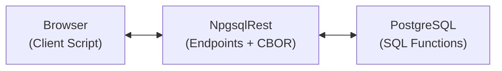
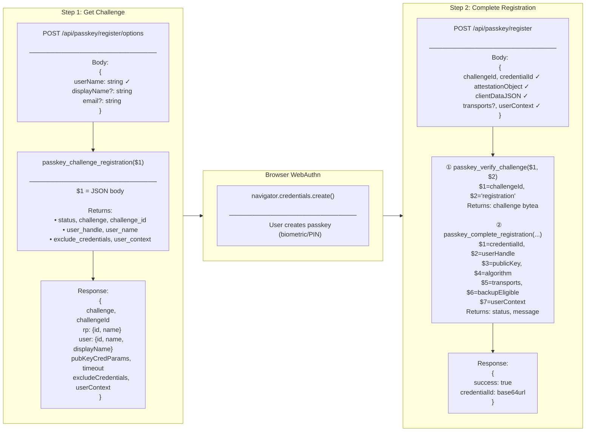
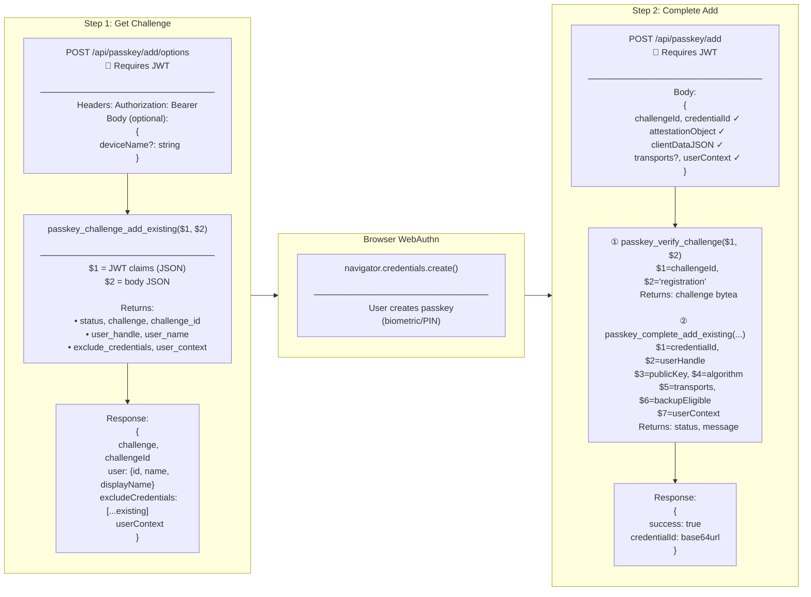
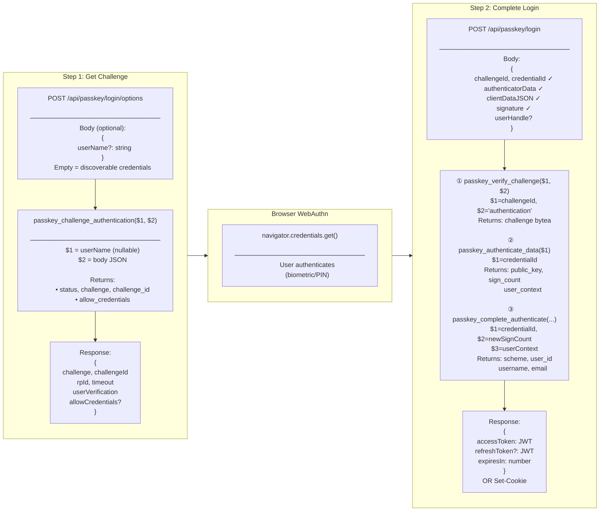

# Implementing WebAuthn Passkeys with Pure SQL and NpgsqlRest

<p class="blog-meta">
<span class="tag">WebAuthn</span> · <span class="tag">Authentication</span> · <span class="tag">January 2026</span>
</p>

---

WebAuthn passkeys replace the weakest part of most systems - the password - with public-key cryptography tied to biometric or PIN verification on the user's device. There is no shared secret to phish, reuse across sites, or leak in a database breach.

NpgsqlRest now supports **built-in passkey authentication** that lets you implement passwordless login with your authentication logic written entirely in PostgreSQL functions. No external authentication libraries, no third-party services—just your database, a few SQL functions, and a client-side script to call the browser's WebAuthn API (see the [passkey.ts example](https://github.com/NpgsqlRest/npgsqlrest-docs/blob/main/examples/13_passkey/src/passkey.ts) you can use as a starting point).

## What Gets Stored (And What Doesn't)

A common misconception about passkeys is that they store biometric data. **They don't.** Here's what actually happens:

1. **During registration**, the user's device generates a public/private key pair. The private key never leaves the device and is protected by biometrics or a PIN
2. **Your database stores only the public key**, a credential ID, and metadata like the signature counter
3. **During login**, the device signs a challenge with the private key, and your server verifies it with the stored public key

No fingerprints, no facial recognition data, no personal biometric information ever touches your server. You're storing cryptographic keys, not sensitive personal data.

## Architecture Overview

NpgsqlRest's passkey implementation follows the WebAuthn specification with a SQL-first approach:



- **Browser**: A client script that calls the browser's WebAuthn API and communicates with NpgsqlRest endpoints. See the [passkey.ts example](https://github.com/NpgsqlRest/npgsqlrest-docs/blob/main/examples/13_passkey/src/passkey.ts) for a complete TypeScript implementation.
- **NpgsqlRest**: Provides the HTTP endpoints and handles CBOR parsing/verification.
- **PostgreSQL**: Your SQL functions control the entire authentication flow—challenge creation, user management, credential storage.

The division of labor: NpgsqlRest does the cryptographic work (parsing CBOR attestation objects, verifying signatures with EC and RSA keys) while your SQL functions define the business logic.

## Complete Example Walkthrough

The full source for the example below is in the [examples/13_passkey](https://github.com/NpgsqlRest/npgsqlrest-docs/tree/main/examples/13_passkey) directory.

### 1. Database Schema

First, create the tables to store users, passkeys, and challenges:

```sql
-- Users table (can integrate with existing users)
create table users (
    user_id serial primary key,
    username text not null,
    email text,
    password text null,  -- null for passkey-only users
    created_at timestamptz default now()
);
create unique index on users(username);

-- Passkeys table - stores the public keys
create table passkeys (
    credential_id bytea primary key,
    user_id int not null references users(user_id) on delete cascade,
    user_handle bytea unique not null,
    public_key bytea not null,
    public_key_algorithm int not null,
    sign_count bigint not null default 0,
    transports text[],
    backup_eligible boolean default false,
    device_name text,
    created_at timestamptz default now(),
    last_used_at timestamptz
);

-- Challenge storage for replay protection
create table passkey_challenges (
    id bigint not null generated always as identity primary key,
    challenge bytea not null,
    user_id int,  -- null for authentication, set for registration
    operation text not null check (operation in ('registration', 'authentication')),
    expires_at timestamptz not null,
    created_at timestamptz default now()
);
```

### 2. Challenge Functions

The WebAuthn flow requires generating random challenges that are verified later. Here's the registration challenge function:

```sql
create or replace function passkey_challenge_registration(_body json)
returns table (
    status int,
    message text,
    challenge text,
    challenge_id bigint,
    user_handle text,
    user_name text,
    user_display_name text,
    exclude_credentials text,
    user_context json
)
security definer
language plpgsql
as $$
declare
    _user_name text = _body->>'userName';
    _user_handle bytea;
    _challenge bytea;
    _challenge_id bigint;
begin
    assert _user_name is not null and _user_name <> '';

    -- Generate new user handle (random 32 bytes)
    _user_handle = gen_random_bytes(32);

    -- Generate challenge (random 32 bytes)
    _challenge = gen_random_bytes(32);

    -- Store challenge for verification
    insert into passkey_challenges
        (challenge, user_id, operation, expires_at)
    values
        (_challenge, null, 'registration', now() + interval '5 minutes')
    returning id into _challenge_id;

    return query select
        200,
        null::text,
        encode(_challenge, 'base64'),
        _challenge_id,
        encode(_user_handle, 'base64'),
        _user_name,
        coalesce(_body->>'displayName', _user_name),
        '[]'::text,
        json_build_object(
            'userName', _user_name,
            'email', _body->>'email',
            'deviceName', _body->>'deviceName'
        );
end;
$$;
```

The function returns exactly the columns NpgsqlRest expects:
- `status`: HTTP status code (200 to proceed)
- `challenge`: Base64-encoded random bytes
- `challenge_id`: Reference for verification
- `user_handle`: Unique identifier stored with the passkey
- `user_context`: JSON that gets passed through to the completion function

### 3. Completion Functions

After the browser creates the credential, NpgsqlRest verifies the attestation and calls your completion function:

```sql
create or replace function passkey_complete_registration(
    _credential_id bytea,
    _user_handle bytea,
    _public_key bytea,
    _public_key_algorithm int,
    _sign_count bigint,
    _backup_eligible boolean,
    _transports text[],
    _user_context json
)
returns table (status int, message text, user_context json)
security definer
language plpgsql
as $$
declare
    _user_id int;
    _user_name text = _user_context->>'userName';
begin
    -- Create the user
    insert into users (username, email)
    values (_user_name, _user_context->>'email')
    returning user_id into _user_id;

    -- Store the passkey
    insert into passkeys (
        credential_id, user_id, user_handle, public_key,
        public_key_algorithm, sign_count, transports,
        backup_eligible, device_name
    )
    values (
        _credential_id, _user_id, _user_handle, _public_key,
        _public_key_algorithm, _sign_count, _transports,
        _backup_eligible, _user_context->>'deviceName'
    );

    return query select 200, null::text,
        json_build_object('userId', _user_id);
end;
$$;
```

NpgsqlRest extracts the public key and algorithm from the CBOR attestation object before calling your function. You just store them.

### 4. Authentication Function

For login, the completion function verifies the user and returns claims for cookie/JWT authentication:

```sql
create or replace function passkey_complete_authenticate(
    _credential_id bytea,
    _new_sign_count bigint,
    _user_context json,
    _analytics_data json default null
)
returns table (
    scheme text,
    user_id int,
    username text,
    email text,
    message jsonb
)
security definer
language plpgsql
as $$
declare
    _user_id int = (_user_context->>'id')::int;
begin
    -- Update sign count and last used timestamp
    update passkeys
    set sign_count = _new_sign_count, last_used_at = now()
    where credential_id = _credential_id;

    -- Return user claims for authentication
    return query
    select
        'cookies' as scheme,
        u.user_id,
        u.username,
        u.email,
        jsonb_build_object(
            'userId', u.user_id,
            'username', u.username,
            'email', u.email
        )
    from users u
    where u.user_id = _user_id;
end;
$$;
```

The `scheme` column tells NpgsqlRest which authentication scheme to use (cookies, JWT bearer, etc.).

### 5. Configuration

Enable passkey authentication in your `appsettings.json`. Minimal configuration:

```json
{
  "Auth": {
    "PasskeyAuth": {
      "Enabled": true,
      "EnableRegister": true
    }
  }
}
```

For custom SQL commands, specify the command settings:

```json
{
  "Auth": {
    "PasskeyAuth": {
      "Enabled": true,
      "EnableRegister": true,
      "ChallengeRegistrationCommand": "select * from passkey_challenge_registration($1)",
      "CompleteRegistrationCommand": "select * from passkey_complete_registration($1,$2,$3,$4,$5,$6,$7,$8)",
      "ChallengeAuthenticationCommand": "select * from passkey_challenge_authentication($1,$2)",
      "AuthenticateDataCommand": "select * from passkey_authenticate_data($1)",
      "CompleteAuthenticateCommand": "select * from passkey_complete_authenticate($1,$2,$3,$4)"
    }
  }
}
```

For the complete configuration reference, see [Passkey Authentication Configuration](/config/passkey-auth).

Key configuration options:

| Option | Description |
|--------|-------------|
| `UserVerificationRequirement` | `"required"` = must use biometric/PIN; `"preferred"` = use if available |
| `ResidentKeyRequirement` | `"required"` = true passwordless (no username field); `"preferred"` = user enters username first |
| `AttestationConveyance` | `"none"` for most apps; `"direct"` to verify authenticator hardware |
| `RateLimiterPolicy` | Name of a configured rate limiter policy for brute-force protection |
| `ConnectionName` | Optional named connection for multi-database setups |
| `CommandRetryStrategy` | Retry strategy for transient database errors (default: `"default"`) |

### 6. Client-Side Implementation

The [passkey.ts](https://github.com/NpgsqlRest/npgsqlrest-docs/blob/main/examples/13_passkey/src/passkey.ts) script in the example provides a complete TypeScript implementation you can use as a template:

```typescript
// Registration
const result = await register({
    userName: 'alice',
    displayName: 'Alice',
    deviceName: 'MacBook Pro'
});

if (result.success) {
    console.log('Registered with credential:', result.credentialId);
}

// Login
const loginResult = await login({
    userName: 'alice'  // Optional for discoverable credentials
});

if (loginResult.success) {
    const user = JSON.parse(loginResult.response);
    console.log('Logged in as:', user.username);
}
```

The script handles:
- Base64URL encoding/decoding for WebAuthn data
- RFC 7807 Problem Details error parsing
- Browser capability detection
- All three flows: registration, login, and adding passkeys to existing accounts

## Three Authentication Flows

NpgsqlRest supports three distinct passkey flows. Each endpoint internally executes a configured SQL command (typically a PostgreSQL function) that you define.

### 1. Registration (New User with Passkey)

For new users signing up with a passkey. Creates both the user account and passkey.



| Endpoint | Executes SQL Command |
|----------|---------------------|
| `POST /api/passkey/register/options` | `ChallengeRegistrationCommand` |
| `POST /api/passkey/register` | `CompleteRegistrationCommand` |

::: warning Registration is Disabled by Default
The standalone registration flow (`EnableRegister: false` by default) allows anyone to create an account with just a passkey. In most production systems, you'll want additional verification before creating accounts—email confirmation, admin approval, invitation codes, or CAPTCHA validation.

For this reason, the recommended approach is:
1. Create user accounts through your existing registration flow (with whatever verification you need)
2. Let users add passkeys to their verified accounts using the **Add Passkey** flow

The standalone registration endpoints are available when you need them (set `EnableRegister: true`), and the [complete example](https://github.com/NpgsqlRest/npgsqlrest-docs/tree/main/examples/13_passkey) demonstrates both approaches.
:::

### 2. Add Passkey (Existing User)

For users who already have an account (maybe they logged in with password) and want to add a passkey. These endpoints require authentication.



| Endpoint (requires auth) | Executes SQL Command |
|--------------------------|---------------------|
| `POST /api/passkey/add/options` | `ChallengeAddExistingUserCommand` |
| `POST /api/passkey/add` | `CompleteAddExistingUserCommand` |

### 3. Login

For authenticating with an existing passkey.



| Endpoint | Executes SQL Command |
|----------|---------------------|
| `POST /api/passkey/login/options` | `ChallengeAuthenticationCommand` |
| `POST /api/passkey/login` | `CompleteAuthenticateCommand` |

## Complete Configuration Reference

This section provides a detailed reference for all PasskeyAuth configuration options and SQL commands.

### General Settings

| Setting | Default | Description |
|---------|---------|-------------|
| `Enabled` | `false` | Master switch to enable passkey authentication |
| `EnableRegister` | `false` | Enable standalone registration (new users can sign up with passkey only) |
| `RateLimiterPolicy` | `null` | Name of a configured rate limiter policy to protect against brute-force |
| `ConnectionName` | `null` | Named connection for multi-database setups; uses default if null |
| `CommandRetryStrategy` | `"default"` | Retry strategy for transient database errors; set to null to disable |

### Relying Party Settings

The Relying Party (RP) identifies your application to the authenticator.

| Setting | Default | Description |
|---------|---------|-------------|
| `RelyingPartyId` | `null` | Domain name (e.g., `"example.com"`). Auto-detected from request if null. **Note:** IP addresses are not permitted—use `"localhost"` for development |
| `RelyingPartyName` | `null` | Human-readable name shown during registration. Uses `ApplicationName` if null |
| `RelyingPartyOrigins` | `[]` | Allowed origins for validation (e.g., `["https://example.com"]`). Auto-detected if empty |

### Endpoint Paths

All paths are POST endpoints. Set to `null` to disable an endpoint.

| Setting | Default | Description |
|---------|---------|-------------|
| `AddPasskeyOptionsPath` | `"/api/passkey/add/options"` | Get options for adding passkey to existing user (requires auth) |
| `AddPasskeyPath` | `"/api/passkey/add"` | Complete adding passkey to existing user (requires auth) |
| `RegistrationOptionsPath` | `"/api/passkey/register/options"` | Get options for new user registration (no auth required) |
| `RegistrationPath` | `"/api/passkey/register"` | Complete new user registration (no auth required) |
| `LoginOptionsPath` | `"/api/passkey/login/options"` | Get login challenge (no auth required) |
| `LoginPath` | `"/api/passkey/login"` | Complete authentication (no auth required) |

### WebAuthn Settings

| Setting | Default | Description |
|---------|---------|-------------|
| `ChallengeTimeoutMinutes` | `5` | How long challenges remain valid before expiring |
| `ValidateSignCount` | `true` | Validate signature counter to detect cloned authenticators |
| `UserVerificationRequirement` | `"required"` | See below |
| `ResidentKeyRequirement` | `"required"` | See below |
| `AttestationConveyance` | `"none"` | See below |

#### UserVerificationRequirement

Controls whether biometric/PIN verification is required:

| Value | Behavior | Use Case |
|-------|----------|----------|
| `"required"` | User MUST verify with biometric or PIN | Banking, healthcare, any sensitive data |
| `"preferred"` | Request verification if available, proceed without if not | Most consumer apps |
| `"discouraged"` | Don't request verification (proves device possession only) | Low-security scenarios |

#### ResidentKeyRequirement

Controls discoverable credentials (true passwordless):

| Value | Behavior | Use Case |
|-------|----------|----------|
| `"required"` | Credential stored on authenticator; browser shows account picker | True passwordless (no username field) |
| `"preferred"` | Request discoverable if supported | Gradual migration to passwordless |
| `"discouraged"` | Server must provide credential ID | Username-first flows |

#### AttestationConveyance

Controls whether to verify authenticator hardware:

| Value | Behavior | Use Case |
|-------|----------|----------|
| `"none"` | Accept any authenticator | Most apps (recommended) |
| `"indirect"` | Allow anonymized attestation | Rarely useful |
| `"direct"` | Request full attestation chain | Verify specific hardware models |
| `"enterprise"` | Enterprise-managed attestation | Corporate device policies |

### SQL Commands Reference

NpgsqlRest calls your SQL functions at specific points in each flow. Here's when each command is executed and what it should return.

#### ChallengeAddExistingUserCommand

**When executed:** User clicks "Add Passkey" in their account settings (they're already logged in)

**Endpoint:** `POST /api/passkey/add/options`

**Parameters:**
- `$1` = `claims` (json): User claims from the authenticated session
- `$2` = `body` (json): Request body (e.g., `{ "deviceName": "My Phone" }`)

**Expected return columns:**

| Column | Type | Description |
|--------|------|-------------|
| `status` | int | HTTP status code. Return `200` to proceed, any other aborts |
| `message` | text | Error message when status ≠ 200 |
| `challenge` | text | Base64-encoded random bytes (32 bytes recommended) |
| `challenge_id` | bigint/uuid/text | Server-side identifier to verify later |
| `user_handle` | text | Base64-encoded random bytes for WebAuthn user.id |
| `user_name` | text | Username shown in authenticator UI |
| `user_display_name` | text | Display name shown in authenticator UI |
| `exclude_credentials` | text | JSON array of existing credential IDs to prevent re-registration |
| `user_context` | json | Passed through to completion command (should contain user ID) |

**Example:**

```sql
create or replace function passkey_challenge_add_existing(
    _claims json,
    _body json
)
returns table (
    status int, message text, challenge text, challenge_id bigint,
    user_handle text, user_name text, user_display_name text,
    exclude_credentials text, user_context json
)
language plpgsql as $$
declare
    _user_id int = (_claims->>'user_id')::int;
    _challenge bytea = gen_random_bytes(32);
    _challenge_id bigint;
    _existing_handle bytea;
begin
    -- Get existing user handle (or create new one)
    select user_handle into _existing_handle
    from passkeys where user_id = _user_id limit 1;

    if _existing_handle is null then
        _existing_handle = gen_random_bytes(32);
    end if;

    -- Store challenge
    insert into passkey_challenges (challenge, user_id, operation, expires_at)
    values (_challenge, _user_id, 'registration', now() + interval '5 minutes')
    returning id into _challenge_id;

    return query
    select 200, null::text,
        encode(_challenge, 'base64'),
        _challenge_id,
        encode(_existing_handle, 'base64'),
        _claims->>'username',
        _claims->>'username',
        (select coalesce(jsonb_agg(jsonb_build_object(
            'type', 'public-key',
            'id', encode(credential_id, 'base64')
        )), '[]'::jsonb)::text from passkeys where user_id = _user_id),
        json_build_object('id', _user_id, 'deviceName', _body->>'deviceName');
end;
$$;
```

---

#### ChallengeRegistrationCommand

**When executed:** New user starts passkey-only registration (no existing account)

**Endpoint:** `POST /api/passkey/register/options`

**Parameters:**
- `$1` = `body` (json): Request body with user info (e.g., `{ "userName": "alice", "email": "alice@example.com" }`)

**Expected return columns:** Same as `ChallengeAddExistingUserCommand`

**Key difference:** The `user_context` should NOT contain an `id` field—this tells the completion command to create a new user.

---

#### ChallengeAuthenticationCommand

**When executed:** User initiates passkey login

**Endpoint:** `POST /api/passkey/login/options`

**Parameters:**
- `$1` = `user_name` (text): Username if provided, NULL for discoverable credential flow
- `$2` = `body` (json): Request body

**Expected return columns:**

| Column | Type | Description |
|--------|------|-------------|
| `status` | int | HTTP status code (200 to proceed) |
| `message` | text | Error message when status ≠ 200 |
| `challenge` | text | Base64-encoded random challenge |
| `challenge_id` | bigint/uuid/text | Server-side identifier |
| `allow_credentials` | text | JSON array of credential IDs for this user (empty for discoverable) |

**Example:**

```sql
create or replace function passkey_challenge_authentication(
    _user_name text,
    _body json
)
returns table (
    status int, message text, challenge text,
    challenge_id bigint, allow_credentials text
)
language plpgsql as $$
declare
    _challenge bytea = gen_random_bytes(32);
    _challenge_id bigint;
    _user_id int;
begin
    -- If username provided, look up user
    if _user_name is not null and _user_name <> '' then
        select user_id into _user_id from users where username = _user_name;
        if _user_id is null then
            return query select 400, 'Bad request'::text,
                null::text, null::bigint, null::text;
            return;
        end if;
    end if;

    -- Store challenge
    insert into passkey_challenges (challenge, user_id, operation, expires_at)
    values (_challenge, _user_id, 'authentication', now() + interval '5 minutes')
    returning id into _challenge_id;

    return query
    select 200, null::text,
        encode(_challenge, 'base64'),
        _challenge_id,
        coalesce((
            select jsonb_agg(jsonb_build_object(
                'type', 'public-key',
                'id', encode(credential_id, 'base64'),
                'transports', transports
            ))::text from passkeys where user_id = _user_id
        ), '[]');
end;
$$;
```

---

#### VerifyChallengeCommand

**When executed:** After browser returns credential, before cryptographic verification

**Used by:** ALL flows (add passkey, registration, and login)

**Parameters:**
- `$1` = `challenge_id` (bigint/uuid/text): The challenge_id from the options response
- `$2` = `operation` (text): Either `"registration"` or `"authentication"`

**Expected return:** Single column `challenge` (bytea) containing the original challenge bytes, or NULL if not found/expired

**Example:**

```sql
create or replace function passkey_verify_challenge(
    _challenge_id bigint,
    _operation text
)
returns bytea
language plpgsql as $$
declare
    _challenge bytea;
begin
    -- Delete and return the challenge (one-time use)
    delete from passkey_challenges
    where id = _challenge_id
      and operation = _operation
      and expires_at > now()
    returning challenge into _challenge;

    return _challenge;
end;
$$;
```

---

#### AuthenticateDataCommand

**When executed:** During login, after challenge verification but before signature verification

**Endpoint:** `POST /api/passkey/login`

**Parameters:**
- `$1` = `credential_id` (bytea): The credential ID from the browser

**Expected return columns:**

| Column | Type | Description |
|--------|------|-------------|
| `status` | int | HTTP status code (200 to proceed) |
| `message` | text | Error message when status ≠ 200 |
| `public_key` | bytea | The stored public key for signature verification |
| `public_key_algorithm` | int | COSE algorithm ID (-7 for ES256, -257 for RS256) |
| `sign_count` | bigint | Current signature counter |
| `user_context` | json | Passed to CompleteAuthenticateCommand (typically contains user ID) |

**Example:**

```sql
create or replace function passkey_authenticate_data(_credential_id bytea)
returns table (
    status int, message text, public_key bytea,
    public_key_algorithm int, sign_count bigint, user_context json
)
language plpgsql as $$
begin
    return query
    select 200, null::text,
        p.public_key,
        p.public_key_algorithm,
        p.sign_count,
        json_build_object('id', p.user_id)
    from passkeys p
    where p.credential_id = _credential_id;

    if not found then
        return query select 400, 'Bad request'::text,
            null::bytea, null::int, null::bigint, null::json;
    end if;
end;
$$;
```

---

#### CompleteAddExistingUserCommand

**When executed:** After successful attestation verification when adding passkey to existing user

**Endpoint:** `POST /api/passkey/add`

**Parameters:**

| Parameter | Type | Description |
|-----------|------|-------------|
| `$1` | bytea | `credential_id` - Unique credential identifier |
| `$2` | bytea | `user_handle` - WebAuthn user.id |
| `$3` | bytea | `public_key` - Public key in COSE format |
| `$4` | int | `algorithm` - COSE algorithm (-7 = ES256, -257 = RS256) |
| `$5` | text[] | `transports` - Transport hints (e.g., `["internal", "hybrid"]`) |
| `$6` | boolean | `backup_eligible` - Whether credential can be synced |
| `$7` | json | `user_context` - From ChallengeAddExistingUserCommand |
| `$8` | json | `analytics_data` - Optional client analytics with server-added IP |

**Expected return columns:**

| Column | Type | Description |
|--------|------|-------------|
| `status` | int | HTTP status code (200 = success) |
| `message` | text | Error message when status ≠ 200 |

---

#### CompleteRegistrationCommand

**When executed:** After successful attestation verification for new user registration

**Endpoint:** `POST /api/passkey/register`

**Parameters:** Same as `CompleteAddExistingUserCommand`

**Expected return columns:** Same as `CompleteAddExistingUserCommand`

**Key difference:** This command should CREATE a new user since `user_context` doesn't contain an existing user ID.

---

#### CompleteAuthenticateCommand

**When executed:** After successful signature verification during login

**Endpoint:** `POST /api/passkey/login`

**Parameters:**

| Parameter | Type | Description |
|-----------|------|-------------|
| `$1` | bytea | `credential_id` - The credential that was used |
| `$2` | bigint | `new_sign_count` - Updated signature counter |
| `$3` | json | `user_context` - From AuthenticateDataCommand |
| `$4` | json | `analytics_data` - Optional client analytics |

**Expected return columns:**

The return columns depend on your authentication scheme. For cookie authentication:

| Column | Type | Description |
|--------|------|-------------|
| `scheme` | text | Authentication scheme (e.g., `"cookies"`) |
| Any claim columns | various | Columns become claims (e.g., `user_id`, `username`, `email`) |
| `message` | jsonb | Optional JSON returned in response body |

**Example:**

```sql
create or replace function passkey_complete_authenticate(
    _credential_id bytea,
    _new_sign_count bigint,
    _user_context json,
    _analytics_data json default null
)
returns table (
    scheme text, user_id int, username text, email text, message jsonb
)
language plpgsql as $$
declare
    _user_id int = (_user_context->>'id')::int;
begin
    -- Update sign count
    update passkeys
    set sign_count = _new_sign_count, last_used_at = now()
    where credential_id = _credential_id;

    -- Optional: Log authentication
    if _analytics_data is not null then
        insert into auth_audit_log (user_id, event_type, analytics_data, ip_address)
        values (_user_id, 'passkey_login', _analytics_data, _analytics_data->>'ip');
    end if;

    -- Return claims for authentication
    return query
    select 'cookies', u.user_id, u.username, u.email,
        jsonb_build_object('userId', u.user_id, 'username', u.username)
    from users u where u.user_id = _user_id;
end;
$$;
```

### Column Name Configuration

If your SQL functions use different column names, you can configure the mappings:

```json
{
  "PasskeyAuth": {
    "StatusColumnName": "status",
    "MessageColumnName": "message",
    "ChallengeColumnName": "challenge",
    "ChallengeIdColumnName": "challenge_id",
    "UserNameColumnName": "user_name",
    "UserDisplayNameColumnName": "user_display_name",
    "UserHandleColumnName": "user_handle",
    "ExcludeCredentialsColumnName": "exclude_credentials",
    "AllowCredentialsColumnName": "allow_credentials",
    "PublicKeyColumnName": "public_key",
    "PublicKeyAlgorithmColumnName": "public_key_algorithm",
    "SignCountColumnName": "sign_count",
    "UserContextColumnName": "user_context"
  }
}
```

### Analytics Data

You can collect client-side analytics by passing `analyticsData` in completion requests. NpgsqlRest automatically adds the client's IP address:

```json
{
  "PasskeyAuth": {
    "ClientAnalyticsIpKey": "ip"
  }
}
```

Set to `null` or empty string to disable IP collection.

## Security Considerations

### What NpgsqlRest Validates

NpgsqlRest performs all the cryptographic verification required by WebAuthn:

- Parses CBOR-encoded attestation objects
- Extracts and validates public keys (EC P-256, EC P-384, RSA)
- Verifies signatures using the stored public key
- Validates origin and relying party ID
- Checks challenge matches and hasn't expired
- Optionally validates and updates signature counters

### What You Control

Your SQL functions control the business logic:

- User creation and lookup
- Credential storage and retrieval
- Challenge expiration policy
- Which users can register/authenticate
- What claims are returned after authentication
- Audit logging and analytics

### Rate Limiting

Always enable rate limiting on passkey endpoints:

```json
{
  "PasskeyAuth": {
    "RateLimiterPolicy": "passkey-limit"
  },
  "RateLimiting": {
    "Policies": {
      "passkey-limit": {
        "Type": "SlidingWindow",
        "PermitLimit": 10,
        "WindowSeconds": 60
      }
    }
  }
}
```

## Advantages of This Approach

### 1. SQL-First Logic

Your authentication flow is defined in PostgreSQL functions. This means:
- Version control with your schema migrations
- Testable with standard SQL testing tools
- No application code changes needed to modify auth logic
- Full power of SQL for complex business rules

### 2. No External Dependencies

No FIDO2 libraries, no external authentication services. NpgsqlRest includes its own CBOR parser and cryptographic verification.

### 3. Complete Control

You decide:
- How users are created and stored
- What metadata to track (device names, last used, etc.)
- How to handle edge cases (duplicate registrations, account recovery)
- What authentication scheme to use (cookies, JWT, custom)

### 4. Built-in Resilience

The passkey endpoints support:
- Connection retry for transient database failures
- Command retry with configurable strategies
- Named connections for multi-database architectures
- Rate limiting to prevent abuse

### 5. Privacy by Design

Since you only store public keys:
- No biometric data ever reaches your server
- No password hashes to protect or rotate
- Minimal personal data exposure in a breach
- GDPR-friendly: public keys aren't personal data

## Getting Started

1. **Create the schema**: Set up your users, passkeys, and challenges tables
2. **Implement the SQL functions**: Challenge creation, verification, completion
3. **Configure PasskeyAuth**: Enable it and point to your functions
4. **Add client code**: Use the provided `passkey.ts` as a starting point
5. **Enable rate limiting**: Protect against brute-force attacks

The [complete example](https://github.com/NpgsqlRest/npgsqlrest-docs/tree/main/examples/13_passkey) includes everything you need: schema, SQL functions, configuration, and client code. For all configuration options, see the [Passkey Authentication Configuration](/config/passkey-auth) reference.

## Conclusion

If you take one recommendation from this post: keep `EnableRegister` off, let users add passkeys to accounts created through your existing verified registration flow, and put a rate limiter on the endpoints. The rest—challenge storage, claims, audit logging—is ordinary SQL, version-controlled next to your schema.

<BlogNav
  :get-started="[
    { text: 'Passkey Configuration Reference', href: '/config/passkey-auth' },
    { text: 'Complete Passkey Example', href: 'https://github.com/NpgsqlRest/npgsqlrest-docs/tree/main/examples/13_passkey' },
    { text: 'Quick Start Guide', href: '/guide/quick-start' }
  ]"
/>
