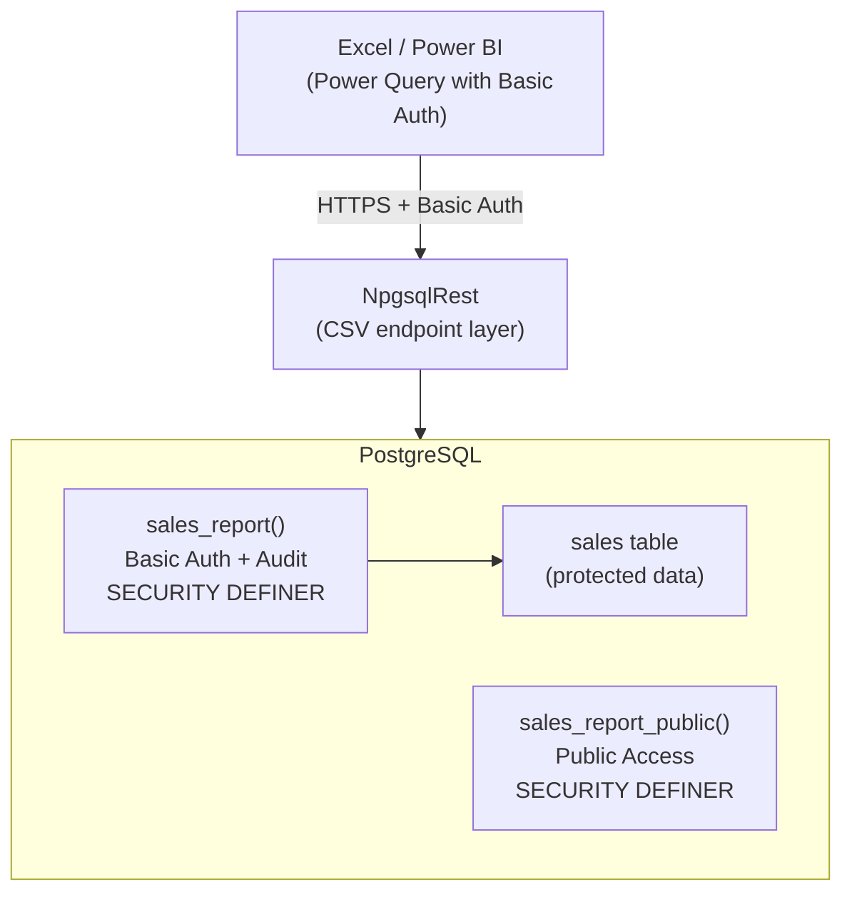
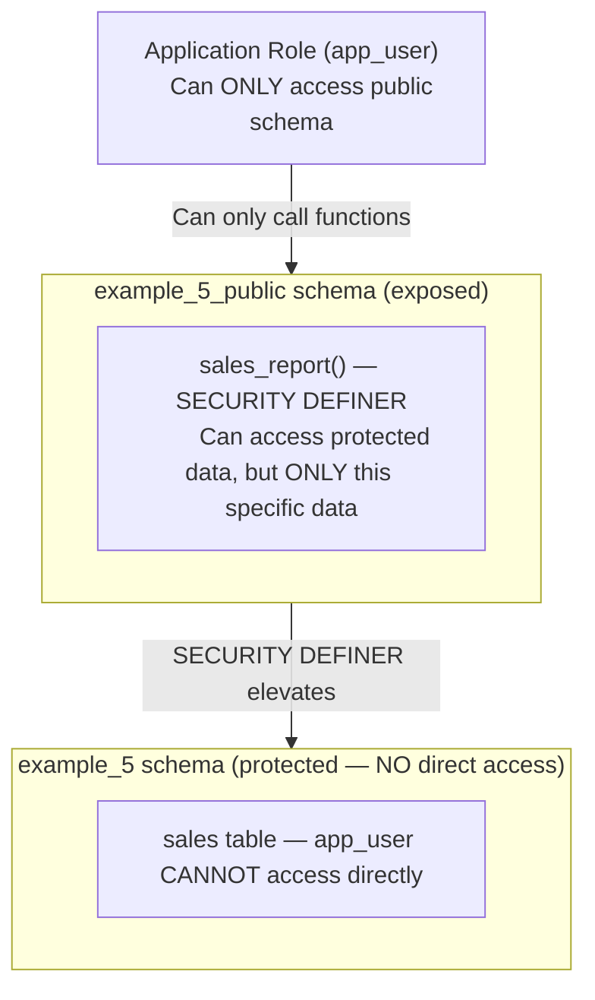

# Turn PostgreSQL into a BI Server: CSV Exports, Basic Auth & Excel Integration

<p class="blog-meta">
  <span>January 2026</span> ·
  <span class="tag">PostgreSQL</span>
  <span class="tag">BI</span>
  <span class="tag">Excel</span>
  <span class="tag">CSV</span>
  <span class="tag">NpgsqlRest</span>
</p>

What if you could turn your PostgreSQL database into a fully-featured Business Intelligence server - serving CSV reports directly to Excel, secured with authentication, all without writing a single line of application code?

This post demonstrates how to build a complete BI data delivery system using NpgsqlRest, where PostgreSQL functions become CSV endpoints that Excel can consume directly. Change the function, and every connected Excel workbook updates automatically.

> **Source Code**: The complete working example is available at [github.com/NpgsqlRest/npgsqlrest-docs/examples/5_csv_basic_auth](https://github.com/NpgsqlRest/npgsqlrest-docs/tree/main/examples/5_csv_basic_auth)

## The Architecture



The key insight: **your reporting logic lives in PostgreSQL functions**, not application code. Business analysts connect Excel directly to these endpoints, and you control everything from one central place - the database.

## Defense in Depth: The Principle of Least Privilege

This example implements the **Principle of Least Privilege (PoLP)** at the database level - a security architecture explained in detail in [Database-Level Security: Building Secure Authentication with PostgreSQL](/blog/database-level-security-postgresql-authentication).

Even if a Basic Auth password is compromised, the damage is limited:



**Why this matters:**

1. **No direct table access** - The application role (`app_user`) cannot query tables directly. Even with a stolen password, an attacker can only call the exposed functions.

2. **Controlled data exposure** - Each `SECURITY DEFINER` function exposes exactly what it's designed to expose - nothing more. The `sales_report()` function returns sales data; it cannot be tricked into returning user passwords or other sensitive data.

3. **Search path protection** - The `set search_path = pg_catalog, pg_temp` prevents [search path injection attacks](https://wiki.postgresql.org/wiki/A_Guide_to_CVE-2018-1058:_Protect_Your_Search_Path) that could otherwise exploit `SECURITY DEFINER` functions.

4. **Audit trail built-in** - The `_user_name` parameter records who accessed the data, providing accountability even for legitimate access.

This is **defense in depth**: SSL protects credentials in transit, Basic Auth controls who can access endpoints, and PoLP limits what authenticated users can actually do. A compromised password gives access to the sales report - not the entire database.

## Creating CSV Endpoints

### Define a Reusable Type

First, create a composite type that defines your report structure:

```sql
create type example_5_public.sales_report_record as (
    exported_by text,
    order_id int,
    customer_name text,
    product text,
    quantity int,
    unit_price numeric(10,2),
    total numeric(10,2),
    order_date date
);
```

This type can be reused across multiple functions and enables type composition (more on this later).

### The Secured Report Function

```sql
create function example_5_public.sales_report(
    _user_name text default null  -- mapped from basic auth name claim
)
returns setof example_5_public.sales_report_record
language sql
set search_path = pg_catalog, pg_temp  -- Protect against search path attacks
security definer  -- Runs as migration user, not app_user
begin atomic;
select
    _user_name as exported_by,  -- Shows who exported the report
    order_id,
    customer_name,
    product,
    quantity,
    unit_price,
    total,
    order_date
from example_5.sales
order by order_date;
end;
```

The `_user_name` parameter is automatically populated from the authenticated user's claims - providing a built-in audit trail of who accessed the data.

### CSV Annotations

The magic happens in the function comment:

```sql
comment on function example_5_public.sales_report(text) is '
HTTP GET
@raw
@separator ,
@new_line \n
@columns
Content-Type: text/csv
Content-Disposition: attachment; filename="sales_report.csv"
@basic_auth admin lgjSqahngJF9DN0W+2vAf+EDgxSs14e9ag+DezupGdsftJJ8DUphu6cfroMB6Uqp
@user_params';
```

| Annotation | Effect |
|------------|--------|
| `@raw` | Return plain text instead of JSON |
| `@separator ,` | Use comma as column delimiter |
| `@new_line \n` | Use newline as row delimiter |
| `@columns` | Include column header row |
| `Content-Type: text/csv` | Set proper MIME type |
| `Content-Disposition: attachment` | Make browser download as file |
| `@basic_auth admin <hash>` | Require Basic Authentication |
| `@user_params` | Map authenticated user to `_user_name` parameter |

The result:

```csv
"exported_by","order_id","customer_name","product","quantity","unit_price","total","order_date"
"admin",1,"Acme Corp","Widget Pro",50,29.99,1499.50,"2024-01-15"
"admin",2,"TechStart Inc","Widget Basic",100,19.99,1999.00,"2024-01-16"
```

## Type Reuse and Composition

NpgsqlRest supports a powerful feature: **composite type expansion**. When a function returns a table that includes a composite type alongside other columns, NpgsqlRest automatically expands the type's fields and merges them with the additional columns into a flat structure.

This isn't just a convenience feature - it's an architectural pattern that promotes the **DRY principle** (Don't Repeat Yourself) at the database level and enables applications to maintain consistency across multiple endpoints.

### The Problem: Schema Duplication

In traditional approaches, each endpoint defines its own return structure:

```sql
-- Endpoint 1: Sales report
create function sales_report() returns table (
    order_id int, customer_name text, product text, quantity int, ...
);

-- Endpoint 2: Sales with audit info
create function sales_audit() returns table (
    order_id int, customer_name text, product text, quantity int, ...  -- duplicated!
    audited_by text, audit_date timestamp
);

-- Endpoint 3: Sales summary
create function sales_summary() returns table (
    order_id int, customer_name text, product text, quantity int, ...  -- duplicated again!
    category text, region text
);
```

When you need to add a field to sales data, you must update every function. Miss one, and your application has inconsistent data structures.

### The Solution: Composite Type Expansion

Define the structure once as a composite type:

```sql
create type example_5_public.sales_report_record as (
    exported_by text,
    order_id int,
    customer_name text,
    product text,
    quantity int,
    unit_price numeric(10,2),
    total numeric(10,2),
    order_date date
);
```

Then compose new return types by combining this type with additional columns:

```sql
create function example_5_public.sales_report_public()
returns table (
    record example_5_public.sales_report_record,  -- reuse the type
    message text                                   -- add context-specific column
)
language sql
set search_path = pg_catalog, pg_temp
security definer
begin atomic;
select
    (report.*)::example_5_public.sales_report_record,
    'WARNING: This is a public endpoint without authentication.' as message
from example_5_public.sales_report('public_user') report;
end;
```

NpgsqlRest automatically expands this into a flat CSV structure:

```csv
"exported_by","order_id","customer_name","product","quantity","unit_price","total","order_date","message"
"public_user",1,"Acme Corp","Widget Pro",50,29.99,1499.50,"2024-01-15","WARNING: This is a public endpoint..."
```

The composite type's 8 fields are expanded inline, followed by the `message` column - all as a single flat row.

### Benefits for Applications

**1. Single Source of Truth**

Change the type definition once, and every function using it inherits the change:

```sql
-- Add a new field to the type
alter type example_5_public.sales_report_record add attribute discount_applied boolean;
```

Every endpoint returning `sales_report_record` now includes `discount_applied`. No hunting through code to update multiple functions.

**2. Consistent API Contracts**

When multiple endpoints share the same base type, applications can rely on consistent field names and types:

```typescript
// TypeScript clients can define a shared interface
interface SalesReportBase {
    exportedBy: string;
    orderId: number;
    customerName: string;
    // ... always the same structure
}

// Extended interfaces compose naturally
interface SalesReportPublic extends SalesReportBase {
    message: string;
}

interface SalesReportAudit extends SalesReportBase {
    auditedBy: string;
    auditTimestamp: Date;
}
```

The database types map directly to application types.

**3. Function Chaining and Layered Access**

Composite types enable building layered APIs where higher-level functions wrap lower-level ones:

```sql
-- Base function: secured, audited
create function sales_report(_user_name text)
returns setof sales_report_record ...

-- Public wrapper: calls base function, adds warning
create function sales_report_public()
returns table (record sales_report_record, message text)
as $$ select *, 'Public access' from sales_report('public_user') $$;

-- Admin wrapper: calls base function, adds admin metadata
create function sales_report_admin(_user_name text)
returns table (record sales_report_record, access_level text, can_edit boolean)
as $$ select *, 'admin', true from sales_report(_user_name) $$;
```

Each layer adds its own context without duplicating the core data structure.

**4. Evolutionary Schema Design**

As your application grows, you can evolve types without breaking existing consumers:

```sql
-- Week 1: Basic type
create type order_summary as (id int, total numeric);

-- Week 4: Add field - existing functions still work
alter type order_summary add attribute status text;
```

**5. Cross-Module Consistency**

In larger applications with multiple schemas, composite types ensure consistency across different modules:

```sql
-- Shared type in a common schema
create schema shared_types;
create type shared_types.customer_info as (
    customer_id int,
    customer_name text,
    email text,
    tier text
);

-- Module A: Orders uses the shared type
create function orders.get_order_details(_order_id int)
returns table (
    customer shared_types.customer_info,  -- reused type
    order_id int,
    order_total numeric,
    order_date date
);

-- Module B: Support tickets uses the same type
create function support.get_ticket_details(_ticket_id int)
returns table (
    customer shared_types.customer_info,  -- same type, consistent structure
    ticket_id int,
    issue text,
    status text
);
```

Both modules produce consistent customer information structures. When customer fields change (e.g., adding `phone`), update the type once and both modules inherit the change.

## Securing with Basic Authentication

### Password Hashing

Never store plain-text passwords in annotations. Generate a hash:

```bash
npgsqlrest --hash secret123
# Output: lgjSqahngJF9DN0W+2vAf+EDgxSs14e9ag+DezupGdsftJJ8DUphu6cfroMB6Uqp
```

Use the hash in your annotation:

```sql
basic_auth admin lgjSqahngJF9DN0W+2vAf+EDgxSs14e9ag+DezupGdsftJJ8DUphu6cfroMB6Uqp
```

### Multiple Users via Configuration

For multiple users, define them in your configuration file instead of annotations:

```json
{
  "NpgsqlRest": {
    "AuthenticationOptions": {
      "BasicAuth": {
        "Enabled": true,
        "UseDefaultPasswordHasher": true,
        "Users": {
          "admin": "lgjSqahngJF9DN0W+2vAf+EDgxSs14e9ag+DezupGdsftJJ8DUphu6cfroMB6Uqp",
          "analyst": "another_hashed_password_here",
          "finance": "yet_another_hash"
        }
      }
    }
  }
}
```

Then use `basic_auth` without credentials in the annotation - it will validate against the configuration:

```sql
comment on function example_5_public.sales_report(text) is '
HTTP GET
@raw
@separator ,
@columns
@basic_auth
@user_params';
```

### Database-Driven Authentication with ChallengeCommand

For more elaborate authentication schemes, use `ChallengeCommand` to delegate authentication to a PostgreSQL function:

```json
{
  "NpgsqlRest": {
    "AuthenticationOptions": {
      "BasicAuth": {
        "Enabled": true,
        "ChallengeCommand": "select * from basic_auth_login($1, $2, $3)"
      }
    }
  }
}
```

The challenge function receives:
- `$1`: Username from Basic Auth header
- `$2`: Password from Basic Auth header
- `$3`: Pre-validation result (if users defined in config)

```sql
create function basic_auth_login(
    _username text,
    _password text,
    _validated bool
)
returns table (
    status bool,
    user_id int,
    user_name text,
    user_roles text[]
)
language plpgsql as $$
begin
    -- Validate against your users table
    return query
    select
        u.password_hash = crypt(_password, u.password_hash),
        u.id,
        u.username,
        array_agg(r.role_name)
    from users u
    left join user_roles r on r.user_id = u.id
    where u.username = _username
    group by u.id, u.username, u.password_hash;
end;
$$;
```

See [Basic Auth Configuration](/config/basic-auth-config) for full documentation.

## SSL Configuration

Basic Authentication transmits credentials in Base64 encoding - **this is NOT encryption**. SSL/TLS is mandatory for production use.

### Setup Steps

1. **Export a development certificate**:

```bash
dotnet dev-certs https --export-path ./5_csv_basic_auth/localhost.pfx --password dev123
```

2. **Trust the certificate** (optional, avoids browser warnings):

```bash
dotnet dev-certs https --trust
```

3. **Configure Kestrel** in your config file:

```json
{
  "Urls": "https://localhost:8080",

  "Ssl": {
    "Enabled": true,
    "UseHttpsRedirection": false,
    "UseHsts": false
  },

  "Kestrel": {
    "Endpoints": {
      "Https": {
        "Url": "https://localhost:8080",
        "Certificate": {
          "Path": "./5_csv_basic_auth/localhost.pfx",
          "Password": "dev123"
        }
      }
    }
  },

  "NpgsqlRest": {
    "AuthenticationOptions": {
      "BasicAuth": {
        "SslRequirement": "Required"
      }
    }
  }
}
```

The `SslRequirement` setting controls SSL enforcement:

| Value | Behavior |
|-------|----------|
| `Required` | Reject Basic Auth over plain HTTP |
| `Warning` | Allow HTTP but log a warning |
| `Ignore` | Allow HTTP silently (debug only) |

## No Code Generation Required

Unlike traditional approaches that require generated API clients, CSV endpoints work with just a URL. The `index.html` in this example is trivially simple:

```html
<a href="/api/example-5-public/sales-report">Download Sales Report (CSV)</a>
```

Click the link, enter credentials when prompted, and the browser downloads the CSV file. No JavaScript, no build process, no dependencies.

## Excel Power Query Integration

### Connecting Excel to Your Endpoint

In Excel, use Power Query to connect:

```powerquery
let
    Source = Web.Contents("https://localhost:8080/api/example-5-public/sales-report"),
    ImportedCSV = Csv.Document(Source, [Delimiter=",", Encoding=TextEncoding.Utf8, QuoteStyle=QuoteStyle.Csv]),
    PromotedHeaders = Table.PromoteHeaders(ImportedCSV, [PromoteAllScalars=true])
in
    PromotedHeaders
```

When you run this query, Excel prompts for Basic Auth credentials. Enter your username and password, and the data flows directly into your spreadsheet.

### The Power of Central Control

Here's where it gets interesting. When you modify the PostgreSQL function:

```sql
-- Add a new column to the report
create or replace function example_5_public.sales_report(...)
returns table (
    -- existing columns...
    profit_margin numeric(5,2)  -- NEW!
)
```

Every Excel workbook that connects to this endpoint will see the new column on the next refresh. **You control the data structure from one place** - the database - and every consumer automatically gets the update.

This is the opposite of traditional BI systems where:
- You export data to a data warehouse
- Transform it through ETL pipelines
- Build reports in a separate BI tool
- Manually update when schemas change

With this approach:
- Functions define the report structure
- Excel connects directly
- Schema changes propagate automatically

### Production Considerations

For production deployment within a corporate network:

1. **Use proper SSL certificates** - Get certificates from your internal CA or a trusted provider
2. **Deploy on trusted network** - These endpoints should only be accessible from your internal network
3. **Use strong passwords** - Consider integrating with your corporate identity system via ChallengeCommand
4. **Audit access** - The `_user_name` parameter in the secured endpoint creates an audit trail

### When You Still Need ETL

This approach works well for many scenarios, but you may still need traditional ETL when:

- **High query load** - Heavy reporting queries shouldn't compete with OLTP workloads on production databases
- **Cross-database joins** - Data from multiple source systems needs consolidation
- **Historical snapshots** - You need point-in-time data that changes over time
- **Complex transformations** - Business logic requires extensive data cleansing or aggregation

For these cases, consider replicating data to a dedicated reporting database (using PostgreSQL logical replication, for example) and pointing NpgsqlRest at that replica. You get the same simple CSV endpoints without impacting production.

## The Cost Comparison

Consider what you'd typically need for a BI system:

| Traditional BI | This Approach |
|----------------|---------------|
| PostgreSQL (or paid database) | PostgreSQL (free) |
| ETL tool licenses | Often not needed* |
| Data warehouse licenses | Often not needed* |
| BI tool licenses (Tableau, etc.) | Not needed |
| Development time for integration | Minutes |
| Ongoing maintenance | Schema changes only |

*For simple reporting from a single database, ETL and data warehouses add unnecessary complexity. For high-load production systems or cross-database reporting, consider a read replica.

With PostgreSQL (free) and NpgsqlRest (free), you have a complete BI data delivery system in minutes. Users get their data in Excel - the tool they already know - and can create any charts or analysis they want.

## Complete Example

The full working example includes:

- **Schema setup** with protected sales data
- **Secured endpoint** with Basic Auth and audit trail
- **Public endpoint** demonstrating type composition
- **SSL configuration** for secure transmission
- **Excel workbook** demonstrating Power Query integration
- **Simple HTML** for direct downloads

```bash
# Clone the repository
git clone https://github.com/NpgsqlRest/npgsqlrest-docs.git

# Navigate to example
cd npgsqlrest-docs/examples/5_csv_basic_auth

# Generate certificate
dotnet dev-certs https --export-path ./localhost.pfx --password dev123

# Run migrations and start
npgsqlrest --config config.json
```

Then open `https://localhost:8080` in your browser or connect Excel to `https://localhost:8080/api/example-5-public/sales-report`.

## Conclusion

You've just built a complete BI data delivery system:

1. **PostgreSQL functions** define your reports - one source of truth
2. **CSV annotations** transform functions into downloadable endpoints
3. **Basic Auth** secures access with built-in audit trails
4. **SSL** protects credentials in transit
5. **Excel connects directly** - no middleware, no ETL, no BI tools
6. **Schema changes propagate automatically** to all consumers

This is serious power. For the cost of running PostgreSQL (free) and NpgsqlRest (free), you can serve your entire organization's BI needs. Business analysts get data in Excel, where they can create any visualization they want. You maintain control from one central place.

No expensive BI licenses. No complex ETL pipelines. No data warehouses to manage. Just PostgreSQL functions serving CSV to Excel.

That's what "database as the application" really means.

::: tip SQL File Source
Everything in this post also works with [SQL file endpoints](/guide/sql-files) — no functions needed. See the [SQL file version of this example](https://github.com/NpgsqlRest/npgsqlrest-docs/tree/main/examples/5_csv_basic_auth_sql_file).
:::

<BlogNav
  source-code="https://github.com/NpgsqlRest/npgsqlrest-docs/tree/main/examples/5_csv_basic_auth"
  :documentation="[
    { text: 'Basic Auth Configuration', href: '/config/basic-auth-config' },
    { text: 'CSV Annotations', href: '/annotations/raw' },
    { text: 'Authentication Options', href: '/config/authentication-options' }
  ]"
/>
