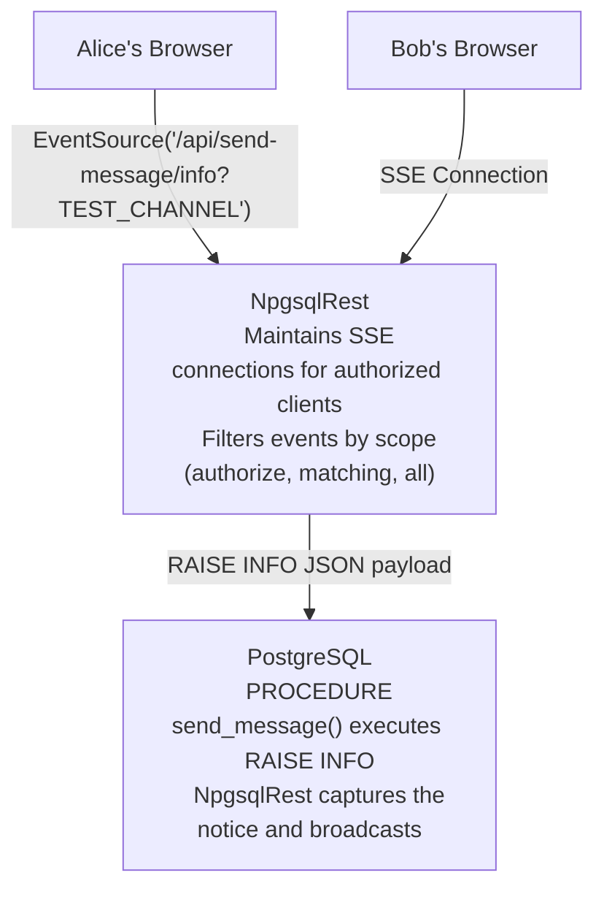

# Build a Real-Time Chat App with PostgreSQL and Server-Sent Events

<p class="blog-meta">
  <span>January 2026</span> ·
  <span class="tag">SSE</span>
  <span class="tag">Real-Time</span>
  <span class="tag">PostgreSQL</span>
  <span class="tag">Chat</span>
  <span class="tag">NpgsqlRest</span>
</p>

Adding chat to an application usually means adding a WebSocket server, a message broker, pub/sub plumbing, and hundreds of lines of code spread across multiple services.

What if you could build a fully functional, **secure real-time chat** with just a single SQL procedure and a few lines of TypeScript?

This tutorial shows how NpgsqlRest's Server-Sent Events (SSE) support turns PostgreSQL `RAISE` statements into real-time events.

> **Source Code**: [github.com/NpgsqlRest/npgsqlrest-docs/examples/8_simple_chat_client](https://github.com/NpgsqlRest/npgsqlrest-docs/tree/main/examples/8_simple_chat_client)

## The Traditional Approach: Complex Infrastructure

Building real-time chat the traditional way requires:

1. **WebSocket Server** - Separate service to manage persistent connections
2. **Message Broker** - Redis Pub/Sub, RabbitMQ, or similar for message distribution
3. **Connection Management** - Track connected users, handle reconnections
4. **Authentication Integration** - Validate tokens on WebSocket handshake
5. **Scaling Strategy** - Sticky sessions or shared state for horizontal scaling
6. **Frontend WebSocket Client** - Handle connection lifecycle, reconnection logic
7. **Backend API** - REST endpoints for message history, user management
8. **Database Integration** - Separate persistence layer for messages

That's eight moving parts, each one a failure point, a deployment concern, and development time.

## The NpgsqlRest Approach: PostgreSQL IS Your Real-Time Server

NpgsqlRest inverts this. Instead of adding infrastructure, it uses what you already have:

- **PostgreSQL `RAISE` statements become SSE events** - No message broker needed
- **Cookie authentication works automatically** - Same auth for REST and SSE
- **Scoped event distribution** - Control who receives events with annotations
- **Single deployment** - No separate WebSocket server
- **Auto-generated TypeScript client** - Including EventSource factory functions

The mechanism is mundane: **PostgreSQL already supports sending messages during query execution via `RAISE`**. NpgsqlRest captures these messages and streams them to connected clients via Server-Sent Events.

## How SSE Works in NpgsqlRest



When an `@sse`-annotated PostgreSQL function or procedure executes `RAISE INFO`, `RAISE NOTICE`, or `RAISE WARNING`, NpgsqlRest captures the matching messages and streams them to connected SSE clients based on the configured scope. Procedures without `@sse` can `RAISE` all they want — those notices are never broadcast.

Internally, every `@sse`-annotated procedure publishes into a single process-wide broadcaster, and every connected `EventSource` reads from that same stream — the URL it opened is just an entry point. Filtering happens per event (scope, hint, optional execution ID), not per URL. This becomes important once you have more than one source of events; see [Cross-procedure pattern](/annotations/sse#cross-procedure-pattern) in the SSE annotation reference.

## Building the Chat: Step by Step

### Step 1: Schema Setup

```sql
-- Users table with secure password hashing
create table example_8.users (
    user_id int primary key generated always as identity,
    username text not null unique,
    password_hash text not null
);

-- Insert test users (alice/password123, bob/password456)
insert into example_8.users (username, password_hash) values
    ('alice', crypt('password123', gen_salt('bf'))),
    ('bob', crypt('password456', gen_salt('bf')));

-- Messages table for chat history
create table example_8.messages (
    message_id int primary key generated always as identity,
    user_id int not null references example_8.users(user_id),
    username text not null,
    message_text text not null,
    created_at timestamptz not null default now()
);
```

### Step 2: Login Function

```sql
create function example_8.login(_username text, _password text)
returns table (scheme text, user_id int, user_name text)
language sql
security definer
begin atomic;
    select 'cookies', u.user_id, u.username
    from example_8.users u
    where u.username = _username
      and u.password_hash = crypt(_password, u.password_hash);
end;

comment on function example_8.login(text, text) is '
HTTP POST
@login
@anonymous';
```

The `login` annotation creates a cookie-based session automatically.

### Step 3: The Magic - Send Message with SSE

Here's the entire backend for real-time messaging:

```sql
create procedure example_8.send_message(
    _message_text text,
    _user_id text = null,
    _user_name text = null
)
language plpgsql
as $$
declare
    _message_id int;
    _created_at timestamptz;
begin
    -- Store the message
    insert into example_8.messages (user_id, username, message_text)
    values (_user_id::int, _user_name, _message_text)
    returning message_id, created_at into _message_id, _created_at;

    -- Broadcast to all connected authorized clients via SSE
    raise info '%', json_build_object(
        'message_id', _message_id,
        'user_id', _user_id::int,
        'username', _user_name,
        'message_text', _message_text,
        'created_at', _created_at
    );
end;
$$;

comment on procedure example_8.send_message(text, text, text) is '
HTTP POST
@authorize
@sse
@sse_scope authorize';
```

**That's it.** The entire real-time messaging backend is 25 lines of SQL.

Three annotations do the work:

| Annotation | Purpose |
|------------|---------|
| `authorize` | Only authenticated users can send messages |
| `sse` | Two effects: (1) registers `/info` as an SSE connection URL, (2) makes this procedure's `RAISE`s feed the SSE broadcaster |
| `sse_scope authorize` | Per-event filter: only authenticated subscribers receive events from this endpoint |

The `RAISE INFO` statement with JSON payload becomes the SSE event data. NpgsqlRest automatically:
- Captures the notice during procedure execution
- Serializes it as an SSE event
- Broadcasts to all connected clients matching the scope
- Handles connection management, reconnection, and cleanup

### Step 4: Message History

```sql
create function example_8.get_messages()
returns table (
    message_id int,
    user_id int,
    username text,
    message_text text,
    created_at timestamptz
)
language sql
begin atomic;
    select message_id, user_id, username, message_text, created_at
    from example_8.messages
    order by created_at asc;
end;

comment on function example_8.get_messages() is '
HTTP GET
@authorize';
```

## Understanding SSE Scopes

The `sse_scope` annotation controls who receives events:

### `sse_scope authorize`

Only authenticated clients receive events. Perfect for private chat rooms.

```sql
comment on procedure private_broadcast() is '
@sse
@sse_scope authorize';
```

### `sse_scope authorize <roles/users>`

Target specific roles or users:

```sql
-- Only admins receive these events
comment on procedure admin_notification() is '
@sse
@sse_scope authorize admin';

-- Specific users receive events
comment on procedure user_alert() is '
@sse
@sse_scope authorize alice, bob';
```

### `sse_scope matching`

Clients with matching security context receive events:

```sql
comment on procedure team_update() is '
@sse
@sse_scope matching';
```

### `sse_scope all`

Broadcast to everyone (use carefully):

```sql
comment on procedure public_announcement() is '
@sse
@sse_scope all';
```

### Dynamic Scopes with RAISE HINT

Override scope per-event at runtime:

```sql
-- This event goes to admins only
raise notice 'Admin alert: server load high' using hint = 'authorize admin';

-- This event goes to everyone
raise notice 'System maintenance in 5 minutes' using hint = 'all';

-- This uses the default scope from annotation
raise notice 'Regular update...';
```

## The Auto-Generated TypeScript Client

NpgsqlRest generates a complete TypeScript client including SSE support:

```typescript
// Auto-generated EventSource factory
export const createSendMessageEventSource = (id: string = "") =>
    new EventSource(baseUrl + "/api/example-8/send-message/info?" + id);

// Auto-generated send function with SSE support
export async function sendMessage(
    request: ISendMessageRequest,
    onMessage?: (message: string) => void,
    id: string | undefined = undefined,
    closeAfterMs = 1000,
    awaitConnectionMs: number | undefined = 0
): Promise<{status: number, error: ... }> {
    const executionId = id ? id : window.crypto.randomUUID();
    let eventSource: EventSource;

    if (onMessage) {
        eventSource = createSendMessageEventSource(executionId);
        eventSource.onmessage = (event: MessageEvent) => {
            onMessage(event.data);
        };
        // ... connection handling
    }

    // ... fetch call with X-NpgsqlRest-ID header
}
```

## The Frontend: Minimal Code Required

Using the generated client, the frontend is straightforward:

```typescript
import { login, logout, sendMessage, createSendMessageEventSource, getMessages }
    from "./example8Api.ts";

const channelName = "TEST_CHANNEL";
let eventSource: EventSource | null = null;

// Connect to SSE when user logs in
function connectEventSource() {
    eventSource = createSendMessageEventSource(channelName);

    eventSource.onmessage = (event: MessageEvent) => {
        const msg = JSON.parse(event.data);
        appendMessage(msg);  // Display in UI
    };
}

// Send a message - it will be broadcast to all connected clients
async function sendChatMessage() {
    const messageText = messageInput.value.trim();
    if (!messageText) return;

    messageInput.value = "";

    await sendMessage(
        { messageText },
        undefined,      // Skip local onMessage (we're already connected)
        channelName     // Channel identifier
    );
}

// Disconnect when logging out
function disconnectEventSource() {
    if (eventSource) {
        eventSource.close();
        eventSource = null;
    }
}
```

## Code Comparison: Traditional vs NpgsqlRest

### Traditional Real-Time Chat Architecture

**Backend (Node.js + Socket.IO + Redis):**

```javascript
// server.js - WebSocket server
const io = require('socket.io')(server);
const redis = require('redis');
const pub = redis.createClient();
const sub = redis.createClient();

// Authentication middleware
io.use(async (socket, next) => {
    const token = socket.handshake.auth.token;
    try {
        const user = await verifyToken(token);
        socket.user = user;
        next();
    } catch (err) {
        next(new Error('Authentication failed'));
    }
});

// Connection handling
io.on('connection', (socket) => {
    const userId = socket.user.id;

    // Join user's room
    socket.join(`user:${userId}`);

    // Handle chat messages
    socket.on('chat:message', async (data) => {
        // Save to database
        const message = await db.messages.create({
            userId: socket.user.id,
            username: socket.user.username,
            text: data.text,
            createdAt: new Date()
        });

        // Broadcast via Redis pub/sub
        pub.publish('chat:messages', JSON.stringify(message));
    });

    // Handle disconnection
    socket.on('disconnect', () => {
        console.log(`User ${userId} disconnected`);
    });
});

// Redis subscription for horizontal scaling
sub.subscribe('chat:messages');
sub.on('message', (channel, message) => {
    const msg = JSON.parse(message);
    io.emit('chat:message', msg);
});
```

**Plus you need:**
- Redis server running
- Session store configuration
- CORS configuration
- Reconnection logic
- Heartbeat/ping-pong
- Room management
- Error handling

**Frontend (Socket.IO client):**

```javascript
import { io } from 'socket.io-client';

const socket = io('http://localhost:3000', {
    auth: { token: getAuthToken() },
    reconnection: true,
    reconnectionAttempts: 5,
    reconnectionDelay: 1000
});

socket.on('connect', () => {
    console.log('Connected');
    loadMessageHistory();
});

socket.on('chat:message', (msg) => {
    appendMessage(msg);
});

socket.on('disconnect', () => {
    showDisconnected();
});

socket.on('connect_error', (err) => {
    handleConnectionError(err);
});

function sendMessage(text) {
    socket.emit('chat:message', { text });
}
```

### NpgsqlRest Approach

**Backend (SQL only):**

```sql
create procedure example_8.send_message(
    _message_text text,
    _user_id text = null,
    _user_name text = null
)
language plpgsql
as $$
declare
    _message_id int;
    _created_at timestamptz;
begin
    insert into example_8.messages (user_id, username, message_text)
    values (_user_id::int, _user_name, _message_text)
    returning message_id, created_at into _message_id, _created_at;

    raise info '%', json_build_object(
        'message_id', _message_id,
        'user_id', _user_id::int,
        'username', _user_name,
        'message_text', _message_text,
        'created_at', _created_at
    );
end;
$$;

comment on procedure example_8.send_message(text, text, text) is '
HTTP POST
@authorize
@sse
@sse_scope authorize';
```

**Frontend (using generated client):**

```typescript
import { sendMessage, createSendMessageEventSource } from "./example8Api.ts";

const eventSource = createSendMessageEventSource(channelName);

eventSource.onmessage = (event) => {
    appendMessage(JSON.parse(event.data));
};

async function send(text: string) {
    await sendMessage({ messageText: text }, undefined, channelName);
}
```

## The Numbers

| Component | Traditional | NpgsqlRest |
|-----------|-------------|------------|
| Backend code | 100-200 lines | 25 lines (SQL) |
| Frontend code | 50-80 lines | 20 lines |
| Infrastructure | WebSocket server + Redis | None (PostgreSQL only) |
| Dependencies | socket.io, redis, jwt, etc. | None additional |
| Services to deploy | 3+ (API, WebSocket, Redis) | 1 (NpgsqlRest) |
| TypeScript types | Manual | Auto-generated |
| Auth integration | Custom middleware | Built-in (cookies) |
| Horizontal scaling | Redis pub/sub required | Works out of the box |
| Time to implement | 1-3 days | 30 minutes |

**Estimated savings: 85-90% less code, single deployment, zero additional infrastructure.**

## When to Use SSE vs WebSockets

SSE (Server-Sent Events) is ideal for:
- **Server-to-client streaming** - Chat messages, notifications, live updates
- **Simple integration** - Uses standard HTTP, works through proxies
- **Auto-reconnection** - Built into the EventSource API
- **Cookie auth works unchanged** - Cookies are sent automatically with EventSource connections

WebSockets are better for:
- **Bidirectional high-frequency** - Gaming, collaborative editing
- **Binary data** - File transfers, video streaming
- **Custom protocols** - When you need full control

For most real-time features (chat, notifications, dashboards), SSE is simpler and sufficient.

## Why Not PostgreSQL LISTEN/NOTIFY?

A common question: why use `RAISE INFO` instead of PostgreSQL's built-in `LISTEN/NOTIFY` for real-time events?

**LISTEN/NOTIFY has a critical scalability problem.** When you execute `NOTIFY` during a transaction, PostgreSQL acquires a **global lock on the entire database** during the commit phase. This serializes all commits across your system.

As [documented by Recall.ai](https://www.recall.ai/blog/postgres-listen-notify-does-not-scale), this creates severe issues under high concurrency:

- **Global mutex contention** - All transactions queue behind the notification lock
- **Throughput collapse** - Query throughput drops dramatically under load
- **Paradoxical behavior** - CPU, disk I/O, and network actually *decrease* during high load because processes are waiting for the lock
- **Hundreds of blocked processes** - Sessions pile up waiting for the global lock

Their load testing showed that removing `NOTIFY` allowed full CPU utilization and rapid recovery from load spikes, while `NOTIFY` caused the database to grind to a halt.

### How NpgsqlRest Avoids This Problem

NpgsqlRest's SSE implementation uses `RAISE INFO/NOTICE/WARNING` instead of `NOTIFY`:

| Aspect | LISTEN/NOTIFY | RAISE + SSE |
|--------|---------------|-------------|
| Locking | Global database lock on commit | No additional locking |
| Scalability | Serializes all commits | Scales with connections |
| Delivery | Requires dedicated listener connection | HTTP streaming (standard) |
| Persistence | Fire-and-forget (can lose messages) | Immediate streaming |
| Connection model | Long-lived DB connections | Standard HTTP connections |
| Client implementation | Custom pg_notify client | Standard EventSource API |

**RAISE statements are connection-local** - they emit notices to the current connection's notice handler without any global coordination. NpgsqlRest captures these notices during query execution and streams them to SSE clients. No locks, no contention, no scalability ceiling.

This is why NpgsqlRest uses `RAISE` instead of `NOTIFY` for real-time events.

## Advanced: Execution-ID correlation as soft channels

The `X-NpgsqlRest-ID` header was designed for **request correlation** — letting the client receive only the events fired during its own POST. When both the connection's query string and the request's header carry the same ID, NpgsqlRest filters out events whose IDs don't match.

You can lean on that mechanism to build channel-like behavior, as long as every emitter sets the header and every listener sets the query string:

```typescript
// Listeners — each connection only receives events tagged with its own ID
const generalChat = createSendMessageEventSource("general");
const teamChat    = createSendMessageEventSource("team-123");
const notifications = createSendMessageEventSource("notifications");

// Sender — pass the same ID; the generated client puts it in X-NpgsqlRest-ID
await sendMessage({ messageText: "Hello team!" }, undefined, "team-123");
```

::: warning Caveat
This is a *soft* filter. If the listener has no execution ID, or the emitter doesn't set the header, the filter is bypassed and the listener will see the event regardless. For truly isolated streams you need scope/hint filtering (per-user, per-role, etc.) rather than execution IDs alone.
:::

## Conclusion

NpgsqlRest's SSE support turns PostgreSQL's notice system into real-time messaging: `RAISE INFO` emits the events, annotations control who receives them, and the same cookie auth covers both your REST API and the event stream. For chat, notifications, and live dashboards, that means one deployment and zero extra infrastructure. Reserve WebSockets for the cases that genuinely need them - bidirectional high-frequency traffic or binary data - and use SSE for everything else.

::: tip SQL File Source
Everything in this post also works with [SQL file endpoints](/guide/sql-files) — no functions needed. See the [SQL file version of this example](https://github.com/NpgsqlRest/npgsqlrest-docs/tree/main/examples/8_simple_chat_client_sql_file).
:::

<BlogNav
  source-code="https://github.com/NpgsqlRest/npgsqlrest-docs/tree/main/examples/8_simple_chat_client"
  :get-started="[
    { text: 'Quick Start Guide', href: '/guide/quick-start' },
    { text: 'SSE Annotation', href: '/annotations/sse' },
    { text: 'SSE Scope', href: '/annotations/sse-events-scope' },
    { text: 'SSE Level', href: '/annotations/sse-events-level' },
    { text: 'Code Generation', href: '/config/codegen' }
  ]"
/>
