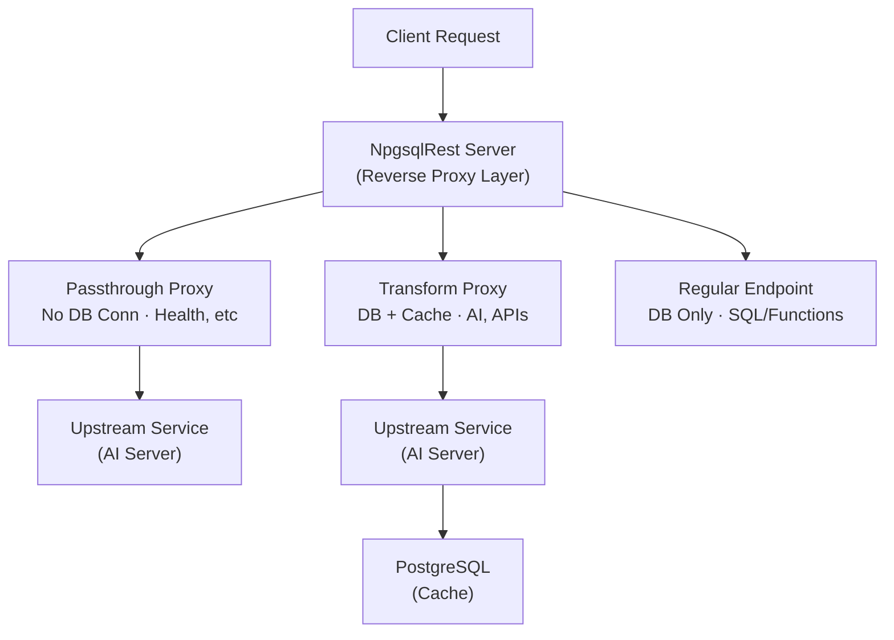

# Reverse Proxy in PostgreSQL: Gateway to External Services with NpgsqlRest

<p class="blog-meta">
<span class="tag">Proxy</span> · <span class="tag">API Gateway</span> · <span class="tag">Microservices</span> · <span class="tag">Caching</span> · <span class="tag">January 2026</span>
</p>

---

Not all API endpoints need a database connection. Health checks, static responses, proxied requests to microservices - these operations consume valuable connection pool slots without ever touching PostgreSQL.

What if you could define endpoints that forward requests to upstream services, transform the responses in PostgreSQL when needed, and skip the database connection entirely when you don't? All while keeping the same annotation-driven workflow.

NpgsqlRest's Reverse Proxy feature does exactly this. Define proxy endpoints in SQL, control when to engage the database, and build sophisticated API gateway patterns - from simple pass-through health checks to intelligent caching layers for expensive AI service calls.

This tutorial demonstrates how to build an **AI Text Analysis Service** that combines a local AI processing server with PostgreSQL-powered caching and enrichment - saving connection pool resources while maximizing code reuse.

> **Source Code**: [github.com/NpgsqlRest/npgsqlrest-docs/examples/10_proxy_ai_service](https://github.com/NpgsqlRest/npgsqlrest-docs/tree/main/examples/10_proxy_ai_service)

## The Problem: Connection Pool Exhaustion

Every NpgsqlRest endpoint normally opens a database connection. This works perfectly for data operations, but consider these common scenarios:

- **Health checks** - `/health` endpoints called every 5 seconds by load balancers
- **Static configuration** - Endpoints returning cached settings
- **Proxied requests** - Forwarding to internal microservices
- **External API gateways** - Routing to third-party services

Each of these consumes a connection from the pool, even when no database operation is needed. Under high load:

- Connection pool depletes rapidly
- Legitimate database operations wait for connections
- Request timeouts cascade through the system

## The NpgsqlRest Solution: Proxy Mode

The Reverse Proxy feature offers two modes:

### Passthrough Mode: Zero Database Connections

When a proxy endpoint function has **no proxy response parameters**, NpgsqlRest:
- Forwards the request directly to the upstream service
- Returns the upstream response to the client
- **Never opens a database connection**

```sql
-- This function body is NEVER executed
-- The proxy annotation handles everything
create function ai_health()
returns void
language sql
begin atomic;
select;
end;

comment on function ai_health is '
HTTP GET /ai/health
@proxy';
```

When a client calls `/ai/health`, NpgsqlRest forwards to the configured upstream host, receives the response, and returns it - no PostgreSQL involved.

### Transform Mode: Process Before Returning

When a proxy endpoint function has **proxy response parameters** (`_proxy_body`, `_proxy_status_code`, etc.), NpgsqlRest:
- Forwards the request to the upstream service
- Passes the response to your PostgreSQL function
- Your function can cache, transform, enrich, or validate the response
- Returns your function's result to the client

```sql
create function ai_summarize(
    _text text,
    _max_length int default 150,
    -- Proxy response parameters - these trigger transform mode
    _proxy_status_code int default null,
    _proxy_body text default null,
    _proxy_success boolean default null,
    _proxy_error_message text default null
)
returns json
language plpgsql
as $$
declare
    _result json;
begin
    -- Check cache first
    select cached_response into _result
    from analysis_cache
    where text_hash = md5(_text);

    if _result is not null then
        return _result;  -- Cache hit - no upstream call was made
    end if;

    -- Upstream response is in _proxy_body
    if not _proxy_success then
        return json_build_object('error', _proxy_error_message);
    end if;

    -- Cache and return
    insert into analysis_cache (text_hash, cached_response)
    values (md5(_text), _proxy_body::json);

    return _proxy_body::json;
end;
$$;

comment on function ai_summarize is '
HTTP POST /ai/summarize
@authorize
@proxy POST';
```

## Architecture: NpgsqlRest as API Gateway



## Building the AI Text Analysis Service

Let's build a complete example: an API that proxies to a local AI text processing service (running on Bun), with PostgreSQL providing intelligent caching.

### The Upstream AI Service

First, we need a service to proxy to. This Bun server provides text analysis:

```typescript
// upstream/server.ts
const PORT = 3001;

const server = Bun.serve({
    port: PORT,
    async fetch(req) {
        const url = new URL(req.url);
        const path = url.pathname;

        // Health check
        if (path === '/ai/health' && req.method === 'GET') {
            return Response.json({
                status: 'healthy',
                service: 'ai-text-service',
                version: '1.0.0'
            });
        }

        // Summarization
        if (path === '/ai/summarize' && req.method === 'POST') {
            const { text, max_length = 150 } = await req.json();
            const summary = summarizeText(text, max_length);
            return Response.json({
                summary,
                original_length: text.length,
                summary_length: summary.length,
                model: 'simple-extractive-v1'
            });
        }

        // Sentiment analysis
        if (path === '/ai/sentiment' && req.method === 'POST') {
            const { text } = await req.json();
            const result = analyzeSentiment(text);
            return Response.json({
                ...result,
                model: 'simple-lexicon-v1'
            });
        }

        // Full analysis
        if (path === '/ai/analyze' && req.method === 'POST') {
            const { text, max_length = 150, max_keywords = 5 } = await req.json();
            return Response.json({
                summary: { text: summarizeText(text, max_length) },
                sentiment: analyzeSentiment(text),
                keywords: { words: extractKeywords(text, max_keywords) },
                model: 'combined-analysis-v1',
                processed_at: new Date().toISOString()
            });
        }

        return Response.json({ error: 'Not found' }, { status: 404 });
    }
});
```

This simulates what a real AI/ML service would provide - in production, this could be:
- An LLM inference server (Ollama, vLLM)
- A Python FastAPI service with transformers
- Any third-party AI API

### PostgreSQL Schema: Caching Layer

```sql
create table example_10.analysis_cache (
    id serial primary key,
    text_hash text not null,
    text_preview text not null,
    summary text,
    sentiment text,
    sentiment_score numeric(4,2),
    sentiment_confidence numeric(4,2),
    keywords text[],
    model_version text,
    created_at timestamptz default now(),
    accessed_count int default 1,
    last_accessed_at timestamptz default now()
);

create unique index idx_analysis_cache_hash
    on example_10.analysis_cache(text_hash);
```

### Passthrough Proxy: Health Check

For health checks, we don't need PostgreSQL at all:

```sql
create function example_10.ai_health()
returns void
language sql
begin atomic;
select;
end;

comment on function example_10.ai_health is '
HTTP GET /ai/health
@proxy';
```

**Key insight**: The function returns `void` and has no proxy parameters. NpgsqlRest detects this and uses passthrough mode - no database connection is opened.

When the load balancer pings `/ai/health` every 5 seconds, it gets the upstream response directly without touching the connection pool.

### Transform Proxy: Summarization with Caching

For summarization, we want to cache results to avoid repeated AI calls:

```sql
create function example_10.ai_summarize(
    _text text,
    _max_length int default 150,
    -- Proxy response parameters trigger transform mode
    _proxy_status_code int default null,
    _proxy_body text default null,
    _proxy_success boolean default null,
    _proxy_error_message text default null
)
returns json
language plpgsql
as $$
declare
    _text_hash text;
    _cached json;
    _result json;
begin
    -- Generate cache key
    _text_hash := md5(_text || '::' || _max_length::text);

    -- Check cache first
    select json_build_object(
        'summary', ac.summary,
        'original_length', length(_text),
        'summary_length', length(ac.summary),
        'cached', true,
        'cache_hits', ac.accessed_count
    )
    into _cached
    from example_10.analysis_cache ac
    where ac.text_hash = _text_hash;

    if _cached is not null then
        -- Update cache stats
        update example_10.analysis_cache
        set accessed_count = accessed_count + 1,
            last_accessed_at = now()
        where text_hash = _text_hash;

        return _cached;  -- Return cached result
    end if;

    -- Handle proxy errors
    if not _proxy_success then
        return json_build_object(
            'error', coalesce(_proxy_error_message, 'AI service unavailable'),
            'status_code', _proxy_status_code
        );
    end if;

    -- Parse and cache the response
    _result := _proxy_body::json;

    insert into example_10.analysis_cache
        (text_hash, text_preview, summary, model_version)
    values (
        _text_hash,
        left(_text, 100),
        _result->>'summary',
        _result->>'model'
    );

    -- Return enriched response
    return json_build_object(
        'summary', _result->>'summary',
        'original_length', (_result->>'original_length')::int,
        'summary_length', (_result->>'summary_length')::int,
        'model', _result->>'model',
        'cached', false
    );
end;
$$;

comment on function example_10.ai_summarize is '
HTTP POST /ai/summarize
@authorize
@proxy POST';
```

**What happens:**

1. Client calls `POST /ai/summarize` with `{"text": "..."}`
2. NpgsqlRest forwards to upstream: `POST http://localhost:3001/ai/summarize`
3. Upstream returns the AI analysis
4. NpgsqlRest passes the response to our function via `_proxy_body`
5. Our function checks cache, stores if new, returns result
6. Client receives the response

**On cache hit:**
- The function returns early with cached data
- The upstream call still happens (the proxy is transparent)
- But we could extend this to skip the proxy call entirely using HTTP Types

### Full Analysis: Complete Transform Example

```sql
create function example_10.ai_analyze(
    _text text,
    _max_length int default 150,
    _max_keywords int default 5,
    _proxy_status_code int default null,
    _proxy_body text default null,
    _proxy_success boolean default null,
    _proxy_error_message text default null
)
returns json
language plpgsql
as $$
declare
    _text_hash text;
    _cached record;
    _result json;
begin
    -- Cache key includes all parameters
    _text_hash := md5(_text || '::full::' || _max_length || '::' || _max_keywords);

    -- Check for complete cached analysis
    select summary, sentiment, sentiment_score,
           sentiment_confidence, keywords, accessed_count
    into _cached
    from example_10.analysis_cache
    where text_hash = _text_hash
      and summary is not null
      and sentiment is not null
      and keywords is not null;

    if found then
        -- Update stats and return cached
        update example_10.analysis_cache
        set accessed_count = accessed_count + 1,
            last_accessed_at = now()
        where text_hash = _text_hash;

        return json_build_object(
            'summary', json_build_object('text', _cached.summary),
            'sentiment', json_build_object(
                'sentiment', _cached.sentiment,
                'score', _cached.sentiment_score,
                'confidence', _cached.sentiment_confidence
            ),
            'keywords', json_build_object(
                'words', to_json(_cached.keywords),
                'count', array_length(_cached.keywords, 1)
            ),
            'cached', true,
            'cache_hits', _cached.accessed_count
        );
    end if;

    -- Handle errors
    if not _proxy_success then
        return json_build_object(
            'error', coalesce(_proxy_error_message, 'AI service unavailable'),
            'status_code', _proxy_status_code
        );
    end if;

    -- Parse and cache
    _result := _proxy_body::json;

    insert into example_10.analysis_cache (
        text_hash, text_preview, summary, sentiment,
        sentiment_score, sentiment_confidence, keywords, model_version
    ) values (
        _text_hash,
        left(_text, 100),
        _result->'summary'->>'text',
        _result->'sentiment'->>'sentiment',
        (_result->'sentiment'->>'score')::numeric,
        (_result->'sentiment'->>'confidence')::numeric,
        array(select jsonb_array_elements_text(
            (_result->'keywords'->'words')::jsonb)),
        _result->>'model'
    )
    on conflict (text_hash) do update set
        summary = excluded.summary,
        sentiment = excluded.sentiment,
        sentiment_score = excluded.sentiment_score,
        sentiment_confidence = excluded.sentiment_confidence,
        keywords = excluded.keywords,
        accessed_count = example_10.analysis_cache.accessed_count + 1,
        last_accessed_at = now();

    return json_build_object(
        'summary', _result->'summary',
        'sentiment', _result->'sentiment',
        'keywords', _result->'keywords',
        'model', _result->>'model',
        'processed_at', _result->>'processed_at',
        'cached', false
    );
end;
$$;

comment on function example_10.ai_analyze is '
HTTP POST /ai/analyze
@authorize
@proxy POST';
```

### Configuration

Enable proxy in your configuration:

```json
{
  "NpgsqlRest": {
    "ProxyOptions": {
      "Enabled": true,
      "Host": "http://localhost:3001",
      "DefaultTimeout": "00:00:30",
      "ForwardHeaders": true,
      "ExcludeHeaders": ["Host", "Content-Length", "Transfer-Encoding"],
      "ForwardResponseHeaders": true
    }
  }
}
```

| Option | Description |
|--------|-------------|
| `Host` | Default upstream URL - can be overridden per endpoint |
| `DefaultTimeout` | Request timeout for proxy calls |
| `ForwardHeaders` | Pass client headers to upstream |
| `ExcludeHeaders` | Headers to strip from forwarded requests |
| `ForwardResponseHeaders` | Pass upstream headers to client |

## Proxy Response Parameters

When your function includes these parameters, it enters transform mode:

| Parameter | Type | Description |
|-----------|------|-------------|
| `_proxy_status_code` | `int` | HTTP status from upstream (200, 404, etc.) |
| `_proxy_body` | `text` | Response body content |
| `_proxy_headers` | `json` | Response headers as JSON object |
| `_proxy_content_type` | `text` | Content-Type header value |
| `_proxy_success` | `boolean` | True for 2xx status codes |
| `_proxy_error_message` | `text` | Error description if request failed |

Parameter names are configurable in `ProxyOptions`.

## The Generated TypeScript Client

NpgsqlRest auto-generates a typed client:

```typescript
// Auto-generated
interface IAiAnalyzeRequest {
    text: string | null;
    maxLength?: number | null;
    maxKeywords?: number | null;
}

export async function aiAnalyze(
    request: IAiAnalyzeRequest
): Promise<{
    status: number,
    response: any,
    error: {status: number; title: string; detail?: string | null} | undefined
}> {
    const response = await fetch(baseUrl + "/ai/analyze", {
        method: "POST",
        body: JSON.stringify(request)
    });
    return {
        status: response.status,
        response: response.ok ? await response.json() : undefined,
        error: !response.ok ? await response.json() : undefined
    };
}
```

Frontend usage:

```typescript
import { aiAnalyze, aiHealth } from "./example10Api.ts";

// Check service health (passthrough - no DB connection)
const health = await aiHealth();
if (health.status === 200) {
    console.log("AI service is online");
}

// Analyze text (transform - with caching)
const result = await aiAnalyze({
    text: "PostgreSQL is an excellent database...",
    maxLength: 150,
    maxKeywords: 5
});

if (result.response.cached) {
    console.log(`Cache hit! ${result.response.cache_hits} previous accesses`);
} else {
    console.log("Fresh analysis from AI service");
}
```

## Docker: Bun Runtime Image

For deployments where the upstream service runs in the same container, NpgsqlRest provides a Docker image with pre-installed Bun:

```bash
docker pull vbilopav/npgsqlrest:latest-bun

docker run --name npgsqlrest-bun -it \
    -p 8080:8080 \
    -v ./config.json:/app/config.json \
    -v ./upstream:/app/upstream \
    vbilopav/npgsqlrest:latest-bun
```

This image includes the [Bun](https://bun.sh/) JavaScript runtime, enabling proxy endpoints to execute Bun scripts within the same container. Perfect for:

- Lightweight AI/ML preprocessing
- Custom transformation logic
- Integration adapters
- Self-contained microservice deployments

## Use Cases for Reverse Proxy

### API Gateway Pattern

Route requests to different microservices:

```sql
-- Users service
create function users_api()
returns void
language sql
begin atomic;
select;
end;
comment on function users_api is '
HTTP GET /api/users
@proxy https://users-service.internal:8080';

-- Orders service
create function orders_api()
returns void
language sql
begin atomic;
select;
end;
comment on function orders_api is '
HTTP GET /api/orders
@proxy https://orders-service.internal:8080';
```

### Caching Expensive Operations

Cache AI, ML, or expensive API calls:

```sql
-- First call: fetch from upstream, cache in PostgreSQL
-- Subsequent calls: return cached result instantly
```

### Data Enrichment

Combine external data with local database data:

```sql
create function get_enriched_weather(
    city text,
    _proxy_body text default null,
    _proxy_success boolean default null
)
returns json
language plpgsql as $$
declare
    local_prefs json;
begin
    -- Get user's city preferences from database
    select json_build_object('favorite', is_favorite, 'notes', notes)
    into local_prefs
    from user_city_preferences
    where city_name = city;

    -- Combine with weather data from proxy
    return json_build_object(
        'weather', _proxy_body::json,
        'local', coalesce(local_prefs, '{}'::json)
    );
end;
$$;

comment on function get_enriched_weather is '
HTTP GET /weather/{city}
@proxy https://api.weather.com/v1/current';
```

### Authentication Context Forwarding

Forward authenticated user claims to upstream:

```sql
create function secure_api_call(
    _proxy_body text default null
)
returns json language plpgsql as $$
begin
    return _proxy_body::json;
end;
$$;

comment on function secure_api_call is '
HTTP GET /secure-data
@authorize
@user_context
@proxy https://internal-api.example.com/data';
```

With `user_context`, NpgsqlRest forwards user claims as HTTP headers to the upstream service.

## The Numbers

| Metric | Without Proxy | With Passthrough Proxy |
|--------|---------------|------------------------|
| Health check DB connections | 1 per request | 0 |
| Connection pool usage | 100% | Reduced by passthrough % |
| Response latency (cached) | ~5-10ms | Same (transform mode) |
| Response latency (passthrough) | ~5-10ms | ~2-3ms (no DB) |

For a service with 50% health check traffic:
- **50% fewer database connections**
- **Faster health check responses**
- **More connections available for data operations**

### Code Comparison

| Component | Traditional Node.js | NpgsqlRest Proxy |
|-----------|--------------------|--------------------|
| Proxy middleware | ~50 lines | 0 |
| Caching logic | ~40 lines | In SQL function |
| HTTP client setup | ~30 lines | Config only |
| Error handling | ~30 lines | Built-in |
| Type definitions | ~20 lines | Auto-generated |
| **Total** | **~170 lines** | **~80 lines SQL** |

Plus the upstream service remains identical - NpgsqlRest adds the gateway layer without changing your services.

## Summary: When to Use Proxy Mode

**Use Passthrough Mode for:**
- Health checks and readiness probes
- Static configuration endpoints
- Simple forwarding to internal services
- Any endpoint that doesn't need database access

**Use Transform Mode for:**
- Caching expensive external API calls
- Data enrichment (combining external + local data)
- Response transformation before returning
- Audit logging of external API usage
- Rate limiting based on database state

**Proxy mode is NOT for:**
- High-frequency streaming (use SSE or WebSockets)
- Large file transfers (use direct proxying)
- Complex retry logic (use message queues)

The Reverse Proxy feature extends NpgsqlRest beyond a database-to-API bridge into a full API gateway - preserving the annotation-driven, SQL-first workflow while adding powerful routing, transformation, and caching capabilities.

::: tip SQL File Source
Everything in this post also works with [SQL file endpoints](/guide/sql-files) — no functions needed. See the [SQL file version of this example](https://github.com/NpgsqlRest/npgsqlrest-docs/tree/main/examples/10_proxy_ai_service_sql_file).
:::

<BlogNav
  source-code="https://github.com/NpgsqlRest/npgsqlrest-docs/tree/main/examples/10_proxy_ai_service"
  :documentation="[
    { text: 'Proxy Annotation', href: '/annotations/proxy' },
    { text: 'Proxy Configuration', href: '/config/proxy' },
    { text: 'Docker Bun Image', href: '/guide/installation#bun-runtime-image' }
  ]"
  :get-started="[
    { text: 'Quick Start Guide', href: '/guide/quick-start' },
    { text: 'Installation', href: '/guide/installation' },
    { text: 'Configuration', href: '/guide/configuration' }
  ]"
/>
