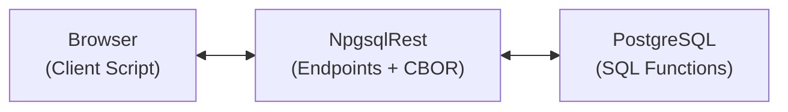

# Passkey Authentication

NpgsqlRest supports WebAuthn/FIDO2 passkey authentication, providing phishing-resistant, passwordless login using device-native biometrics or PINs.

::: tip New in 3.5.0
Passkey authentication was added in version 3.5.0.
:::

## Overview

Passkeys use public-key cryptography tied to user devices. Unlike passwords, passkeys:

- Cannot be phished (tied to origin)
- Cannot be reused across sites
- Cannot be stolen in database breaches (only public keys stored)
- Require biometric or PIN verification

Minimal configuration to enable passkey authentication:

```json
{
  "Auth": {
    "PasskeyAuth": {
      "Enabled": true
    }
  }
}
```

## How It Works

NpgsqlRest handles the WebAuthn protocol (CBOR parsing, signature verification) while your PostgreSQL functions control the business logic:



- **Browser**: A client script that calls the browser's WebAuthn API and communicates with NpgsqlRest endpoints. See the [passkey.ts example](https://github.com/NpgsqlRest/npgsqlrest-docs/blob/main/examples/13_passkey/src/passkey.ts) for a complete TypeScript implementation you can use as a starting point.
- **NpgsqlRest**: Provides the HTTP endpoints and handles CBOR parsing/verification.
- **PostgreSQL**: Your SQL functions control the entire authentication flow.

Your database stores only public keys - no biometric data ever touches your server.

## Three Authentication Flows

NpgsqlRest supports three distinct passkey flows. Each endpoint internally executes a configured SQL command (typically a PostgreSQL function) that you define.

### 1. Registration (New User with Passkey)

For new users signing up with a passkey. Creates both the user account and passkey.

| Endpoint | Executes SQL Command |
|----------|---------------------|
| `POST /api/passkey/register/options` | `ChallengeRegistrationCommand` |
| `POST /api/passkey/register` | `CompleteRegistrationCommand` |

::: warning Registration is Disabled by Default
Standalone registration (`EnableRegister: false` by default) allows anyone to create an account with just a passkey. In production, you'll typically want additional verification (email confirmation, CAPTCHA, etc.) before creating accounts.

The recommended approach is:
1. Create user accounts through your existing registration flow
2. Let users add passkeys to verified accounts using the **Add Passkey** flow
:::

### 2. Add Passkey (Existing User)

For authenticated users who want to add a passkey to their account. These endpoints require authentication.

| Endpoint (requires auth) | Executes SQL Command |
|--------------------------|---------------------|
| `POST /api/passkey/add/options` | `ChallengeAddExistingUserCommand` |
| `POST /api/passkey/add` | `CompleteAddExistingUserCommand` |

### 3. Login

For authenticating with an existing passkey.

| Endpoint | Executes SQL Command |
|----------|---------------------|
| `POST /api/passkey/login/options` | `ChallengeAuthenticationCommand` |
| `POST /api/passkey/login` | `CompleteAuthenticateCommand` |

## Settings Reference

### General Settings

| Setting | Type | Default | Description |
|---------|------|---------|-------------|
| `Enabled` | bool | `false` | Enable passkey authentication. |
| `EnableRegister` | bool | `false` | Enable standalone registration (new users can sign up with passkey only). |
| `RateLimiterPolicy` | string | `null` | Name of a configured rate limiter policy. Recommended for brute-force protection. |
| `ConnectionName` | string | `null` | Named connection for multi-database setups. Uses default if null. |
| `CommandRetryStrategy` | string | `"default"` | Retry strategy for transient database errors. Set to null to disable. |

### Relying Party Settings

The Relying Party (RP) identifies your application to the authenticator.

| Setting | Type | Default | Description |
|---------|------|---------|-------------|
| `RelyingPartyId` | string | `null` | Domain name (e.g., `"example.com"`). Auto-detected if null. **Note:** IP addresses not permitted - use `"localhost"` for development. |
| `RelyingPartyName` | string | `null` | Human-readable name shown during registration. Uses `ApplicationName` if null. |
| `RelyingPartyOrigins` | string[] | `[]` | Allowed origins (e.g., `["https://example.com"]`). ⚠️ When empty, origin validation accepts ANY origin — a startup warning is logged (3.17.0+). Always set explicitly in production. |

### Endpoint Paths

All paths are POST endpoints. Set to `null` to disable an endpoint.

| Setting | Default | Description |
|---------|---------|-------------|
| `AddPasskeyOptionsPath` | `"/api/passkey/add/options"` | Get options for adding passkey to existing user (requires auth). |
| `AddPasskeyPath` | `"/api/passkey/add"` | Complete adding passkey (requires auth). |
| `RegistrationOptionsPath` | `"/api/passkey/register/options"` | Get options for new user registration. |
| `RegistrationPath` | `"/api/passkey/register"` | Complete new user registration. |
| `LoginOptionsPath` | `"/api/passkey/login/options"` | Get login challenge. |
| `LoginPath` | `"/api/passkey/login"` | Complete authentication. |

### WebAuthn Settings

| Setting | Type | Default | Description |
|---------|------|---------|-------------|
| `ChallengeTimeoutMinutes` | int | `5` | How long challenges remain valid. |
| `ValidateSignCount` | bool | `true` | Validate signature counter to detect cloned authenticators. |
| `UserVerificationRequirement` | string | `"required"` | See below. |
| `ResidentKeyRequirement` | string | `"required"` | See below. |
| `AttestationConveyance` | string | `"none"` | See below. |

#### UserVerificationRequirement

Controls whether biometric/PIN verification is required:

| Value | Behavior | Use Case |
|-------|----------|----------|
| `"required"` | User MUST verify with biometric or PIN | Banking, healthcare, sensitive data |
| `"preferred"` | Request verification if available | Most consumer apps |
| `"discouraged"` | Don't request verification (proves possession only) | Low-security scenarios |

#### ResidentKeyRequirement

Controls discoverable credentials (true passwordless):

| Value | Behavior | Use Case |
|-------|----------|----------|
| `"required"` | Credential stored on device; browser shows account picker | True passwordless (no username field) |
| `"preferred"` | Request discoverable if supported | Gradual migration to passwordless |
| `"discouraged"` | Server must provide credential ID | Username-first flows |

#### AttestationConveyance

Controls whether to verify authenticator hardware:

| Value | Behavior | Use Case |
|-------|----------|----------|
| `"none"` | Accept any authenticator | Most apps (recommended) |
| `"indirect"` | Allow anonymized attestation | Rarely useful |
| `"direct"` | Request full attestation chain | Verify specific hardware models |
| `"enterprise"` | Enterprise-managed attestation | Corporate device policies |

## SQL Commands Reference

NpgsqlRest calls your SQL functions at specific points in each flow.

### ChallengeAddExistingUserCommand

**When executed:** User clicks "Add Passkey" (already authenticated)

**Parameters:**
- `$1` = `claims` (json): User claims from authenticated session
- `$2` = `body` (json): Request body (e.g., `{ "deviceName": "My Phone" }`)

**Expected return columns:**

| Column | Type | Description |
|--------|------|-------------|
| `status` | int | HTTP status code. Return `200` to proceed. |
| `message` | text | Error message when status ≠ 200. |
| `challenge` | text | Base64-encoded random bytes (32 bytes recommended). |
| `challenge_id` | bigint/uuid/text | Server-side identifier for verification. |
| `user_handle` | text | Base64-encoded random bytes for WebAuthn user.id. |
| `user_name` | text | Username shown in authenticator UI. |
| `user_display_name` | text | Display name shown in authenticator UI. |
| `exclude_credentials` | text | JSON array of existing credential IDs. |
| `user_context` | json | Passed through to completion command. |

### ChallengeRegistrationCommand

**When executed:** New user starts passkey-only registration

**Parameters:**
- `$1` = `body` (json): Request body with user info

**Expected return columns:** Same as `ChallengeAddExistingUserCommand`

### ChallengeAuthenticationCommand

**When executed:** User initiates passkey login

**Parameters:**
- `$1` = `user_name` (text): Username if provided, NULL for discoverable credentials
- `$2` = `body` (json): Request body

**Expected return columns:**

| Column | Type | Description |
|--------|------|-------------|
| `status` | int | HTTP status code (200 to proceed). |
| `message` | text | Error message when status ≠ 200. |
| `challenge` | text | Base64-encoded random challenge. |
| `challenge_id` | bigint/uuid/text | Server-side identifier. |
| `allow_credentials` | text | JSON array of credential IDs for this user. |

### VerifyChallengeCommand

**When executed:** After browser returns credential, before cryptographic verification

**Used by:** ALL flows

**Parameters:**
- `$1` = `challenge_id`: The challenge_id from options response
- `$2` = `operation` (text): Either `"registration"` or `"authentication"`

**Expected return:** Single column `challenge` (bytea) - original challenge bytes, or NULL if not found/expired

### AuthenticateDataCommand

**When executed:** During login, to retrieve stored credential data

**Parameters:**
- `$1` = `credential_id` (bytea): The credential ID from browser

**Expected return columns:**

| Column | Type | Description |
|--------|------|-------------|
| `status` | int | HTTP status code (200 to proceed). |
| `message` | text | Error message when status ≠ 200. |
| `public_key` | bytea | Stored public key for signature verification. |
| `public_key_algorithm` | int | COSE algorithm ID (-7 for ES256, -257 for RS256). |
| `sign_count` | bigint | Current signature counter. |
| `user_context` | json | Passed to CompleteAuthenticateCommand. |

### CompleteAddExistingUserCommand / CompleteRegistrationCommand

**When executed:** After successful attestation verification

**Parameters:**

| Parameter | Type | Description |
|-----------|------|-------------|
| `$1` | bytea | `credential_id` - Unique credential identifier |
| `$2` | bytea | `user_handle` - WebAuthn user.id |
| `$3` | bytea | `public_key` - Public key in COSE format |
| `$4` | int | `algorithm` - COSE algorithm (-7 = ES256, -257 = RS256) |
| `$5` | text[] | `transports` - Transport hints (e.g., `["internal", "hybrid"]`) |
| `$6` | boolean | `backup_eligible` - Whether credential can be synced |
| `$7` | json | `user_context` - From challenge command |
| `$8` | json | `analytics_data` - Optional client analytics |

**Expected return columns:**

| Column | Type | Description |
|--------|------|-------------|
| `status` | int | HTTP status code (200 = success). |
| `message` | text | Error message when status ≠ 200. |

### CompleteAuthenticateCommand

**When executed:** After successful signature verification during login

**Parameters:**

| Parameter | Type | Description |
|-----------|------|-------------|
| `$1` | bytea | `credential_id` - The credential used |
| `$2` | bigint | `new_sign_count` - Updated signature counter |
| `$3` | json | `user_context` - From AuthenticateDataCommand |
| `$4` | json | `analytics_data` - Optional client analytics |

**Expected return columns:** Same as [login endpoint](../annotations/login) - the `scheme` column determines authentication type, other columns become claims.

## Column Name Configuration

If your SQL functions use different column names:

```json
{
  "Auth": {
    "PasskeyAuth": {
      "StatusColumnName": "status",
      "MessageColumnName": "message",
      "ChallengeColumnName": "challenge",
      "ChallengeIdColumnName": "challenge_id",
      "UserNameColumnName": "user_name",
      "UserDisplayNameColumnName": "user_display_name",
      "UserHandleColumnName": "user_handle",
      "ExcludeCredentialsColumnName": "exclude_credentials",
      "AllowCredentialsColumnName": "allow_credentials",
      "PublicKeyColumnName": "public_key",
      "PublicKeyAlgorithmColumnName": "public_key_algorithm",
      "SignCountColumnName": "sign_count"
    }
  }
}
```

## Analytics Data

Collect client-side analytics by passing `analyticsData` in completion requests. NpgsqlRest automatically adds the client's IP address:

```json
{
  "Auth": {
    "PasskeyAuth": {
      "ClientAnalyticsIpKey": "ip"
    }
  }
}
```

Set to `null` or empty string to disable IP collection.

## Complete Example

### Minimal Configuration

```json
{
  "Auth": {
    "CookieAuth": true,
    "PasskeyAuth": {
      "Enabled": true
    }
  }
}
```

### Full Configuration

```json
{
  "Auth": {
    "CookieAuth": true,
    "PasskeyAuth": {
      "Enabled": true,
      "EnableRegister": true,
      "RateLimiterPolicy": "passkey-limit",

      "RelyingPartyId": null,
      "RelyingPartyName": "My Application",
      "RelyingPartyOrigins": [],

      "UserVerificationRequirement": "required",
      "ResidentKeyRequirement": "required",
      "AttestationConveyance": "none",

      "ChallengeTimeoutMinutes": 5,
      "ValidateSignCount": true,

      "ChallengeAddExistingUserCommand": "select * from passkey_challenge_add_existing($1,$2)",
      "ChallengeRegistrationCommand": "select * from passkey_challenge_registration($1)",
      "ChallengeAuthenticationCommand": "select * from passkey_challenge_authentication($1,$2)",
      "VerifyChallengeCommand": "select * from passkey_verify_challenge($1,$2)",
      "AuthenticateDataCommand": "select * from passkey_authenticate_data($1)",
      "CompleteAddExistingUserCommand": "select * from passkey_complete_add_existing($1,$2,$3,$4,$5,$6,$7,$8)",
      "CompleteRegistrationCommand": "select * from passkey_complete_registration($1,$2,$3,$4,$5,$6,$7,$8)",
      "CompleteAuthenticateCommand": "select * from passkey_complete_authenticate($1,$2,$3,$4)"
    }
  },
  "RateLimiting": {
    "Policies": {
      "passkey-limit": {
        "Type": "SlidingWindow",
        "PermitLimit": 10,
        "WindowSeconds": 60
      }
    }
  }
}
```

## Related

- [Authentication](./auth) - Cookie, Bearer Token, and JWT authentication
- [External OAuth](./external-auth) - Google, LinkedIn, GitHub, Microsoft, Facebook OAuth
- [Rate Limiter](./rate-limiter) - Rate limiting configuration
- [Passkey Blog Post](/blog/passkey-sql-auth) - In-depth tutorial with complete SQL examples
- [Passkey Example](https://github.com/NpgsqlRest/npgsqlrest-docs/tree/main/examples/13_passkey) - Complete working example
- [NpgsqlRest vs PostgREST vs Supabase](/blog/npgsqlrest-vs-postgrest-supabase-comparison) - Feature comparison (passkey support is unique to NpgsqlRest)

## Next Steps

- [Authentication](./auth) - Configure other authentication methods
- [External OAuth](./external-auth) - Configure external OAuth providers
- [Rate Limiter](./rate-limiter) - Set up rate limiting for passkey endpoints
