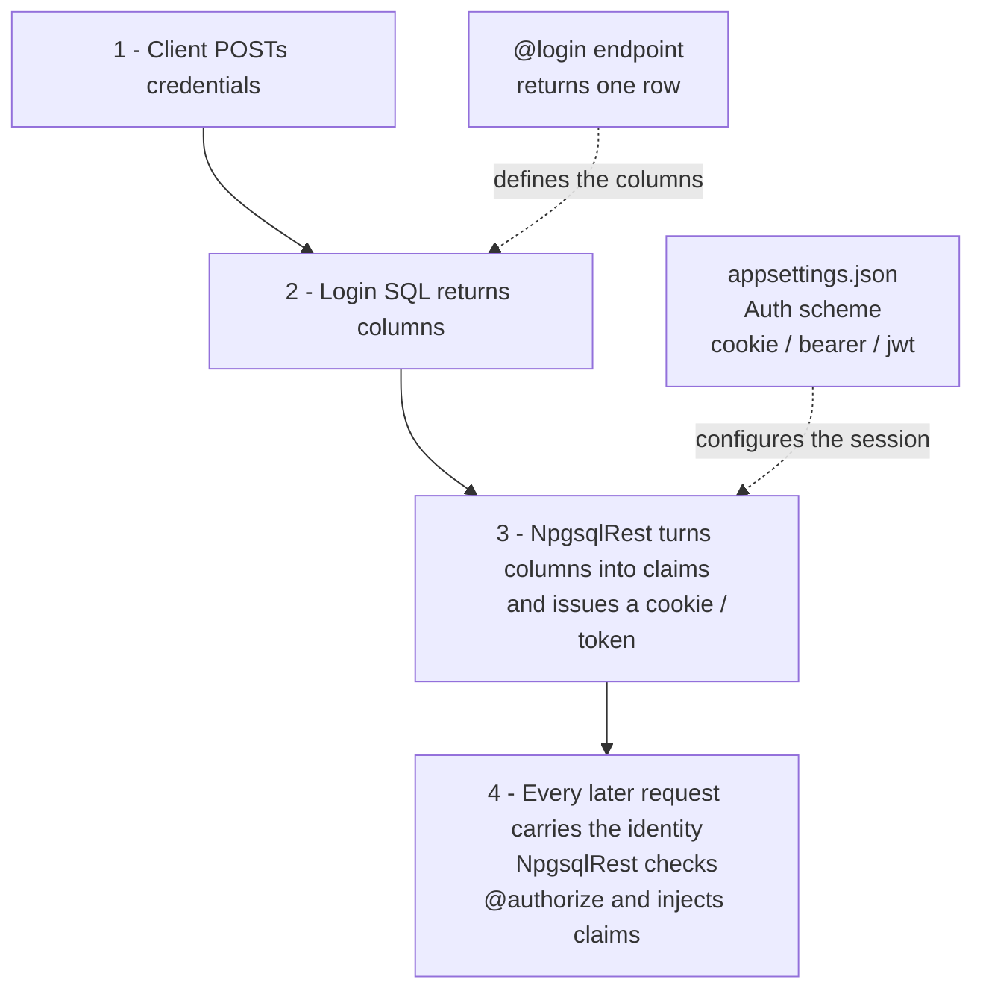

# Authentication

This guide explains how authentication works in NpgsqlRest from end to end:

1. [The big picture](#the-big-picture) — how the pieces fit together
2. [Configure an authentication scheme](#step-1-configure-an-authentication-scheme) — cookie, bearer token, or JWT
3. [Write a login endpoint](#step-2-write-a-login-endpoint) — sign users in from SQL
4. [How claims work](#how-claims-work) — the user identity, produced from columns
5. [Accessing claims in your endpoints](#accessing-claims-in-your-endpoints) — as parameters, context variables, or template placeholders
6. [Logging out](#logging-out)
7. [A complete worked example](#a-complete-worked-example)

::: tip Reference pages
This is the conceptual walkthrough. For exact options see [`@login`](../annotations/login), [`@logout`](../annotations/logout), [Authentication configuration](../config/auth), [Authentication Options](../config/authentication-options), and [Claims Mapping](../config/claims-mapping).
:::

## The big picture

Authentication in NpgsqlRest is **driven by your database**. There is no separate identity service and no C# to write — you configure a scheme in `appsettings.json`, then write a normal SQL endpoint annotated with [`@login`](../annotations/login). Everything flows from there:



The three moving parts:

| Part | Where it lives | What it does |
|------|----------------|--------------|
| **Scheme** | `appsettings.json` → `Auth` | Decides *how* the session is carried — an encrypted cookie, a bearer token, or a JWT. |
| **Login endpoint** | a `@login` SQL routine / file | Validates credentials and returns the columns that become the user's claims. |
| **Claims** | produced at login, read on every request | The user's identity (id, name, roles, and anything else you select). |

## Step 1: Configure an authentication scheme

A scheme decides how the signed-in session is carried between requests. Enable one (or several) in the `Auth` section. See [Authentication configuration](../config/auth) for every option.

### Cookie (the simplest)

An encrypted, http-only cookie. Best for browser apps.

```json
{
  "Auth": {
    "CookieAuth": true,
    "CookieAuthScheme": "cookies",
    "CookieName": "my_app_auth",
    "CookieValid": "1 day"
  }
}
```

### Bearer token

A stateless token the client stores and sends in the `Authorization: Bearer …` header. Best for APIs and mobile clients.

```json
{
  "Auth": {
    "BearerTokenAuth": true,
    "BearerTokenAuthScheme": "token",
    "BearerTokenExpire": "1 hour",
    "BearerTokenRefreshPath": "/api/token/refresh"
  }
}
```

### JWT

A signed JSON Web Token, verifiable by other services that share the secret.

```json
{
  "Auth": {
    "JwtAuth": true,
    "JwtAuthScheme": "jwt",
    "JwtSecret": "your-secret-key-at-least-32-characters-long",
    "JwtIssuer": "my_app",
    "JwtAudience": "my_app",
    "JwtExpire": "60 minutes"
  }
}
```

The string you set as `CookieAuthScheme` / `BearerTokenAuthScheme` / `JwtAuthScheme` is the **scheme name**. Your login endpoint chooses which one to issue via its [`scheme` column](#choosing-a-scheme). You can enable more than one at the same time, as the [Multiple Auth Schemes example](/examples/) does.

::: tip Require auth by default
Set `NpgsqlRest.RequiresAuthorization: true` so every endpoint requires authentication unless it opts out with [`@allow_anonymous`](../annotations/allow-anonymous). This is a safer default than protecting endpoints one by one.
:::

External OAuth providers (Google, etc.) layer on top of this — see [External Authentication](../config/external-auth).

## Step 2: Write a login endpoint

A login endpoint is a normal SQL endpoint annotated with [`@login`](../annotations/login). It returns **one row**; NpgsqlRest reads a few [special columns](../annotations/login#special-columns) and turns the rest into claims.

```sql
create function login(_username text, _password text)
returns table (
    scheme text,
    user_id int,
    username text,
    email text
)
language sql
security definer
as $$
select
    'cookies' as scheme,   -- which scheme to sign in
    u.user_id,
    u.username,
    u.email
from users u
where u.username = _username
  and verify_password(_password, u.password_hash);  -- your own check
$$;

comment on function login(text, text) is '
HTTP POST
@login
@anonymous
@security_sensitive';
```

**Equivalent as a SQL file endpoint** (`sql/login.sql`):

```sql
/*
HTTP POST
@login
@anonymous
@security_sensitive
*/
select
    'cookies' as scheme,   -- which scheme to sign in
    u.user_id,
    u.username,
    u.email
from users u
where u.username = :username
  and verify_password(:password, u.password_hash);
```

What happens:

- A correct password returns one row → NpgsqlRest signs the user in and creates the claims `user_id`, `username`, `email`.
- A wrong password matches nothing → **empty result → 401 Unauthorized**. No `status` column is needed for this.
- [`@anonymous`](../annotations/allow-anonymous) lets unauthenticated callers reach the endpoint; [`@security_sensitive`](../annotations/security-sensitive) keeps the password out of the logs.

### Verifying the password

You have two options (full detail in [`@login` → Password verification](../annotations/login#password-verification)):

- **Verify in SQL** (above): call your own function (e.g. `verify_password`) and just don't return a row when it fails. You control the hashing, but it runs on your database server.
- **Built-in hasher** *(more secure — recommended for production)*: return the stored hash in a `hash` column and let NpgsqlRest verify it against the password parameter, with optional [success/failure callbacks](../annotations/login#verification-callbacks). Pair it with [`@parameter_hash`](../annotations/parameter-hash) when registering users. It uses a strong, OWASP-recommended PBKDF2 configuration and — importantly — runs the CPU-intensive hashing on the **NpgsqlRest application instance** instead of your database. Password hashing is deliberately expensive, and the app tier is easier to scale than PostgreSQL, so offloading it is an important consideration.

For the **verify-in-SQL** option you don't need anything external — PostgreSQL's built-in [`pgcrypto`](https://www.postgresql.org/docs/current/pgcrypto.html) extension provides `crypt()`, `gen_salt()`, and `digest()`. The recommended scheme pre-hashes the password with SHA-256 + base64 before bcrypt (bcrypt truncates input at 72 bytes; the digest is a fixed 44 chars that always fits):

```sql
create extension if not exists pgcrypto;

create function hash_password(_password text)
returns text language sql as $$
  select crypt(encode(digest(_password, 'sha256'), 'base64'), gen_salt('bf', 12));
$$;

create function verify_password(_password text, _password_hash text)
returns boolean language sql as $$
  select crypt(encode(digest(_password, 'sha256'), 'base64'), _password_hash) = _password_hash;
$$;
```

Use `hash_password()` when registering a user and `verify_password()` in the login query above. `gen_salt('bf', 12)` sets the bcrypt work factor — `12` is a sensible default in 2026.

This keeps everything in the database and is fine for small or low-traffic apps. For **greater security and to offload the CPU-intensive hashing from your database to the app tier**, prefer the built-in hasher — see [`@login` → Password verification](../annotations/login#password-verification) for the full comparison.

### Choosing a scheme

The `scheme` column picks which configured scheme to issue. With several schemes enabled you can let the client choose by passing it as a parameter:

```sql
-- _scheme is 'cookies', 'token' or 'jwt'; an unknown scheme is rejected (404)
select _scheme as scheme, u.user_id, u.username, u.roles, u.email, u.password_hash as hash
from users u
where u.username = _username;
```

## How claims work

A **claim** is a single fact about the signed-in user — `user_id = 1`, `username = alice`, `roles = {admin}`. Claims are the bridge between "who logged in" and "what your SQL can see".

### Claims are just the login columns

The rule is deliberately simple:

> **Every column your login endpoint returns — except the [special columns](../annotations/login#special-columns) `status`, `scheme`, `body`, `hash` — becomes a claim.** The column name is the claim name; the column value is the claim value.

So this login row:

| user_id | username | email | roles |
|---------|----------|-------|-------|
| 1 | alice | alice@example.com | {admin} |

produces four claims: `user_id`, `username`, `email`, `roles`. You don't configure anything to *create* claims — you just select the columns you want to carry.

### Identity claims

Three claims are special: they form the **canonical identity** used for the signed-in principal, for role checks in [`@authorize`](../annotations/authorize), and as the arguments to the [verification callbacks](../annotations/login#verification-callbacks). They're configured in [Authentication Options](../config/authentication-options#default-claim-types):

| Config option | Default | Your login must return a column named… |
|---------------|---------|----------------------------------------|
| `DefaultUserIdClaimType` | `user_id` | the user id |
| `DefaultNameClaimType` | `user_name` | the display name |
| `DefaultRoleClaimType` | `user_roles` | the roles (a `text[]`) |

Either name your columns to match the defaults, or change the config to match your columns. For example, if your login returns `username` and `roles` instead of `user_name` and `user_roles`:

```json
{
  "NpgsqlRest": {
    "AuthenticationOptions": {
      "DefaultUserIdClaimType": "user_id",
      "DefaultNameClaimType": "username",
      "DefaultRoleClaimType": "roles"
    }
  }
}
```

With the role claim wired up, `@authorize admin` checks the `roles` claim for the value `admin`:

```sql
comment on function get_users() is '
HTTP GET
@authorize admin';   -- 403 unless the roles claim contains "admin"
```

## Accessing claims in your endpoints

After login, claims travel with every request. NpgsqlRest can hand them to your SQL in three ways. The constant that links all of them is the **claim name** — the same string that was the login column name.

### As function parameters

Annotate the endpoint with [`@user_parameters`](../annotations/user-parameters) (or enable globally with `UseUserParameters: true`). NpgsqlRest fills matching parameters from the claims, using `ParameterNameClaimsMapping` (parameter name → claim name):

```json
{
  "NpgsqlRest": {
    "AuthenticationOptions": {
      "UseUserParameters": true,
      "ParameterNameClaimsMapping": {
        "_user_id": "user_id",
        "_username": "username",
        "_email": "email"
      }
    }
  }
}
```

```sql
create function who_am_i(
    _user_id text = null,   -- filled from the user_id claim
    _username text = null,   -- filled from the username claim
    _email text = null       -- filled from the email claim
)
returns table (user_id text, username text, email text)
language sql
as $$
    select _user_id, _username, _email;
$$;

comment on function who_am_i(text, text, text) is '
HTTP GET
@authorize';
```

- **Claim values arrive as `text`** (multi-value claims like roles as `text[]`); PostgreSQL coerces to your parameter types.
- Give parameters **default values** so the function still works for anonymous calls — the default is used when there's no claim.
- This is the approach in the [Security & Auth example](/examples/).

::: warning Never trust client-supplied identity
Declare the identity parameters (`_user_id`, …) and let NpgsqlRest fill them from the authenticated principal. Don't accept a user id from the request body and trust it. With `@user_parameters`, a value the client tries to send is overwritten by the claim.
:::

### As PostgreSQL context variables

Annotate with [`@user_context`](../annotations/user-context) (or enable globally with `UseUserContext: true`). NpgsqlRest writes each claim into a session variable before running your SQL; you read it with `current_setting('key', true)`. The mapping is `ContextKeyClaimsMapping` (context key → claim name):

```json
{
  "NpgsqlRest": {
    "AuthenticationOptions": {
      "UseUserContext": true,
      "ContextKeyClaimsMapping": {
        "request.user_id": "user_id",
        "request.username": "username",
        "request.email": "email",
        "request.roles": "roles"
      }
    }
  }
}
```

```sql
create function who_am_i()
returns table (user_id int, username text, email text, roles text[])
language sql
as $$
select
    nullif(current_setting('request.user_id', true), '')::int,
    nullif(current_setting('request.username', true), ''),
    nullif(current_setting('request.email', true), ''),
    nullif(current_setting('request.roles', true), '')::text[]
from users
where user_id = nullif(current_setting('request.user_id', true), '')::int;
$$;

comment on function who_am_i() is '
HTTP GET
@authorize';
```

- Always pass `true` as the second argument to `current_setting()` so a missing setting returns `NULL` instead of raising an error.
- The client IP is available too (`IpAddressContextKey`, default `request.ip_address`), and all claims as JSON if you set `ClaimsJsonContextKey`.
- This is the approach in the [Multiple Auth Schemes example](/examples/).

::: tip Parameters vs context — which one?
**Parameters** are type-checked by PostgreSQL and slightly faster; great for focused endpoints. **Context** variables are available to *any* SQL the request runs (views, triggers, nested function calls, resolved-parameter expressions) without threading them through every signature — great for cross-cutting things like row-level filtering. You can enable both.
:::

### As template placeholders

Anything that becomes a **parameter** (via `@user_parameters`) can also be referenced as a `{name}` [placeholder](../annotations/parameter-substitution) in annotations that support substitution — response headers, [custom/upload parameters](../annotations/custom-parameters), and [HTTP custom type](../annotations/http-type) calls. This lets a claim drive a header, a file path, or an outbound request without the client sending it:

```sql
comment on function upload_avatar(_user_id int, _file text) is '
HTTP POST
@authorize
@user_parameters
@upload for file_system
@file_system_path = /var/uploads/{_user_id}';   -- claim value drives the path
```

And once claims are in **context variables** (`@user_context`), they're visible to every SQL expression the request evaluates — including [resolved parameter expressions](../annotations/resolved-parameters). For **proxy** endpoints, enabling `UseUserContext` / `UseUserParameters` also forwards the claims upstream (as HTTP headers / request parameters respectively — see [forwarding in the Proxy guide](./proxy#forwarding-headers-claims-and-ip)).

## Logging out

Mark an endpoint with [`@logout`](../annotations/logout). Returning nothing signs the user out of the default scheme; returning scheme name(s) signs out those specific schemes.

```sql
create function logout()
returns void
language sql
security definer
as $$
  -- nothing to return → sign out the current user's scheme
$$;

comment on function logout() is '
HTTP POST
@logout
@authorize';
```

## A complete worked example

A minimal but complete cookie-based setup: configuration, a login endpoint, and a protected endpoint that reads the signed-in user via parameters.

**`appsettings.json`**

```json
{
  "Auth": {
    "CookieAuth": true,
    "CookieAuthScheme": "cookies",
    "CookieName": "my_app_auth",
    "CookieValid": "1 day"
  },
  "NpgsqlRest": {
    "IncludeSchemas": [ "api" ],
    "RequiresAuthorization": true,
    "AuthenticationOptions": {
      "DefaultUserIdClaimType": "user_id",
      "DefaultNameClaimType": "username",
      "DefaultRoleClaimType": "roles",
      "UseUserParameters": true,
      "ParameterNameClaimsMapping": {
        "_user_id": "user_id",
        "_username": "username",
        "_roles": "roles"
      }
    }
  }
}
```

**`login` — sign in (anonymous, verifies password in SQL)**

```sql
create function api.login(_username text, _password text)
returns table (scheme text, user_id int, username text, roles text[])
language sql
security definer
as $$
select 'cookies', u.user_id, u.username, u.roles
from api.users u
where u.username = _username
  and api.verify_password(_password, u.password_hash);
$$;

comment on function api.login(text, text) is '
HTTP POST
@login
@anonymous
@security_sensitive';
```

**`my_profile` — protected, reads claims via parameters**

```sql
create function api.my_profile(_user_id int = null, _username text = null, _roles text[] = '{}')
returns table (user_id int, username text, roles text[], is_admin boolean)
language sql
as $$
select _user_id, _username, _roles, _roles @> array['admin'];
$$;

comment on function api.my_profile(int, text, text[]) is '
HTTP GET
@authorize';
```

**`admin_users` — admin only**

```sql
create function api.admin_users()
returns setof api.users
language sql
as $$ select * from api.users; $$;

comment on function api.admin_users() is '
HTTP GET
@authorize admin';   -- requires the roles claim to contain "admin"
```

Flow:
1. `POST /api/login` with a valid username/password → cookie set, claims `user_id`/`username`/`roles` created.
2. `GET /api/my-profile` → NpgsqlRest fills `_user_id`/`_username`/`_roles` from the claims; anonymous callers are rejected (401) because of `@authorize`.
3. `GET /api/admin-users` → only succeeds when the `roles` claim contains `admin` (otherwise 403).

## See it in the examples

Two runnable examples demonstrate both claim-access styles:

- [**Security & Auth**](/examples/) — cookie auth, password hashing in SQL, claims read as **parameters**.
- [**Passwords, Tokens & Roles**](/examples/) — cookie + bearer + JWT, built-in password hasher with callbacks, external (Google) login, claims read as **context variables**, role-based authorization.

## Related

- [`@login`](../annotations/login) / [`@logout`](../annotations/logout) — the sign-in / sign-out annotations
- [`@authorize`](../annotations/authorize) / [`@allow_anonymous`](../annotations/allow-anonymous) — protecting endpoints
- [`@user_parameters`](../annotations/user-parameters) / [`@user_context`](../annotations/user-context) — reading claims
- [Authentication configuration](../config/auth) — cookie / bearer / JWT scheme options
- [Authentication Options](../config/authentication-options) — login behavior, special columns, claim types
- [Claims Mapping](../config/claims-mapping) — map claims to parameters and context
- [External Authentication](../config/external-auth) — Google and other OAuth providers
- [Passkey Authentication](../config/passkey-auth) — passwordless sign-in
