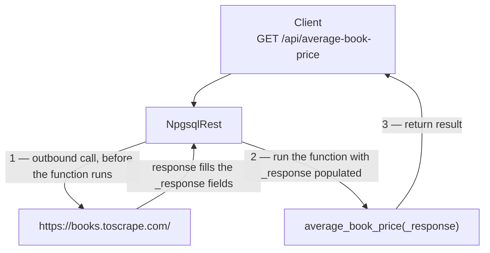

# HTTP Custom Types

HTTP Custom Types let a PostgreSQL routine **make outbound HTTP calls** — to a third-party API, an internal microservice, or even another endpoint of your own app — without any extension or `plpython`. You define the request in a **composite type's comment**, use that type as a function parameter, and NpgsqlRest performs the call and hands your function the response.

This guide covers:

1. [How HTTP Custom Types work](#how-it-works)
2. [Enabling the HTTP client](#enabling-the-http-client)
3. [Defining and using a type](#defining-and-using-a-type)
4. [Reading the response](#reading-the-response)
5. [Dynamic requests with placeholders](#dynamic-requests-with-placeholders)
6. [Timeouts, retries, and caching](#timeouts-retries-and-caching)
7. [Multiple calls in parallel](#multiple-calls-in-parallel)
8. [Self-calls: composing your own endpoints](#self-calls-composing-your-own-endpoints)
9. [Secrets and server-side values](#secrets-and-server-side-values)
10. [Configuration](#configuration)

::: tip Reference page
This is the conceptual walkthrough. For the exact directive grammar and every option see [`@http` custom types](../annotations/http-type) and [HTTP Client configuration](../config/http-client).
:::

## How it works

A composite **type** whose comment starts with (or contains) an HTTP request line becomes an HTTP Custom Type. When a routine declares a parameter of that type, NpgsqlRest performs the request **before** the routine runs and fills the type's fields with the response:



So from your function's point of view, the HTTP response is just **another input parameter** that's already populated. There are no callbacks and no blocking I/O in your SQL — NpgsqlRest does the call on the app tier.

## Enabling the HTTP client

HTTP Custom Types require the client to be switched on:

```json
{
  "NpgsqlRest": {
    "HttpClientOptions": {
      "Enabled": true
    }
  }
}
```

## Defining and using a type

Two steps: define the composite type with a request in its comment, then declare it as a parameter.

::: code-group

```sql [Function]
-- 1. The type's comment defines the outbound request.
create type books_api as (
    body text,
    status_code int,
    success boolean,
    error_message text
);

comment on type books_api is 'GET https://books.toscrape.com/
Accept: text/html
@timeout 30s';

-- 2. Use the type as a parameter; NpgsqlRest fills it before the function runs.
create function average_book_price(_response books_api default null)
returns numeric
language plpgsql
as $$
begin
    if not (_response).success then
        raise exception 'fetch failed: %',
            coalesce((_response).error_message, 'status ' || (_response).status_code);
    end if;
    -- parse (_response).body … (XPath/regex) and compute the average
    return round(avg(substring(p::text from '([0-9]+(?:\.[0-9]+)?)')::numeric), 2)
    from unnest(
        xpath('//p[@class="price_color"]/text()',
              xmlparse(document (_response).body))
    ) as p;
end;
$$;

comment on function average_book_price(books_api) is '
HTTP GET /average-book-price
@allow_anonymous
@single';
```

```sql [SQL file]
-- The type is created once (in a migration or schema file):
--   create type books_api as (body text, status_code int, success boolean, error_message text);
--   comment on type books_api is 'GET https://books.toscrape.com/
--   Accept: text/html
--   @timeout 30s';

-- sql/average-book-price.sql
/*
HTTP GET /average-book-price
@allow_anonymous
@single
@param :_response books_api
*/
select round(avg(substring(p::text from '([0-9]+(?:\.[0-9]+)?)')::numeric), 2) as avg_price
from unnest(
    xpath('//p[@class="price_color"]/text()',
          xmlparse(document (:_response).body))
) as p;
```

:::

The request spec lives entirely in the type comment:

```
GET https://books.toscrape.com/   ← method + URL (GET/POST/PUT/PATCH/DELETE)
Accept: text/html                 ← request headers, one per line
@timeout 30s                      ← optional directives (before the request line or after the headers)

… request body …                 ← optional, after a blank line
```

> This is the [web-scraping example](/examples/) (`17_scrap_demo_2`): fetch HTML server-side, then parse it with PostgreSQL's native XPath.

## Reading the response

Your function reads the response through the type's fields with the `(_param).field` syntax. The standard fields (names are [configurable](#configuration)):

| Field | Type | Meaning |
|-------|------|---------|
| `body` | `text` (or `jsonb`) | Response body. Declare it `jsonb` to parse JSON automatically. |
| `status_code` | `int` | HTTP status code. |
| `success` | `boolean` | `true` for any `2xx` status. |
| `content_type` | `text` | The `Content-Type` header value. |
| `headers` | `json` | All response headers as a JSON object. |
| `error_message` | `text` | Set when the call itself failed (timeout, DNS, connection) — otherwise `null`. |

Errors are reported through `success`/`error_message`, **not** raised as exceptions — so always branch on `(_response).success` before using the body. You only need to declare the fields you actually use:

```sql
create type weather_api as (body jsonb, success boolean, error_message text);
```

## Dynamic requests with placeholders

Any `{name}` in the URL, a header, or the body is replaced at request time with the value of the parameter `name` (the shared [parameter-substitution](../annotations/parameter-substitution) mechanism). Matching is case-insensitive; a `NULL` becomes an empty string.

```sql
create type exchange_rate_api as (body jsonb, status_code int, success boolean, error_message text);

comment on type exchange_rate_api is 'GET https://open.er-api.com/v6/latest/{_base_currency}
Accept: application/json
@timeout 10s';

create function get_rates(_base_currency text, _response exchange_rate_api default null)
returns jsonb language sql as $$
  select case when (_response).success then (_response).body
              else jsonb_build_object('error', (_response).error_message) end;
$$;

comment on function get_rates(text, exchange_rate_api) is '
HTTP GET /rates
@allow_anonymous';
```

A call to `GET /api/rates?baseCurrency=EUR` fetches `https://open.er-api.com/v6/latest/EUR`. Placeholders can also resolve to an **allowlisted environment variable** (for API keys — see [secrets](#secrets-and-server-side-values)) or a **resolved-parameter expression**. Since 3.21.0 the strict forms `{!name}` and `{!name:fallback}` work as well — the inline fallback applies when an allowlisted variable is unset with no configured default, or when a parameter value is null.

## Timeouts, retries, and caching

Three optional directives shape the call. They may appear **before** the request line or **after** the headers:

```sql
comment on type my_api is '@timeout 10s
@retry_delay 1s, 2s, 5s on 429, 503
@cache 5m
GET https://api.example.com/data
Accept: application/json';
```

| Directive | What it does |
|-----------|--------------|
| `@timeout 10s` | Per-request timeout. Interval format (`30`, `30s`, `2min`, `00:00:30`). |
| `@retry_delay 1s, 2s, 5s` | Retry on failure. The list sets **both** the number of retries and the delay before each (here: 3 retries). Add `on 429, 503` to retry only those status codes. |
| `@cache 5m` | Cache the response for the given TTL. **GET only, `2xx` only.** Concurrent requests for the same key coalesce into one outbound call (stampede protection). |

`@cache` is opt-in per type and can be turned off globally with `HttpClientOptions.CacheEnabled: false`. The cache key is the fully-resolved method + URL + headers + body, so two calls with different `{placeholders}` cache separately.

## Multiple calls in parallel

Give a function **several** HTTP Custom Type parameters and NpgsqlRest fires them **concurrently**, then runs your function once all have completed. This turns the database function into an API aggregator:

```sql
create type exchange_rate_api as (body jsonb, status_code int, success boolean, error_message text);
create type crypto_price_api  as (body jsonb, status_code int, success boolean, error_message text);

comment on type exchange_rate_api is 'GET https://open.er-api.com/v6/latest/{_base_currency}
Accept: application/json
@timeout 10s';

comment on type crypto_price_api is 'GET https://api.coingecko.com/api/v3/simple/price?ids={_crypto_ids_csv}&vs_currencies={_vs_currencies_csv}
Accept: application/json
@timeout 10s';

create function get_financial_dashboard(
    _base_currency text,
    _crypto_ids_csv text,
    _vs_currencies_csv text,
    _exchange_rate_response exchange_rate_api,  -- both HTTP calls
    _crypto_response crypto_price_api           -- run in parallel
)
returns json language plpgsql as $$
begin
    return json_build_object(
        'rates',  case when (_exchange_rate_response).success then (_exchange_rate_response).body end,
        'crypto', case when (_crypto_response).success       then (_crypto_response).body end
    );
end;
$$;

comment on function get_financial_dashboard(text, text, text, exchange_rate_api, crypto_price_api) is '
HTTP GET /financial-dashboard
@authorize';
```

> This is the [external-API example](/examples/) (`9_http_calls`): two upstreams fetched in parallel and merged into one response.

## Self-calls: composing your own endpoints

If the request URL is **relative** (e.g. `GET /api/users`), NpgsqlRest treats it as a **self-call** to another of your own endpoints — handled in-process, with **no HTTP round trip**. Combined with parallel execution, this lets one endpoint compose several others cheaply:

```sql
create type api_users  as (body json);
create type api_orders as (body json);
comment on type api_users  is 'GET /api/users';
comment on type api_orders is 'GET /api/orders';

create function dashboard(_users api_users, _orders api_orders)
returns json language sql as $$
  select json_build_object('users', ($1).body, 'orders', ($2).body);
$$;

comment on function dashboard(api_users, api_orders) is '
HTTP GET /dashboard
@authorize';
```

One request to `/api/dashboard` triggers two parallel internal calls and returns the combined result — microseconds per call instead of milliseconds, since the HTTP stack is bypassed.

## Secrets and server-side values

Never make the client send an API key. Two server-side ways to supply one:

**Allowlisted environment variable** — reference `{API_KEY}` in the type and allowlist it:

```jsonc
{
  "NpgsqlRest": { "AvailableEnvVars": [ "WEATHER_API_KEY" ] }
}
```

```sql
comment on type weather_api is 'GET https://api.example.com/v1/current?city={_city}
Authorization: Bearer {WEATHER_API_KEY}';
```

**Resolved-parameter expression** — compute the value with SQL (e.g. a per-user token from a table). The client can't override it:

```sql
comment on type my_api is 'GET https://api.example.com/data
Authorization: Bearer {_token}';

comment on function get_secure_data(_user_id int, _req my_api, _token text) is '
HTTP GET /secure-data
@authorize
_token = select api_token from user_tokens where user_id = {_user_id}';
```

NpgsqlRest resolves `_token` server-side, substitutes it into the `Authorization` header, and makes the call — the token never reaches the browser.

## Configuration

All under `NpgsqlRest.HttpClientOptions`:

| Setting | Default | Description |
|---------|---------|-------------|
| `Enabled` | `false` | **Must be `true`** for HTTP Custom Types to work. |
| `CacheEnabled` | `true` | Global kill switch for the [`@cache`](#timeouts-retries-and-caching) directive. When `false`, every call is fresh. |
| `MaxCacheEntries` | `10000` | Max distinct cached responses held in memory. |
| `CachePruneIntervalSeconds` | `60` | How often expired cache entries are pruned. |
| `ResponseBodyField` | `"body"` | Field name for the response body. |
| `ResponseStatusCodeField` | `"status_code"` | Field name for the status code. |
| `ResponseSuccessField` | `"success"` | Field name for the success flag. |
| `ResponseContentTypeField` | `"content_type"` | Field name for the content type. |
| `ResponseHeadersField` | `"headers"` | Field name for the headers JSON. |
| `ResponseErrorMessageField` | `"error_message"` | Field name for the error message. |

The `Response*Field` settings let you rename the composite fields to whatever you prefer; the defaults are the names used throughout this guide.

```json
{
  "NpgsqlRest": {
    "HttpClientOptions": {
      "Enabled": true,
      "CacheEnabled": true,
      "MaxCacheEntries": 10000,
      "CachePruneIntervalSeconds": 60
    }
  }
}
```

## See it in the examples

- [**External API Calls**](/examples/) (`9_http_calls`) — a financial dashboard aggregating two upstream APIs in parallel. Tutorial: [Call External APIs from PostgreSQL](/blog/external-api-calls-postgresql-http-types).
- [**Web Scraping**](/examples/) (`16_scrap_demo`, `17_scrap_demo_2`) — fetch HTML and parse it with PostgreSQL XPath. Tutorial: [Web Scraping with HTTP Types](/blog/web-scraping-postgresql-http-types-xml).

## Related

- [`@http` custom types](../annotations/http-type) — full directive grammar and behavior
- [HTTP Client configuration](../config/http-client) — every `HttpClientOptions` setting
- [Parameter Value Substitution](../annotations/parameter-substitution) — how `{name}` placeholders resolve
- [Resolved Parameters](../annotations/resolved-parameters) — compute a value server-side from SQL
- [Proxy guide](./proxy) — when you want to forward/stream the upstream response instead of consuming it in SQL
