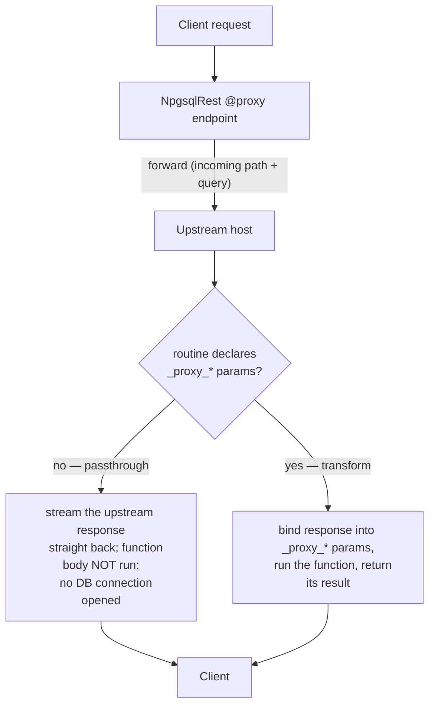

# Proxy Endpoints

A proxy endpoint forwards a request to an **upstream service** and returns its response. With NpgsqlRest you turn any routine into a reverse proxy by adding [`@proxy`](../annotations/proxy) — and you choose whether to **stream the upstream response straight through** or **run it through SQL first** to cache, enrich, or reshape it. This makes PostgreSQL a lightweight API gateway that can add auth, caching, and database context to any backend.

This guide covers:

1. [How proxy endpoints work](#how-it-works)
2. [Enabling the proxy](#enabling-the-proxy)
3. [Passthrough mode](#passthrough-mode)
4. [Transform mode](#transform-mode)
5. [Where the request goes: target URL](#where-the-request-goes-target-url)
6. [Forwarding headers, claims, and IP](#forwarding-headers-claims-and-ip)
7. [Forward proxy: send a function result upstream](#forward-proxy-send-a-function-result-upstream)
8. [Configuration](#configuration)
9. [A complete example: cached AI gateway](#a-complete-example-cached-ai-gateway)

::: tip Reference pages
This is the conceptual walkthrough. For exact options see [`@proxy`](../annotations/proxy), [`@proxy_out`](../annotations/proxy-out), and [Proxy configuration](../config/proxy).
:::

## How it works

`@proxy` forwards the incoming request to an upstream host. What happens to the response depends on **one thing**: whether your routine declares the special **`_proxy_*` response parameters**.



- **Passthrough** — no `_proxy_*` parameters. NpgsqlRest streams the upstream response directly back to the client. The function body is **never executed** and **no database connection is opened**. This is a pure reverse proxy.
- **Transform** — the routine declares `_proxy_*` parameters. NpgsqlRest performs the upstream call, binds the response into those parameters, runs your function, and returns **the function's** result.

## Enabling the proxy

```json
{
  "NpgsqlRest": {
    "ProxyOptions": {
      "Enabled": true,
      "Host": "http://localhost:3001"
    }
  }
}
```

`Host` is the default upstream; an annotation can override it per endpoint (see [target URL](#where-the-request-goes-target-url)).

## Passthrough mode

The simplest proxy: forward and stream back. No `_proxy_*` parameters, so the body never runs.

::: code-group

```sql [Function]
create function service_status()
returns void
language plpgsql
as $$ begin end; $$;   -- body is never executed in passthrough mode

comment on function service_status() is '
HTTP GET /status
@proxy http://internal-service:8080';
```

```sql [SQL file]
-- sql/status.sql
/*
HTTP GET /status
@proxy http://internal-service:8080
*/
select;   -- never executed; the endpoint just forwards
```

:::

`GET /status` is forwarded to `http://internal-service:8080/status` and the upstream response is streamed back unchanged. Because no DB connection is opened, passthrough proxying is cheap — useful for putting NpgsqlRest's auth, CORS, rate limiting, or TLS in front of a plain internal service.

::: warning Passthrough does not run your SQL
If you need the function body to execute (to log, cache, or reshape), you're in **transform** mode — you must declare at least one `_proxy_*` parameter. A passthrough endpoint's body is dead code.
:::

## Transform mode

Declare the response parameters and NpgsqlRest hands you the upstream response to do with as you like. All parameters are optional — declare only the ones you need:

| Parameter | Type | Meaning |
|-----------|------|---------|
| `_proxy_status_code` | `int` (or `text`) | Upstream HTTP status code. |
| `_proxy_body` | `text` | Response body (`null` if empty). |
| `_proxy_headers` | `json` | Response headers as JSON. |
| `_proxy_content_type` | `text` | `Content-Type` of the response. |
| `_proxy_success` | `boolean` | `true` for a `2xx` status. |
| `_proxy_error_message` | `text` | Set if the call failed (timeout, connection error); else `null`. |

```sql
create function fetch_and_wrap(
    _proxy_status_code int default null,
    _proxy_body text default null,
    _proxy_success boolean default null,
    _proxy_error_message text default null
)
returns json
language plpgsql
as $$
begin
    if not _proxy_success then
        return json_build_object('error', coalesce(_proxy_error_message, 'upstream failed'),
                                 'status', _proxy_status_code);
    end if;
    return json_build_object('status', _proxy_status_code, 'data', _proxy_body::json);
end;
$$;

comment on function fetch_and_wrap(int, text, boolean, text) is '
HTTP GET /wrapped
@authorize
@proxy https://api.example.com/data';
```

Here NpgsqlRest calls the upstream, fills the four parameters, runs `fetch_and_wrap`, and returns *its* JSON — letting you handle errors, cache the body in a table, or merge it with database data before responding. (The `_proxy_*` names are [configurable](#configuration).)

## Where the request goes: target URL

The upstream target is built as:

```
target = host + incoming request path + incoming query string
```

The **host** comes from the annotation if present, otherwise from `ProxyOptions.Host`. A **relative** annotation path makes it a self-call:

| Annotation | `ProxyOptions.Host` | Resolved target | Self-call? |
|------------|---------------------|-----------------|:----------:|
| `@proxy` | `https://api.example.com` | `https://api.example.com` + path + query | no |
| `@proxy POST` | `https://api.example.com` | same host, upstream method forced to `POST` | no |
| `@proxy https://other.com` | `https://api.example.com` | `https://other.com` + path + query | no |
| `@proxy /api/data` | *(any)* | `/api/data` — internal call, no network | **yes** |

The optional `[METHOD]` lets the upstream verb differ from the incoming one (e.g. accept a `GET` from clients but call the upstream with `POST`). A **relative** target (`@proxy /api/other`) is dispatched in-process to another of your endpoints with no HTTP round trip.

## Forwarding headers, claims, and IP

By default request and response headers are forwarded (minus a small exclude list). On top of that, NpgsqlRest can forward the **authenticated identity** to the upstream automatically — so the backend can trust who the caller is without re-doing auth:

- **[`@user_parameters`](../annotations/user-parameters)** — user claims, the client IP, HTTP-Custom-Type fields, and resolved-parameter values are forwarded in the endpoint's native shape: **query-string parameters** for `QueryString` endpoints, or **merged into the JSON body** for `BodyJson` endpoints.
- **[`@user_context`](../annotations/user-context)** — the claims and client IP are forwarded as **HTTP headers** (one per `ContextKeyClaimsMapping` entry, plus a claims-JSON header and an IP header).

```sql
create function secure_gateway(
    _user_id text default null,     -- forwarded upstream as ?userId=…
    _user_name text default null    -- forwarded upstream as ?userName=…
)
returns void
language plpgsql
as $$ begin end; $$;

comment on function secure_gateway(text, text) is '
HTTP GET /gateway
@authorize
@user_parameters
@proxy https://internal-api/secure';
```

::: info Long values are guarded
Automatic values appended to the upstream **query string** are capped by `MaxForwardedQueryParamLength` (default `2048`). A longer value is skipped with a warning rather than producing an unusable request line. Use a `BodyJson` endpoint if you must forward large values.
:::

## Forward proxy: send a function result upstream

[`@proxy_out`](../annotations/proxy-out) (alias `@forward_proxy`) reverses the order: your function runs **first**, and **its result is sent as the request body** to the upstream, whose response is returned to the client. Use it to build a payload in SQL and hand it to a rendering/processing service:

::: code-group

```sql [Function]
create function generate_report(_report_id int)
returns json
language sql
as $$
  select json_build_object(
    'title', 'Monthly Report',
    'rows', (select json_agg(row_to_json(s)) from sales s where s.month = _report_id));
$$;

comment on function generate_report(int) is '
HTTP GET /report
@proxy_out POST https://render-service.internal/render';
```

```sql [SQL file]
-- sql/report.sql
/*
HTTP GET /report
@proxy_out POST https://render-service.internal/render
*/
select json_build_object(
  'title', 'Monthly Report',
  'rows', (select json_agg(row_to_json(s)) from sales s where s.month = :report_id));
```

:::

`GET /report?reportId=3` runs `generate_report`, POSTs its JSON to the render service, and returns the rendered response. If the **function** fails, the error goes straight to the client and the upstream is never called; if the **upstream** fails, its status/body are forwarded (502 for connection errors, 504 for timeouts).

## Configuration

All under `NpgsqlRest.ProxyOptions`:

| Setting | Default | Description |
|---------|---------|-------------|
| `Enabled` | `false` | **Must be `true`** for proxy annotations to work. |
| `Host` | `null` | Default upstream host. Used when an annotation has no URL; ignored when it specifies one. |
| `DefaultTimeout` | `"00:00:30"` | Per-request timeout (`HH:MM:SS` or interval format). |
| `ForwardHeaders` | `true` | Forward request headers upstream. |
| `ExcludeHeaders` | `["Host", "Content-Length", "Transfer-Encoding"]` | Request headers not forwarded. |
| `ForwardResponseHeaders` | `true` | Forward upstream response headers to the client. |
| `ExcludeResponseHeaders` | `["Transfer-Encoding", "Content-Length"]` | Response headers not forwarded. |
| `ForwardUploadContent` | `false` | Forward raw `multipart/form-data` upstream instead of processing it locally. |
| `MaxForwardedQueryParamLength` | `2048` | Max length of a single auto-forwarded query value (`0` disables the guard). |
| `Response*Parameter` | `_proxy_status_code`, `_proxy_body`, `_proxy_headers`, `_proxy_content_type`, `_proxy_success`, `_proxy_error_message` | Names of the transform-mode response parameters. |

```json
{
  "NpgsqlRest": {
    "ProxyOptions": {
      "Enabled": true,
      "Host": "http://localhost:3001",
      "DefaultTimeout": "00:00:30",
      "ForwardHeaders": true,
      "ForwardResponseHeaders": true
    }
  }
}
```

## A complete example: cached AI gateway

This transform-mode endpoint proxies a request to an AI service, but **caches** each result in a table so repeated inputs never hit the upstream twice — a database-backed cache in front of a slow/expensive API.

```sql
create function ai_sentiment(
    _text text,
    _proxy_status_code int default null,
    _proxy_body text default null,
    _proxy_success boolean default null,
    _proxy_error_message text default null
)
returns json
language plpgsql
as $$
declare
    _hash text := md5(_text || '::sentiment');
    _cached record;
    _result json;
begin
    -- 1. serve from the database cache when present
    select sentiment, sentiment_score into _cached
    from analysis_cache where text_hash = _hash;

    if _cached.sentiment is not null then
        return json_build_object('sentiment', _cached.sentiment,
                                 'score', _cached.sentiment_score, 'cached', true);
    end if;

    -- 2. handle upstream failure
    if not _proxy_success then
        return json_build_object('error', coalesce(_proxy_error_message, 'AI service unavailable'),
                                 'status_code', _proxy_status_code);
    end if;

    -- 3. cache the fresh result and return it
    _result := _proxy_body::json;
    insert into analysis_cache (text_hash, sentiment, sentiment_score)
    values (_hash, _result->>'sentiment', (_result->>'score')::numeric)
    on conflict (text_hash) do nothing;

    return json_build_object('sentiment', _result->>'sentiment',
                             'score', (_result->>'score')::numeric, 'cached', false);
end;
$$;

comment on function ai_sentiment(text, int, text, boolean, text) is '
HTTP POST /ai/sentiment
@authorize
@proxy POST';   -- no host → forwarded to ProxyOptions.Host
```

`POST /ai/sentiment` is forwarded to the configured AI service; the function then caches and shapes the result. Note that **with caching, the upstream is still called every time** (NpgsqlRest can't know the result is cached before the proxy runs) — to skip the call entirely on a cache hit, fetch with an [HTTP Custom Type](./http-types) instead of `@proxy`, or split the lookup into a separate endpoint.

## See it in the examples

- [**Reverse Proxy & AI Service**](/examples/) (`10_proxy_ai_service`) — transform-mode proxy with database-backed caching of AI responses. Tutorial: [Reverse Proxy in PostgreSQL](/blog/reverse-proxy-postgresql-ai-service-npgsqlrest).
- [**Scraping Proxy**](/examples/) (`18_scrap_proxy_demo`) — an [HTTP Custom Type](./http-types) fetches a page, then `@proxy` forwards the scraped HTML to an upstream parser via [`@body_parameter_name`](../annotations/body-parameter-name).

## Related

- [`@proxy`](../annotations/proxy) — reverse-proxy an endpoint (passthrough or transform)
- [`@proxy_out`](../annotations/proxy-out) — forward a function result upstream
- [Proxy configuration](../config/proxy) — every `ProxyOptions` setting
- [HTTP Custom Types guide](./http-types) — call an upstream and consume the response in SQL (skips on cache hit)
- [`@user_parameters`](../annotations/user-parameters) / [`@user_context`](../annotations/user-context) — forwarding the authenticated identity upstream
