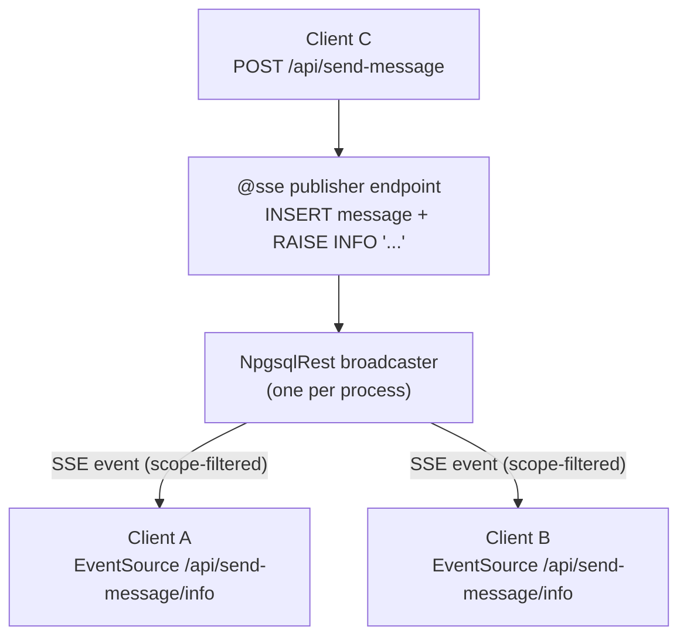

# Server-Sent Events (SSE)

NpgsqlRest can stream real-time updates from PostgreSQL to connected clients over [Server-Sent Events](https://developer.mozilla.org/en-US/docs/Web/API/Server-sent_events) — a one-way HTTP stream the browser consumes with the native `EventSource` API. You don't write any streaming code: a procedure simply emits events with PostgreSQL's `RAISE` statement, and NpgsqlRest broadcasts them to subscribers.

This guide covers:

1. [How SSE works in NpgsqlRest](#how-sse-works)
2. [Creating a publisher endpoint](#creating-a-publisher-endpoint)
3. [Subscribing from the browser](#subscribing-from-the-browser)
4. [Who receives events: scope](#who-receives-events-scope)
5. [Which RAISE level fires: event level](#which-raise-level-fires-event-level)
6. [Targeting specific recipients](#targeting-specific-recipients)
7. [Splitting publish from subscribe](#splitting-publish-from-subscribe)
8. [Configuration](#configuration)
9. [A complete example: real-time chat](#a-complete-example-real-time-chat)

::: tip Reference pages
This is the conceptual walkthrough. For exact options see [`@sse`](../annotations/sse), [`@sse_events_level`](../annotations/sse-events-level), and [`@sse_events_scope`](../annotations/sse-events-scope).
:::

## How SSE works

The model is deliberately small. Mark a routine with [`@sse`](../annotations/sse) and it becomes a **publisher**: any `RAISE INFO/NOTICE/WARNING` inside its body is turned into an SSE event and broadcast to connected clients. The annotation also registers a **subscribe URL** that a browser connects to with `EventSource`.



Key points:

- There is **one process-wide broadcaster**. Every `EventSource` connection reads from the same stream; the subscribe URL is an entry point, not a per-topic channel.
- **Who** receives a given event is decided per event by its [scope](#who-receives-events-scope) (everyone, authorized users, a matching security context, or a specific user).
- **Which** `RAISE` statements become events is decided by the [event level](#which-raise-level-fires-event-level) — and level matching is **exact**, not "this level and above".
- A connected client is a **pure listener** — connecting never runs the procedure body.

## Creating a publisher endpoint

Add `@sse` to any endpoint and emit events with `RAISE`. Here is the message-sending half of a chat app — it inserts a row and broadcasts the new message as JSON:

::: code-group

```sql [Function]
create procedure send_message(
    _message_text text,
    _user_id text = null,
    _user_name text = null
)
language plpgsql
as $$
declare
    _message_id int;
    _created_at timestamptz;
begin
    insert into messages (user_id, username, message_text)
    values (_user_id::int, _user_name, _message_text)
    returning message_id, created_at into _message_id, _created_at;

    -- broadcast the new message to all connected, authorized clients
    raise info '%', json_build_object(
        'message_id', _message_id,
        'user_id', _user_id::int,
        'username', _user_name,
        'message_text', _message_text,
        'created_at', _created_at
    );
end;
$$;

comment on procedure send_message(text, text, text) is '
HTTP POST
@authorize
@user_parameters
@sse
@sse_scope authorize';
```

```sql [SQL file]
-- sql/send-message.sql
/*
HTTP POST
@authorize
@user_parameters
@sse
@sse_scope authorize
@param $1 message_text text
@param $2 _user_id text = null
@param $3 _user_name text = null
@void
*/
begin;

-- a DO block can't read $N parameters directly — hand them over as session settings
select set_config('app.message_text', $1, true);
select set_config('app.user_id', $2, true);
select set_config('app.user_name', $3, true);

do $$
declare
    _message_text text = current_setting('app.message_text');
    _user_id int = current_setting('app.user_id')::int;
    _user_name text = current_setting('app.user_name');
    _message_id int;
    _created_at timestamptz;
begin
    insert into messages (user_id, username, message_text)
    values (_user_id, _user_name, _message_text)
    returning message_id, created_at into _message_id, _created_at;

    raise info '%', json_build_object(
        'message_id', _message_id,
        'user_id', _user_id,
        'username', _user_name,
        'message_text', _message_text,
        'created_at', _created_at
    );
end;
$$;

end;
```

:::

- `@sse` makes this a publisher and registers the subscribe URL (see below). Its **default event level is `info`**, so `RAISE INFO` is what gets broadcast here.
- `@sse_scope authorize` means only authenticated clients receive the broadcast — see [scope](#who-receives-events-scope).
- The body still runs normally when the endpoint is called (the `INSERT` happens); the `RAISE` is the *additional* broadcast.
- Emit a payload by formatting it into the `RAISE` message — JSON is the natural choice for structured events.

## Subscribing from the browser

`@sse` registers a connection URL at **`<endpoint-path>/<level>`** — for the `send_message` endpoint above, with its default `info` level, that's `GET /api/send-message/info`.

You don't build that URL by hand. Set `ClientCodeGen.ExportEventSources: true` and NpgsqlRest generates a typed `EventSource` factory for each SSE endpoint as part of the [TypeScript client](../config/codegen). For `send_message` you get a `createSendMessageEventSource()` function — use it directly:

```js
import { createSendMessageEventSource } from './example8Api'; // generated client

const events = createSendMessageEventSource();
events.onmessage = (e) => {
  const msg = JSON.parse(e.data);
  console.log(`${msg.username}: ${msg.message_text}`);
};
```

Connecting **does not** run the procedure — the client just listens. Any time *another* request triggers the procedure (or any publisher that emits on this stream), the event arrives here.

::: tip One-call subscribe + send
The generated POST function for the same endpoint can open the stream for you too: pass an `onMessage` callback as `sendMessage(request, onMessage)` and the client subscribes, sends, and tidies up the `EventSource` in a single call.
:::

## Who receives events: scope

Scope answers *which connected clients should receive this event*. Set the default for an endpoint with [`@sse_scope`](../annotations/sse-events-scope) (alias `@sse_events_scope`):

| Scope | Who receives the event |
|-------|------------------------|
| `all` | Every connected client. |
| `authorize` | Only authenticated clients. Optionally restrict to roles / usernames / user IDs: `@sse_scope authorize admin, manager`. |
| `matching` | Clients whose security context matches the emitting request (by roles, usernames, and user IDs). |

```
@sse_scope all
@sse_scope authorize
@sse_scope authorize admin, manager
@sse_scope matching
```

The scope set on the annotation is the **default** for events from that endpoint. Individual events can override it at runtime — see [targeting](#targeting-specific-recipients).

## Which RAISE level fires: event level

An SSE endpoint listens at **one** PostgreSQL notice level. Only `RAISE` statements at that exact level become events:

| Endpoint level | `RAISE INFO` | `RAISE NOTICE` | `RAISE WARNING` |
|----------------|:------------:|:--------------:|:---------------:|
| `info` (default) | ✅ broadcast | — | — |
| `notice` | — | ✅ broadcast | — |
| `warning` | — | — | ✅ broadcast |

The level is **exact, not hierarchical** — an `info` endpoint does *not* also forward `notice` or `warning`. Set the level inline on `@sse` or with the dedicated annotation:

```
@sse                     -- default level: info → subscribe at <path>/info
@sse my_events on notice -- custom path + notice level → subscribe at <path>/my_events
@sse_events_level notice -- set the level separately
```

The process-wide default level is `DefaultServerSentEventsEventNoticeLevel` (default `INFO`); see [configuration](#configuration).

## Targeting specific recipients

Beyond the endpoint's default scope, a single event can pick its own audience at runtime using `RAISE … USING hint`. The hint string is a scope expression:

```sql
-- broadcast to everyone, regardless of the endpoint's default scope
raise notice 'System maintenance in 5 minutes' using hint = 'all';

-- only admins
raise notice '%' using hint = 'authorize admin', message;

-- only specific users, by username or id
raise info 'Your report is ready' using hint = format('authorize %s', _user_id);
```

This is what makes per-user notifications possible: an endpoint that processes a job can notify *just the user who owns it* with `using hint = format('authorize %s', _user_id)`, even though the broadcaster is shared.

::: info Request correlation
When a request carries an execution-id header (`ExecutionIdHeaderName`, default `X-NpgsqlRest-ID`) and an `EventSource` includes the same id as a query parameter, events are also filtered to that execution id — useful for streaming the progress of one specific long-running call back to its initiator.
:::

## Splitting publish from subscribe

In the chat example, one endpoint both sends and is subscribed to. Often you want them separate — for example, a privileged action emits events, but ordinary users subscribe. Use a **subscribe-only** endpoint (its body never runs — it exists only to register the URL) plus one or more **emitter** endpoints that broadcast on the same level/scope.

::: code-group

```sql [Function]
-- subscribe-only: clients connect here, body never executes
create procedure user_events_subscribe()
language plpgsql as $$ begin perform 1; end; $$;

comment on procedure user_events_subscribe() is '
HTTP GET
@authorize
@sse
@sse_scope authorize';

-- emitter: a privileged action that notifies the affected user
create procedure update_user_roles(_target_user_id int, _roles text[])
language plpgsql as $$
begin
    -- ... perform the role update ...
    raise info 'roles updated'
        using hint = format('authorize %s', _target_user_id);
end;
$$;

comment on procedure update_user_roles(int, text[]) is '
HTTP POST
@authorize manager
@sse
@sse_scope authorize';
```

```sql [SQL file]
-- sql/user-events-subscribe.sql  (subscribe-only)
/*
HTTP GET
@authorize
@sse
@sse_scope authorize
@void
*/
select 1;

-- sql/update-user-roles.sql  (emitter)
/*
HTTP POST
@authorize manager
@sse
@sse_scope authorize
@param $1 target_user_id int
@param $2 roles text[]
@void
*/
begin;

select set_config('app.target_user_id', $1::text, true);
select set_config('app.roles', $2::text, true);

do $$
declare
    _target_user_id int = current_setting('app.target_user_id')::int;
    _roles text[] = current_setting('app.roles')::text[];
begin
    -- ... perform the role update ...
    raise info 'roles updated'
        using hint = format('authorize %s', _target_user_id);
end;
$$;

end;
```

:::

The browser subscribes to `GET /api/user-events-subscribe/info`; when a manager calls `update_user_roles`, only the targeted user's connection receives the event.

## Configuration

SSE works out of the box — no global enable flag. These options under `NpgsqlRest` tune the defaults:

| Setting | Default | Description |
|---------|---------|-------------|
| `DefaultServerSentEventsEventNoticeLevel` | `"INFO"` | Default PostgreSQL notice level for SSE events (`INFO`, `NOTICE`, or `WARNING`). Overridable per endpoint via [`@sse … on <level>`](#which-raise-level-fires-event-level). |
| `ServerSentEventsResponseHeaders` | `{}` | Extra headers added to SSE responses. |
| `WarnUnboundServerSentEventsNotices` | `true` | Logs a one-time warning for a `RAISE` that matches the SSE level but sits on an endpoint with no `@sse` annotation (a likely missing publisher). |

```json
{
  "NpgsqlRest": {
    "DefaultServerSentEventsEventNoticeLevel": "INFO",
    "ServerSentEventsResponseHeaders": {
      "X-Accel-Buffering": "no"
    }
  }
}
```

::: tip Behind nginx
SSE is a long-lived streaming response. If you run behind nginx, add `X-Accel-Buffering: no` (as above) so the proxy doesn't buffer the stream and delay events.
:::

::: warning Cache hits don't broadcast
If a publisher endpoint is also [`@cached`](../annotations/cached) and a request is served from cache, the function body doesn't run — so no `RAISE` fires and no event is broadcast. That's correct behavior, but keep it in mind: don't cache an endpoint whose side effect is the broadcast.
:::

## A complete example: real-time chat

The pieces below form a minimal chat: a login, a publisher that sends + broadcasts, a history endpoint, and the browser subscription. (Cookie auth setup omitted — see the [Authentication guide](./authentication).)

**Tables**

```sql
create table messages (
    message_id int primary key generated always as identity,
    user_id int not null,
    username text not null,
    message_text text not null,
    created_at timestamptz not null default now()
);
```

**Send + broadcast** (publisher)

```sql
create procedure send_message(_message_text text, _user_id text = null, _user_name text = null)
language plpgsql as $$
declare _message_id int; _created_at timestamptz;
begin
    insert into messages (user_id, username, message_text)
    values (_user_id::int, _user_name, _message_text)
    returning message_id, created_at into _message_id, _created_at;

    raise info '%', json_build_object(
        'message_id', _message_id, 'user_id', _user_id::int,
        'username', _user_name, 'message_text', _message_text, 'created_at', _created_at);
end;
$$;

comment on procedure send_message(text, text, text) is '
HTTP POST
@authorize
@user_parameters
@sse
@sse_scope authorize';
```

**Load history** (plain endpoint, no SSE)

```sql
create function get_messages()
returns setof messages
language sql as $$
  select * from messages order by created_at asc;
$$;

comment on function get_messages() is '
HTTP GET
@authorize';
```

**Browser** — using the generated TypeScript client, no hand-written `fetch`:

```js
import { getMessages, sendMessage, createSendMessageEventSource } from './example8Api';

// 1. load history (typed, generated)
const { response: history } = await getMessages();
history?.forEach(renderMessage);

// 2. subscribe to new messages
const events = createSendMessageEventSource();
events.onmessage = e => renderMessage(JSON.parse(e.data));

// 3. send a message — every authorized subscriber receives the broadcast
await sendMessage({ messageText: 'Hello!' });
```

Because the broadcast uses `@sse_scope authorize`, every signed-in client connected to the stream sees each new message in real time. All three functions — `getMessages`, `sendMessage`, and `createSendMessageEventSource` — are generated from your SQL; you don't write the HTTP calls.

## See it in the examples

- [**Simple Chat Client**](/examples/) (`8_simple_chat_client`) — the full runnable chat app, function-based and as SQL files.
- Tutorial walkthrough: [Real-Time Chat with SSE](/blog/real-time-chat-postgresql-sse-npgsqlrest).

## Related

- [`@sse`](../annotations/sse) — mark an endpoint as an SSE publisher / subscribe URL
- [`@sse_events_level`](../annotations/sse-events-level) — set the notice level the endpoint listens on
- [`@sse_events_scope`](../annotations/sse-events-scope) — set who receives the events
- [`@authorize`](../annotations/authorize) / [Authentication guide](./authentication) — securing real-time endpoints
- [`@cached`](../annotations/cached) — caching (and why it skips broadcasts)
- [TypeScript client generation](../config/codegen) — `ExportEventSources` for typed `EventSource` clients
